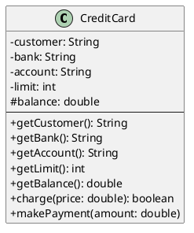
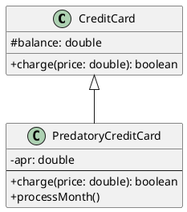
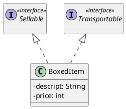
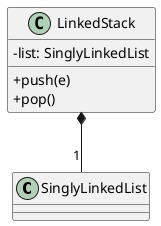
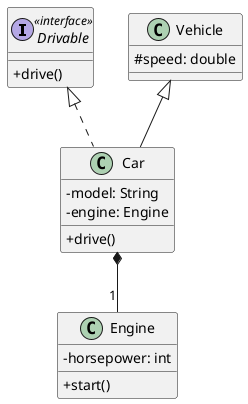

# How to Write a UML Class Diagram 📝
A quick guide to visually representing your object-oriented designs.
## {{ $slidev.configs.subject }}
### Semester {{ $slidev.configs.semester }}

---

## What is a UML Class Diagram?

A UML (Unified Modeling Language) diagram is a standard visual way to express the design of object-oriented software.

A **class diagram** specifically shows:
* The program's classes
* Their attributes (fields) and operations (methods)
* The relationships between the classes 

---

## The Class Box 📦

A class is represented by a rectangle with three compartments stacked vertically.

| Compartment | Content | Example |
|---|---|---|
| **Top** | The name of the class. | `CreditCard` |
| **Middle**| The attributes (instance variables). | `customer: String` |
| **Bottom**| The operations (methods). | `charge(price: double)` |

---

## Member Syntax and Visibility

Each attribute and method has its visibility marked on the left. 

**Visibility Symbols**
* `+`  **public**
* `#`  **protected**
* `-`  **private**

**Type Syntax** 
* **Attributes:** `visibility name: type`
    * Example: `- limit: int`
* **Methods:** `visibility name(parameter: type): returnType`
    * Example: `+ charge(price: double): boolean`

---

## Showing Relationships: Inheritance

To show relationships like inheritance, you use arrows.

  * **Inheritance** is represented by a **hollow arrow** pointing from the **subclass** to the **superclass**. 
  * This is an **"is-a"** relationship. It connects a subclass to its superclass.

**Notation:** A solid line with a **hollow, triangular arrowhead** pointing from the subclass to the superclass.

*`PredatoryCreditCard` is a subclass of `CreditCard`.*

---

## Interface Implementation (Realization)

This is an **"implements"** relationship. It connects a class to an interface it provides an implementation for.

**Notation:** A dashed line with a **hollow, triangular arrowhead** pointing from the implementing class to the interface. Interface names are typically marked with `<<interface>>`.

---

## Association (Composition)

This is a **"has-a"** or **"part-of"** relationship, where an object of one class is composed of, or contains, an object of another.

**Notation:** A solid line with a **filled diamond** on the side of the containing class (the "whole").

This is used for the **Composition Design Pattern** mentioned in the text. For example, a `LinkedStack` contains a `SinglyLinkedList` to manage its data.

---
layout: two-cols
---

## Summary of Relationships

| Relationship | Meaning | Arrow Style | Line Style |
|---|---|---|---|
| **Inheritance** | "is-a" | Hollow Triangle | Solid |
| **Implementation**| "implements" | Hollow Triangle | Dashed |
| **Composition** | "has-a" / "part-of" | Filled Diamond | Solid |

Here is a diagram that combines all the relationship types we've discussed.

:: right ::

<Transform :scale="0.85">

*   **Inheritance:** `Car` is a type of `Vehicle`.
*   **Implementation:** `Car` implements the `Drivable` interface.
*   **Composition:** `Car` has an `Engine` (represented by the `engine` attribute).

</Transform>