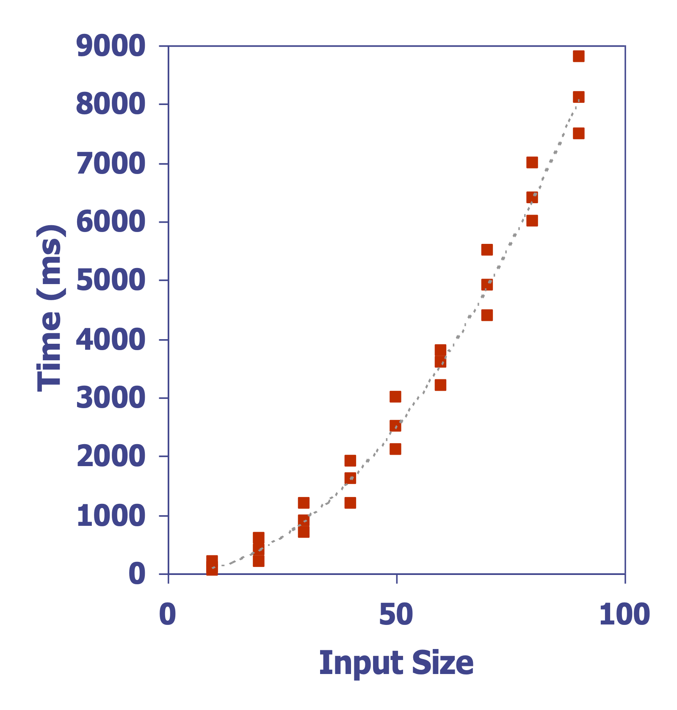
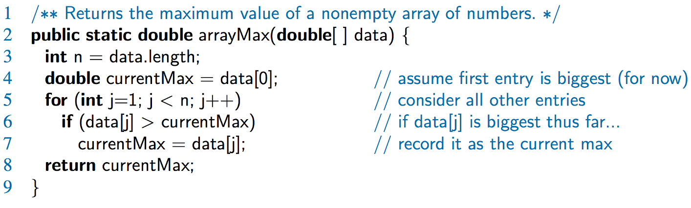
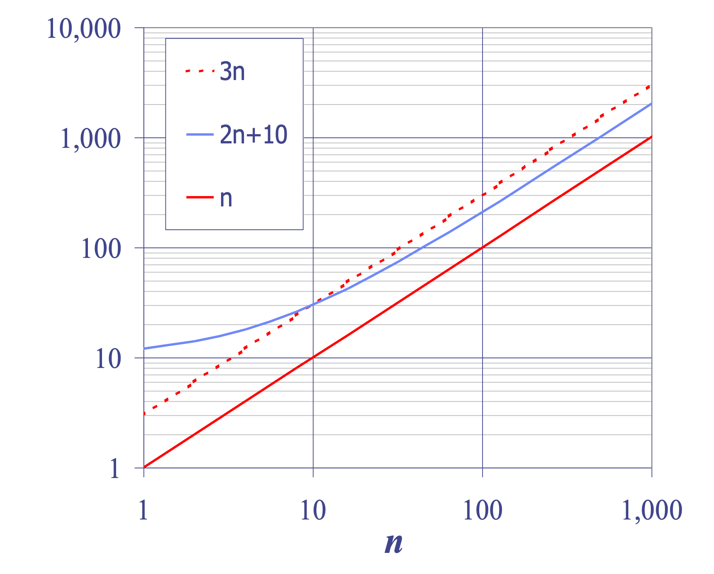
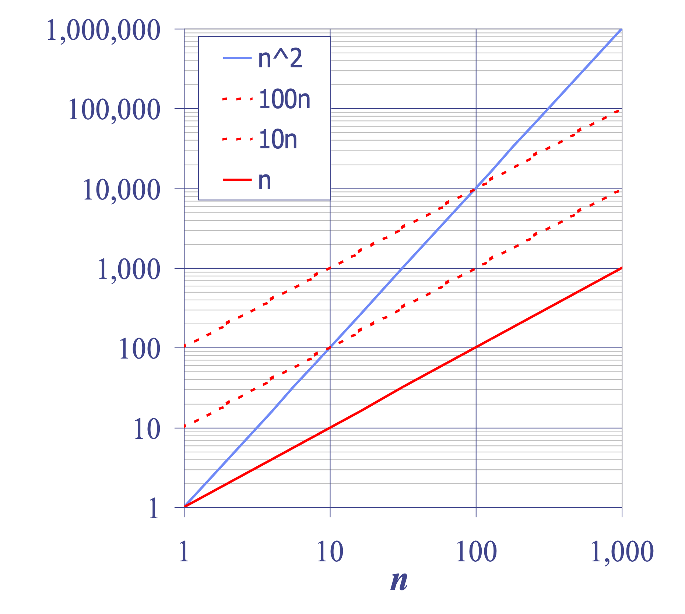

# Analysis of Algorithms
## Algorithm and Data Structures
### Semester 1/2025
### Dr. Ruslee Sutthaweekul

---
hideInToc: false
---

## Outline

<toc mode="onlySiblings" minDepth="2" columns="3"/>

---

## Analysis of Algorithms

Understanding how algorithms perform.

* **Input:** What goes into the algorithm.
* **Algorithm:** The set of rules or steps.
* **Output:** What comes out of the algorithm.


---

## Running Time Explained

* Algorithms typically take inputs and produce outputs.
* The time an algorithm takes usually **increases as the input size gets larger**.
* Figuring out the average time can be complex.
* Therefore, we often concentrate on the **worst-case running time**.
* Analyzing the worst case is simpler and vital for time-sensitive applications like gaming, finance, and robotics.


---
layout: two-cols
---

## Experimental Analysis

How to measure performance empirically:

1.  **Implement:** Code the algorithm.
2.  **Run:** Execute the program with various input sizes and types.
3.  **Measure:** Record the time taken for each run.
    * Example: Use `System.currentTimeMillis()` before and after execution to find the elapsed time.
4.  **Plot:** Graph the time taken against the input size.

:: right ::



---

## Limitations of Experimental Studies

Why experiments aren't always enough:

* **Implementation Effort:** Coding the algorithm can be time-consuming and challenging.
* **Limited Scope:** Results might only reflect performance on the specific inputs tested, not all possible inputs.
* **Environment Dependency:** To compare algorithms fairly, tests must run on identical hardware and software setups.

---

## Theoretical Analysis

A different approach to evaluating algorithms:

* Uses a high-level description (like pseudocode) instead of actual code.
* Defines running time as a function of the input size, 'n'.
* Considers all potential inputs.
* Allows algorithm speed comparison independent of specific hardware or software.

---

## Pseudocode: A Quick Look

* A way to describe algorithms that's more structured than plain English but less detailed than actual code.
* It's the preferred method for describing algorithms.
* Keeps the focus on the logic, hiding implementation details.


---

## Pseudocode Conventions

Common elements used:

* **Control Flow:** `if...then...[else...]`, `while...do`, `repeat...until`, `for...do`. Indentation is used instead of braces.
* **Method Declaration:** `Algorithm method(arg1, arg2, ...)` with specified Input and Output.
* **Method Call:** `method(arg1, arg2, ...)`
* **Return Value:** `return expression`
* **Expressions:**
    * `←` for assignment.
    * `=` for equality testing.
    * Mathematical notation like `n²` is allowed.

---
layout: two-cols
---

## The RAM Model

Abstract model for analysis:

* **CPU:** The processor.
* **Memory:** A theoretically infinite bank of memory cells.
* Each cell holds a number or character.
* Cells are numbered, and accessing any cell takes a fixed amount of time (unit time).

:: right ::


---
layout: two-cols
---
## Key Functions in Algorithm Analysis

Seven common growth functions:

* **Constant:** ≈ 1
* **Logarithmic:** ≈ log n
* **Linear:** ≈ n
* **N-Log-N:** ≈ n log n
* **Quadratic:** ≈ n²
* **Cubic:** ≈ n³
* **Exponential:** ≈ 2ⁿ

:: right ::


---

## Visualizing Growth Rates (Normal Scale)

Comparing how different functions grow as input size 'n' increases:

* `g(n)=lg n` (Logarithmic)
* `g(n)=n` (Linear)
* `g(n)=n lg n` (N-Log-N)
* `g(n)=n²` (Quadratic)
* `g(n)=n³` (Cubic)
* `g(n)=2ⁿ` (Exponential) - Grows extremely fast.

(Graphs comparing these functions on a standard scale)

---
layout: two-cols
---

## Primitive Operations

* These are the fundamental computations an algorithm performs.
* They can be identified in pseudocode.
* Mostly independent of the specific programming language used.
* We assume each takes a constant amount of time in the RAM model.
* **Examples:** Evaluating expressions, assigning values, array indexing, calling/returning from methods.

:: right ::


---

## Counting Primitive Operations

* We can estimate the maximum number of primitive operations an algorithm executes by examining its pseudocode.
* This count is expressed as a function of the input size, 'n'.
* Example `arrayMax` algorithm:
    * Finding the maximum element in an array.
    * Operations involve comparisons, assignments, loop control.
    * Analysis shows steps contribute operations like: 2 ops, 2 ops, 2n ops, 2n ops, up to n ops, 1 op.


---

## Estimating Running Time

* Let's say `arrayMax` performs `5n + 5` primitive operations in the worst case and `4n + 5` in the best case.
* If 'a' is the time for the fastest operation and 'b' is the time for the slowest:
* The worst-case time T(n) is bounded: `a(4n + 5) ≤ T(n) ≤ b(5n + 5)`
* This shows T(n) is bounded by two linear functions.


---

## Growth Rate of Running Time

* Changing the hardware or software environment affects the running time (T(n)) by a constant factor.
* However, it **does not change the growth rate** of T(n).
* For `arrayMax`, the linear growth rate is an inherent characteristic of the algorithm itself.

---

## Why Growth Rate is Crucial

* Consider how runtime changes as input size 'n' increases:
    * **Linear (c n):** Doubling 'n' doubles the time (2cn). Quadrupling 'n' quadruples the time (4cn).
    * **Quadratic (c n²):** Doubling 'n' quadruples the time (4cn²). Quadrupling 'n' increases time 16-fold (16cn²).
    * **Exponential (c 2ⁿ):** Time grows extremely rapidly.
* Small changes in 'n' can lead to huge differences in runtime for less efficient algorithms.



---

## Algorithm Comparison Example

* **Insertion Sort:** Roughly n²/4 operations.
* **Merge Sort:** Roughly 2n log n operations.
* Sorting a million items:
    * Insertion sort might take ~70 hours on a given machine.
    * Merge sort might take ~40 seconds on the same machine.
* Even on a machine 100x faster, the difference is significant (40 minutes vs. < 0.5 seconds). Growth rate dominates.

---

## Constant Factors & Lower-Order Terms

* When analyzing growth rates, constant factors and lower-order terms don't matter in the long run.
* **Examples:**
    * `102n + 105` behaves like a linear function (order n).
    * `10⁵n² + 10⁸n` behaves like a quadratic function (order n²).
* As 'n' gets large, the highest-order term dictates the growth.



---

## Big-Oh Notation: O(g(n))

* A way to formally describe the upper bound of a function's growth rate.
* We say `f(n)` is `O(g(n))` if there exist positive constants `c` and `n₀` such that `f(n) ≤ c * g(n)` for all `n ≥ n₀`.
* Essentially, `f(n)` grows no faster than `g(n)`, ignoring constant factors and behavior at small 'n'.
* **Example:** `2n + 10` is `O(n)` because we can find `c=3` and `n₀=10` where `2n + 10 ≤ 3n` for `n ≥ 10`.

(Graph illustrating `f(n) <= c*g(n)` after `n₀`)

---

## Big-Oh Example: n² is NOT O(n)

* Can we find constants `c` and `n₀` such that `n² ≤ c * n` for all `n ≥ n₀`?
* Dividing by `n` (for `n > 0`), we get `n ≤ c`.
* This inequality cannot hold for *all* `n ≥ n₀` because `n` grows indefinitely, while `c` must be a fixed constant.
* Therefore, `n²` grows faster than `n`, so `n²` is not `O(n)`.


---

## More Big-Oh Examples

* **`7n - 2` is `O(n)`:** True, using `c = 7` and `n₀ = 1`. (`7n - 2 ≤ 7n` for `n ≥ 1`).
* **`3n³ + 20n² + 5` is `O(n³)`:** True, using `c = 4` and `n₀ = 21`. (For large n, the `n³` term dominates).
* **`3 log n + 5` is `O(log n)`:** True, using `c = 8` and `n₀ = 2`. (Logarithmic growth).

---

## Big-Oh and Growth Rate Summary

* Big-Oh provides an **upper bound** on the growth rate.
* `f(n)` is `O(g(n))` means `f(n)`'s growth is less than or equal to `g(n)`'s growth.
* This allows ranking functions by how fast they grow.

| `f(n)` is `O(g(n))` | `g(n)` is `O(f(n))` | Growth Comparison      |
| :------------------ | :------------------ | :--------------------- |
| Yes                 | No                  | `g(n)` grows faster    |
| No                  | Yes                 | `f(n)` grows faster    |
| Yes                 | Yes                 | Same growth rate       |

---

## Big-Oh Rules of Thumb

1.  **Polynomials:** If `f(n)` is a polynomial of degree `d`, then `f(n)` is `O(nᵈ)`.
    * Drop lower-order terms.
    * Drop constant factors.
2.  **Tightest Bound:** Use the smallest appropriate class. Say `2n` is `O(n)`, not `O(n²)`.
3.  **Simplest Form:** Use the simplest expression. Say `3n + 5` is `O(n)`, not `O(3n)`.

---

## Asymptotic Algorithm Analysis

* This process determines the running time of an algorithm using Big-Oh notation.
* **Steps:**
    1.  Find the maximum number of primitive operations executed in the worst case, as a function of input size `n`.
    2.  Express this function using Big-Oh notation (applying the rules: drop constants and lower-order terms).
* **Example:** For `arrayMax`, we found the operations were roughly `5n + 5`. Asymptotically, we say `arrayMax` runs in `O(n)` time.
* We can often simplify the counting process by ignoring constants and lower terms from the start.

---

## Example: Prefix Averages

* **Problem:** Given an array `X`, compute an array `A` where `A[i]` is the average of `X[0]` through `X[i]`.
    * `A[i] = (X[0] + X[1] + ... + X[i]) / (i + 1)`
* This has applications, for instance, in financial analysis (e.g., moving averages).

(Diagram showing an example array X and its corresponding prefix average array A)

---

## Prefix Averages: Quadratic Algorithm (`prefixAverage1`)

* A straightforward approach using nested loops:
    * Outer loop iterates from `i = 0` to `n-1`.
    * Inner loop iterates from `j = 0` to `i`, summing `X[j]`.
    * Calculate and store the average `A[i]`.

```txt
Algorithm prefixAverage1(X):
  Input: An n-element array X of numbers.
  Output: An n-element array A of prefix averages.
  A = new array of size n
  for i = 0 to n-1 do
    s = X[0]
    for j = 1 to i do
      s = s + X[j]
    A[i] = s / (i + 1)
  return A
```

---

## Analysis of `prefixAverage1`

* The outer loop runs `n` times.
* The inner loop runs `1` time, then `2` times, ..., up to `n` times.
* The total number of operations related to the inner loop sum is proportional to `1 + 2 + ... + n`.
* The sum `1 + 2 + ... + n = n(n + 1) / 2`, which is `O(n²)`.
* Therefore, the `prefixAverage1` algorithm runs in **`O(n²)` time** (quadratic).

(Visual proof diagram for the sum of the first n integers)

---

## Prefix Averages: Linear Algorithm (`prefixAverage2`)

* A more efficient approach using a running sum:
    * Keep track of the current sum as we iterate.
    * Avoids the nested loop.

```txt
Algorithm prefixAverage2(X):
  Input: An n-element array X of numbers.
  Output: An n-element array A of prefix averages.
  A = new array of size n
  s = 0
  for i = 0 to n-1 do
    s = s + X[i]
    A[i] = s / (i + 1)
  return A
```

* This algorithm performs a constant number of operations per iteration of a single loop.
* It runs in **`O(n)` time** (linear) - much faster for large `n`!

---

## Essential Math Review

Concepts frequently used in algorithm analysis:

* **Summations:** Especially `1 + 2 + ... + n`.
* **Powers:** Rules like `a^(b+c) = a^b * a^c`, `(a^b)^c = a^(bc)`.
* **Logarithms:** Rules like `log(xy) = log x + log y`, `log(x^a) = a log x`, change of base.
* **Proof Techniques:** Induction, contradiction.
* **Basic Probability:** For average-case analysis (though less focus here).

---

## Relatives of Big-Oh

* **Big-Omega (Ω): Lower Bound**
    * `f(n)` is `Ω(g(n))` if `f(n)` grows *at least as fast as* `g(n)`.
    * Formal: `f(n) ≥ c * g(n)` for constants `c > 0`, `n₀ ≥ 1`, and `n ≥ n₀`.
* **Big-Theta (Θ): Tight Bound**
    * `f(n)` is `Θ(g(n))` if `f(n)` grows *at the same rate as* `g(n)`.
    * Formal: `c' * g(n) ≤ f(n) ≤ c'' * g(n)` for constants `c' > 0`, `c'' > 0`, `n₀ ≥ 1`, and `n ≥ n₀`.
    * This means `f(n)` is both `O(g(n))` and `Ω(g(n))`.

---

## Asymptotic Notation Intuition

* **`O(g(n))` (Big-Oh):** `f(n)` is asymptotically **less than or equal to** `g(n)`. (Upper Bound)
* **`Ω(g(n))` (Big-Omega):** `f(n)` is asymptotically **greater than or equal to** `g(n)`. (Lower Bound)
* **`Θ(g(n))` (Big-Theta):** `f(n)` is asymptotically **equal to** `g(n)`. (Tight Bound)

---

## Examples Using Ω and Θ

* **`5n²` is `Ω(n²)`:** True. `5n² ≥ c * n²` holds for `c = 5`, `n₀ = 1`.
* **`5n²` is `Ω(n)`:** True. `5n² ≥ c * n` holds for `c = 1`, `n₀ = 1` (it grows *faster* than `n`).
* **`5n²` is `Θ(n²)`:** True. It's `O(n²)` (upper bound) and `Ω(n²)` (lower bound), so it has the same asymptotic growth rate. Requires finding `c'` and `c''`. Example: `1*n² ≤ 5n² ≤ 5*n²` for `n ≥ 1`.
