---
# Frontmatter for Slidev configuration
title: 'Priority Queues'
transition: slide-left
theme: seriph
layout: cover
background: https://cover.sli.dev
---

# Priority Queues
## {{ $slidev.configs.subject }}
### Semester {{ $slidev.configs.semester }}
<br>

### Presented by {{ $slidev.configs.presenter }}

---
hideInToc: false
---

## Outline

<toc mode="onlySiblings" minDepth="2" columns="2"/>


---

## Priority Queue Abstract Data Type (ADT)

* A **Priority Queue** stores a collection of entries.
* Each entry is a pair: `(key, value)`. Keys represent priority and must be **comparable**.
* **Core Operations:**
    * `insert(k, v)`: Adds an entry with key `k` and value `v`.
    * `removeMin()`: Removes and returns the entry with the *smallest* key (highest priority). Returns `null` if the queue is empty.
* **Helper Operations:**
    * `min()`: Returns, without removing, the entry with the smallest key. Returns `null` if the queue is empty.
    * `size()`: Returns the number of entries.
    * `isEmpty()`: Checks if the queue is empty.
* **Applications:** Managing standby lists, auctions, stock market orders (prioritizing by price/time).

---
layout: two-cols-header
---

## Priority Queue Example
:: left ::

| **Method Call**    | **Return Value** | **Priority Queue Contents (Key, Value pairs)** |
| :------------- | :----------- | :----------------------------------------- |
| `insert(5, A)` |              | `{(5, A)}`                                  |
| `insert(9, C)` |              | `{(5, A), (9, C)}`                           |
| `insert(3, B)` |              | `{(3, B), (5, A), (9, C)}`                   |
| `min()`        | (3, B)       | `{(3, B), (5, A), (9, C)}`                   |
| `removeMin()`  | (3, B)       | `{(5, A), (9, C)}`                           |

:: right ::

| **Method Call**    | **Return Value** | **Priority Queue Contents (Key, Value pairs)** |
| :------------- | :----------- | :----------------------------------------- |
| `insert(7, D)` |              | `{(5, A), (9, C), (7, D)}`                   |
| `min()`        | (5, A)       | `{(5, A), (9, C), (7, D)}`                   |
| `removeMin()`  | (5, A)       | `{(7, D), (9, C)}`                           |
| `removeMin()`  | (7, D)       | `{(9, C)}`                                   |
| `removeMin()`  | (9, C)       | `{}`                                         |
| `removeMin()`  | null         | `{}`                                         |

---

## The Entry ADT

* Represents the `(key, value)` pair stored within the priority queue.
* A simple interface defining methods to access the key and value.

```java
/** Interface for a key-value pair. */
public interface Entry<K, V> {
    /** Returns the key stored in this entry. */
    K getKey();

    /** Returns the value stored in this entry. */
    V getValue();
}

```

* Concrete implementations of this interface would hold the actual key and value data.

---

## Keys and Comparators

* To determine the "smallest" key, we need a way to compare keys.
* **Options:**
    1.  Keys come from a domain with a **natural ordering** (e.g., integers, strings). The key type should implement the `Comparable` interface in Java.
    2.  Provide a custom **Comparator** object. A comparator defines how to compare two keys. It's useful when the natural ordering isn't desired or doesn't exist.
* The `java.util.Comparator` interface has one primary method:
    * `compare(a, b)`: Returns `< 0` if `a < b`, `0` if `a == b`, `> 0` if `a > b`.


---
layout: two-cols
---

## The `Comparable` Interface

*   The `java.lang.Comparable` interface defines a **natural ordering** for a class.
*   A class that implements `Comparable` can be sorted automatically by methods like `Arrays.sort()` and `Collections.sort()`.
*   It has a single method:
    *   `compareTo(T other)`:
        *   Returns a negative integer if `this` object is less than `other`.
        *   Returns zero if `this` object is equal to `other`.
        *   Returns a positive integer if `this` object is greater than `other`.

:: right ::

*Example: Compare Students by GPA:*

```plantuml {scale:0.8}
@startuml
' Hide the default attribute icon for a cleaner look, as per best practice
skinparam classAttributeIconSize 0

' Define the standard Java Comparable interface, specialized for Student
interface "Comparable<Student>" as Comparable <<interface>> {
  + compareTo(other: Student): int
}

' Define the Student class based on the provided Java code.
' It has private attributes and public methods.
class Student implements Comparable<Student> {
  - name: String
  - gpa: double
  --
  + compareTo(other: Student): int
}

' The "implements" keyword in the class definition automatically
' creates the correct realization arrow (dashed line with a hollow triangle)
' pointing from the implementing class (Student) to the interface (Comparable).
@enduml

```



```java {*|19-27}{'maxHeight':'160px','lines':true}
public class Student implements Comparable<Student> {
    private String name;
    private double gpa;

    public Student(String name, double gpa) {
        this.name = name;
        this.gpa = gpa;
    }

    public String getName() {
        return name;
    }

    public double getGpa() {
        return gpa;
    }

    @Override
    public int compareTo(Student other) {
        // Compare students based on their GPA
        // A student with a lower GPA is considered "smaller" (higher priority in a min-priority queue)
        if (this.gpa < other.gpa) {
            return -1;
        } else if (this.gpa > other.gpa) {
            return 1;
        } else {
            return 0; // GPAs are equal
        }
        // For descending order (highest GPA first), reverse the logic:
        // if (this.gpa > other.gpa) return -1;
        // else if (this.gpa < other.gpa) return 1;
        // else return 0;
    }

    @Override
    public String toString() {
        return "Student{" +
               "name='" + name + '\'' +
               ", gpa=" + gpa +
               '}';
    }
}
```


---
layout: two-cols-header
---

## The `Comparator` Interface

*   The `java.util.Comparator` interface defines an **alternative ordering** for objects.
:: left ::
*   It's a separate class, useful when:
    *   You can't modify the class you want to sort.
    *   You need multiple different sorting orders for the same class.
*   It is a **functional interface** with one primary abstract method:
    *   `compare(T o1, T o2)`:
        *   Returns a negative integer if `o1` is less than `o2`.
        *   Returns zero if `o1` is equal to `o2`.
        *   Returns a positive integer if `o1` is greater than `o2`.

:: right ::

**Default Comparator**

*   If no custom comparator is provided, the priority queue typically relies on the keys' natural ordering.
*   Assumes keys implement `java.lang.Comparable`.
*   The `compareTo` method of the key type is used implicitly.

```java {maxHeight:'200px'}
public class DefaultComparator<E extends Comparable<E>>
  implements Comparator<E> {

  public int compare(E a, E b) {
    return a.compareTo(b);
  }
}
```


---

## Priority Queue Sorting

A priority queue offers a natural way to sort a collection of elements. The core idea is to insert all elements into the priority queue and then pull them out one by one. Since the PQ always yields the element with the highest priority (smallest key), the elements are extracted in sorted order.

*   **Algorithm (PQ-Sort):**
    1.  **Phase 1 (Insertion):** For each element `e` in the input sequence `S`, insert it into an initially empty priority queue `P`. We use the element itself as both the key and the value: `P.insert(e, e)`.
    2.  **Phase 2 (Removal):** While `P` is not empty, call `P.removeMin()` to extract the entry with the smallest key. Place this element back into the sequence `S`.

*   **Correctness:** The `removeMin` operation guarantees that we always extract the smallest remaining element, so the final sequence `S` will be sorted.

*   **Efficiency:** The overall performance of PQ-Sort is not fixed. It depends entirely on the data structure used to implement the priority queue `P`. We will see that different implementations lead to different sorting algorithm complexities.


---

## PQ-Sort Implementation using Unsorted Sequence

* Store entries in an unsorted list or array-based sequence.
* **Performance:**
    * `insert`: $O(1)$ time (just add to the end).
    * `min`/`removeMin`: $O(n)$ time (must scan the entire sequence to find the minimum key).
* **PQ-Sort using Unsorted Sequence:**
    * Phase 1 (n inserts):$O(n)$ total time.
    * Phase 2 (n removeMins): $O(n * n) = O(n²)$ total time.
    * Overall PQ-Sort time: $O(n²)$. This is equivalent to **Selection Sort**.

---
layout: two-cols-header
---

## PQ-Sort Example using Unsorted PQ

**Input Sequence S:** `(7, 4, 8, 2, 5, 3, 9)`
:: left ::
**Phase 1: Insertion ($O(n)$)**

Elements are added to the end of the unsorted list `P`.

| **Operation**      | **Priority Queue `P` Contents (Unsorted)**           |
| :------------- | :------------------------------------------------- |
| `insert(7, 7)` | `{(7, 7)}`                                         |
| `insert(4, 4)` | `{(7, 7), (4, 4)}`                                 |
| `insert(8, 8)` | `{(7, 7), (4, 4), (8, 8)}`                         |

:: right ::
| **Operation**      | **Priority Queue `P` Contents (Unsorted)**           |
| :------------- | :------------------------------------------------- |
| `insert(2, 2)` | `{(7, 7), (4, 4), (8, 8), (2, 2)}`                 |
| `insert(5, 5)` | `{(7, 7), (4, 4), (8, 8), (2, 2), (5, 5)}`         |
| `insert(3, 3)` | `{(7, 7), (4, 4), (8, 8), (2, 2), (5, 5), (3, 3)}` |
| `insert(9, 9)` | `{(7, 7), (4, 4), (8, 8), (2, 2), (5, 5), (3, 3), (9, 9)}` |

---
layout: two-cols-header
---

## PQ-Sort Example using Unsorted PQ (cont.)
**PQ Contents (Unsorted):** `{(7, 7), (4, 4), (8, 8), (2, 2), (5, 5), (3, 3), (9, 9)}` 

**Phase 2: Removal ($O(n²)$)**

* Each `removeMin` scans `P` to find the minimum, then removes it.
:: left ::
| **Operation**     | **Returns** | **Resulting Sequence `S`**      |
| :------------ | :------ | :-------------------------- |
| `removeMin()` | `(2,2)` | `(2)`                       |
| `removeMin()` | `(3,3)` | `(2, 3)`                    |
| `removeMin()` | `(4,4)` | `(2, 3, 4)`                 |
| `removeMin()` | `(5,5)` | `(2, 3, 4, 5)`              |

:: right ::
| **Operation**     | **Returns** | **Resulting Sequence `S`**      |
| :------------ | :------ | :-------------------------- |
| `removeMin()` | `(7,7)` | `(2, 3, 4, 5, 7)`           |
| `removeMin()` | `(8,8)` | `(2, 3, 4, 5, 7, 8)`        |
| `removeMin()` | `(9,9)` | `(2, 3, 4, 5, 7, 8, 9)`     |

<br>

**Final Sorted Sequence S:** `(2, 3, 4, 5, 7, 8, 9)`

---

## Implementation: Sorted Sequence

* Store entries in a sequence sorted by key (e.g., using a sorted array or sorted list).
* **Performance:**
    * `insert`: $O(n)$ time (must find the correct position and potentially shift elements).
    * `min`/`removeMin`: $O(1)$ time (minimum is always at the beginning).
* **PQ-Sort using Sorted Sequence:**
    * Phase 1 ($n$ inserts): $O(1 + 2 + ... + n) = O(n²)$ total time.
    * Phase 2 ($n$ removeMins): $O(n)$ total time.
    * Overall PQ-Sort time: $O(n²)$. This is equivalent to **Insertion Sort**.

---
layout: two-cols-header
---

## PQ-Sort Example using Sorted PQ
:: left ::
**Input Sequence S:** `(7, 4, 8, 2, 5, 3, 9)`

**Phase 1: Insertion($O(n^2)$)**

Elements from `S` are inserted into an empty Priority Queue `P`. The conceptual view of `P` below is shown sorted by key for clarity.


| **Operation**      | **Priority Queue `P` Contents (Key, Value)**         |
| :------------- | :------------------------------------------------- |
| `insert(7, 7)` | `{(7, 7)}`                                         |
| `insert(4, 4)` | `{(4, 4), (7, 7)}`                                 |


:: right ::
| **Operation**      | **Priority Queue `P` Contents (Key, Value)**         |
| :------------- | :------------------------------------------------- |
| `insert(8, 8)` | `{(4, 4), (7, 7), (8, 8)}`                         |
| `insert(2, 2)` | `{(2, 2), (4, 4), (7, 7), (8, 8)}`                 |
| `insert(5, 5)` | `{(2, 2), (4, 4), (5, 5), (7, 7), (8, 8)}`         |
| `insert(3, 3)` | `{(2, 2), (3, 3), (4, 4), (5, 5), (7, 7), (8, 8)}` |
| `insert(9, 9)` | `{(2, 2), (3, 3), (4, 4), (5, 5), (7, 7), (8, 8), (9, 9)}` |


---
layout: two-cols-header
---

## PQ-Sort Example using Sorted PQ (cont.)

**PQ contents (Key, Value) :** `{(2, 2), (3, 3), (4, 4), (5, 5), (7, 7), (8, 8), (9, 9)}`

### Phase 2: Removal ($O(n)$)

Elements are removed from `P` and placed back into `S` in sorted order.

:: left ::

| **Operation**     | **Returns** | **Resulting Sequence `S`**      |
| :------------ | :------ | :-------------------------- |
| `removeMin()` | `(2,2)` | `(2)`                       |
| `removeMin()` | `(3,3)` | `(2, 3)`                    |
| `removeMin()` | `(4,4)` | `(2, 3, 4)`                 |
| `removeMin()` | `(5,5)` | `(2, 3, 4, 5)`              |
| `removeMin()` | `(7,7)` | `(2, 3, 4, 5, 7)`           |

:: right ::

| **Operation**     | **Returns** | **Resulting Sequence `S`**      |
| :------------ | :------ | :-------------------------- |
| `removeMin()` | `(8,8)` | `(2, 3, 4, 5, 7, 8)`        |
| `removeMin()` | `(9,9)` | `(2, 3, 4, 5, 7, 8, 9)`     |

<br>

**Final Sorted Sequence S:** `(2, 3, 4, 5, 7, 8, 9)`

---
layout: two-cols
transition: slide-up
---

## Summary: Priority Queues & Simple Sorting

*   **Priority Queue (PQ):** An ADT that stores `(key, value)` pairs and prioritizes removing the entry with the smallest key.
    *   `insert(k, v)`
    *   `removeMin()`
    *   `min()`

*   **PQ-Sort:** A general sorting algorithm:
    1.  **Insert** all `n` elements into a PQ.
    2.  **Remove** all `n` elements from the PQ.

*   The efficiency of PQ-Sort depends entirely on the underlying data structure used for the PQ.

::right::

### Implementation Performance

<Transform scale="0.85">

| Implementation | `insert` | `removeMin` | PQ-Sort Time | Equivalent To |
| :--- | :---: | :---: | :---: | :--- |
| **Unsorted List** | $O(1)$ | $O(n)$ | $O(n^2)$ | Selection Sort |
| **Sorted List** | $O(n)$ | $O(1)$ | $O(n^2)$ | Insertion Sort |
</Transform>

**Key Takeaway:** Simple list-based implementations of a Priority Queue lead to inefficient $O(n^2)$ sorting algorithms. To achieve better performance (like $O(n \log n)$), we need a more advanced data structure.

**Next Up:** The **Heap**, a tree-based structure perfect for implementing efficient Priority Queues.
