---
# Frontmatter for Slidev configuration
title: 'Heaps'
transition: slide-left
theme: seriph
layout: cover
background: https://cover.sli.dev
---

# Heaps
## {{ $slidev.configs.subject }}
### Semester {{ $slidev.configs.semester }}
 

### Presented by {{ $slidev.configs.presenter }}

---
hideInToc: false
---

## Outline

<toc mode="onlySiblings" minDepth="2" columns="2"/>

---
layout: two-cols
---

## Recall: Priority Queue ADT

* Stores entries as `(key, value)` pairs.
* **Main Operations:**
    * `insert(k, v)`: Adds an entry.
    * `removeMin()`: Removes and returns the entry with the smallest key.
* **Other Operations:** `min()`, `size()`, `isEmpty()`.
* **Applications:** Standby lists, auctions, stock markets.

:: right ::

**Use a priority queue `P` to sort a sequence `S`:**
* **Phase 1:** Insert all elements from `S` into `P`.
* **Phase 2:** Repeatedly call `removeMin()` on `P` and place results back into `S` in order.
* **Efficiency depends on P's implementation:**
    * Unsorted sequence $\rightarrow O(n²)$ (Selection Sort)
    * Sorted sequence $\rightarrow O(n²)$ (Insertion Sort)
* **Question:** Can we achieve better sorting performance using a more efficient priority queue implementation?

---
layout: two-cols-header
---

## What is a Heap?

* A **heap** is a binary tree structure (`T`) storing key-value entries at its nodes, satisfying two key properties:
    1.  **Heap-Order Property:** For every node `p` (other than the root), the key stored at `p` is *greater than or equal to* the key stored at its parent. This implies the smallest key is always at the root.
    2.  **Complete Binary Tree Property:** The tree `T` is a **complete binary tree**. This means the tree is perfectly balanced, and all levels are filled except possibly the last level, which is filled from left to right.

:: left ::

*   **Heap-Order:** The key at any node is less than or equal to the keys of its children.
    *   Example: `4 ≤ 5` and `4 ≤ 8`.
*   **Completeness:** The tree is filled level by level, from left to right.

:: right ::

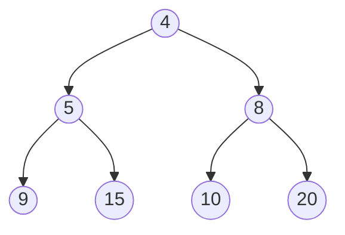

---
layout: two-cols
---
## Heap Height

* A heap `T` storing `n` entries has a height `h`.
* **Theorem:** The height `h` of a heap with `n` entries is **$\bm{O(\log n)}$**.
* **Proof Idea:**
    * A complete binary tree of height `h` has at least $1 + 2 + 4 + ... + 2^{(h-1)} + 1 = 2^h$ nodes at levels 0 to h-1.
    * So, $n \geq 2^h$. Taking $\log₂$ of both sides gives $\log_2 n \geq h$.
    * Thus, $h \leq \log_2 n$, meaning $h$ is $O(\log n)$.

<!-- 

| Level | Nodes at this Level | Total Nodes up to this Level |
| :---: | :---: | :---: |
| 0     | 1 = 20 | 1 |
| 1     | 2 = 21 | 3 |
| 2     | 4 = 22 | 7 |
| ...   | ...               | ... |
| i     | 2i     | 2i+1 - 1 |

 
A tree of height `h` has at least `2^h` nodes.
 
`n ≥ 2^h  =>  \log₂(n) ≥ h`

 -->

:: right ::

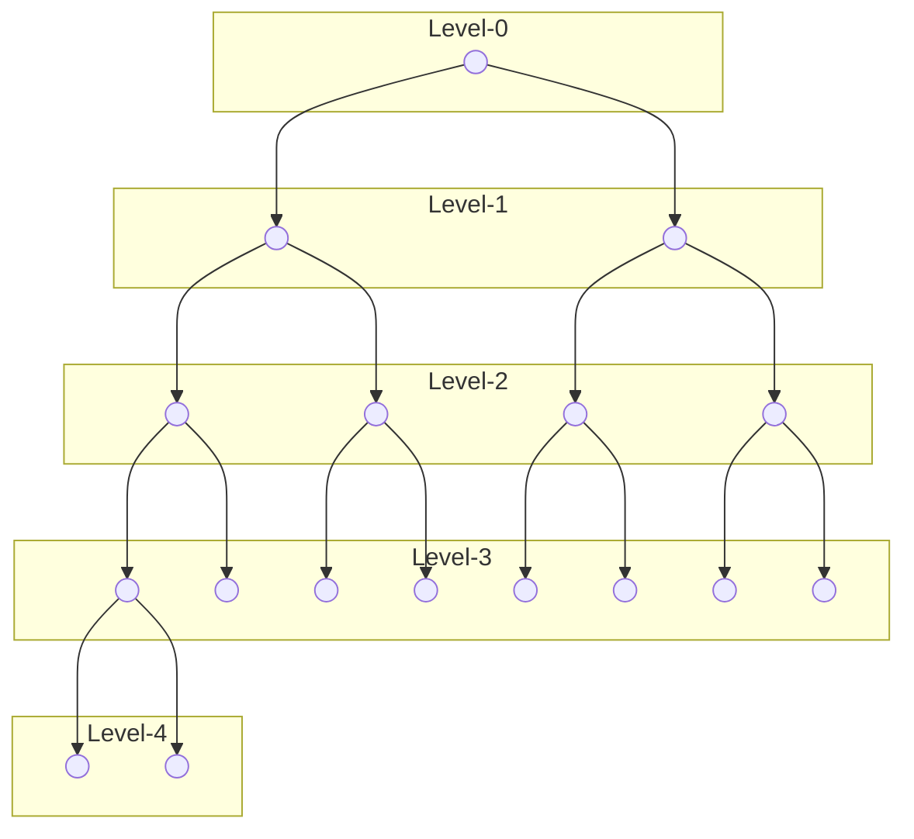

---
layout: two-cols
---

## Heap Implementation: Array-Based List

* We can represent a complete binary tree (like a heap) efficiently using an array-based list (e.g., `ArrayList`).
* Map tree nodes to array indices:
    * Root is at index 0.
    * For a node at index `i`:
        * Its left child is at index `2i + 1`.
        * Its right child is at index `2i + 2`.
        * Its parent is at index `floor((i - 1) / 2)`.
* This allows direct index calculations to navigate between parent and children, without needing explicit node objects with links.

:: right ::

**Array Representation:**

| Value | 4 | 5 | 8 | 9 | 15 | 10 | 20 |
| :---: |:-:|:-:|:-:|:-:|:--:|:--:|:--:|
| Index | 0 | 1 | 2 | 3 | 4  | 5  | 6  |

 

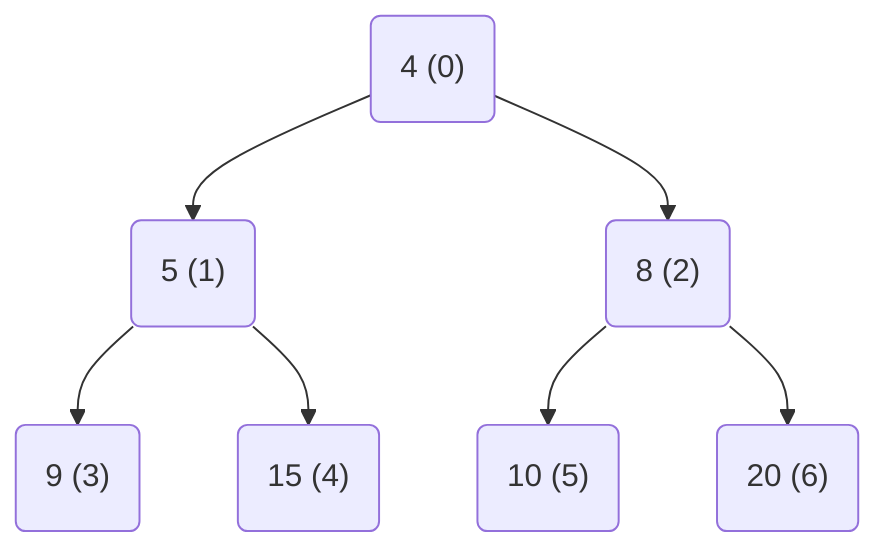

---

## Heap Operations: Insertion (`insert`)

* **Goal:** Add a new entry `(k, v)` while maintaining heap properties.
* **Method (Upheap Bubbling):**
    1.  Add the new entry to the *next available slot* at the end of the array representation (maintaining completeness). Let this position be `p`.
    2.  **Upheap:** While `p` is not the root and the key at `p` is *less than* the key at its parent:
        * Swap the entry at `p` with the entry at its parent.
        * Update `p` to be the position of its parent.
    3.  Repeat the upheap process until the heap-order property is restored.

---

## Heap Insertion Example Trace

**1. Add to End**

Insert the new key `2` into the next available position to maintain the complete tree structure.

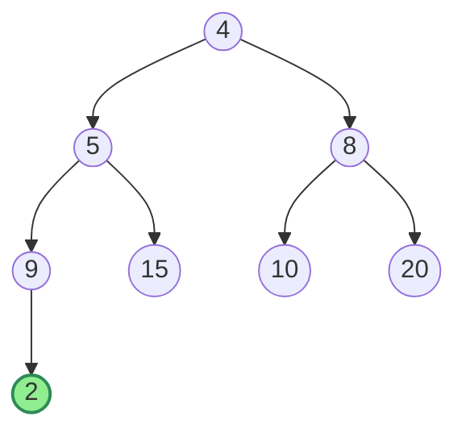

**2. Upheap Swap 1**

`2 < 9`, so swap `2` with its parent.

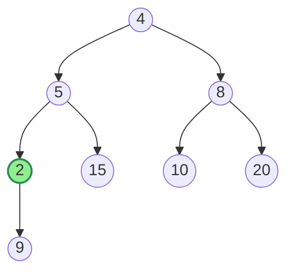

---

## Heap Insertion Example Trace (cont.)

**3. Upheap Swap 2**

`2 < 5`, so swap `2` with its new parent.

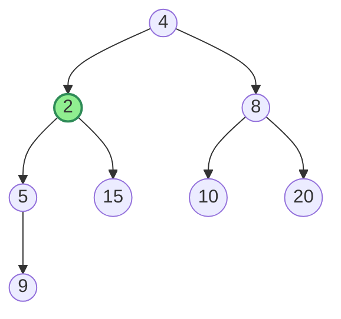

**4. Final Swap**

`2 < 4`, so swap `2` with its new parent. `2` is now the root. The heap property is restored.

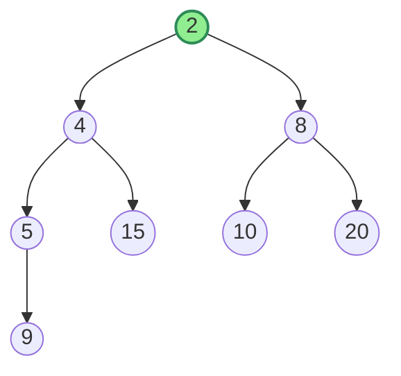

---

## Heap Operations: Removal (`removeMin`)

* **Goal:** Remove the entry with the minimum key (always at the root) while maintaining heap properties.
* **Method (Downheap Bubbling):**
    1.  Save the root entry (this is the minimum to be returned).
    2.  Move the *last* entry in the array representation to the root position (index 0). This maintains completeness but likely violates heap-order.
    3.  Remove the last entry's original position (decrease size).
    4.  **Downheap:** Let `p` be the root position (index 0). While `p` has at least one child:
        * Find the child `c` of `p` with the *smaller* key.
        * If the key at `p` is *greater than* the key at `c`:
            * Swap the entries at `p` and `c`.
            * Update `p` to be the position `c`.
        * Else (heap-order is locally satisfied): Break the loop.
    5.  Return the saved minimum entry.

---

## Heap Removal Example Trace

**1. Remove Root, Replace with Last**

Remove the root `4`. Move the last element `20` to the root position. The heap-order is now violated.
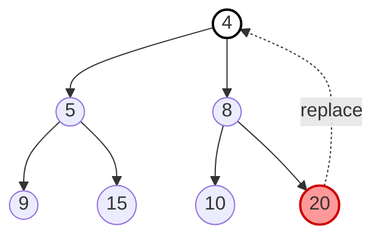
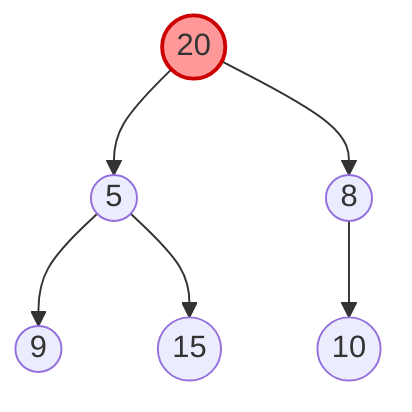

**2. Downheap Swap 1**

Compare `20` with its children (`5`, `8`). The smaller child is `5`. Since `20 > 5`, swap them.

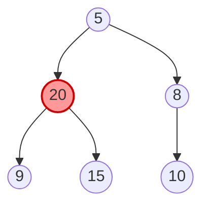

---

## Heap Removal Example Trace (cont.)

**3. Downheap Swap 2**

Compare `20` with its new children (`9`, `15`). The smaller child is `9`. Since `20 > 9`, swap them.

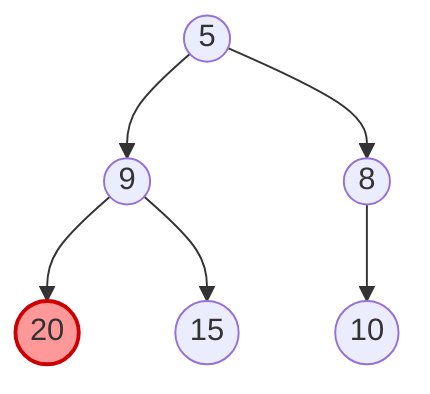

**4. Final Heap**

`20` now has no children, so the downheap process stops. The heap property is restored.

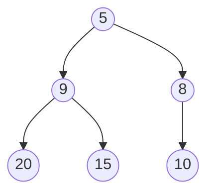

---

## Heap Performance Analysis

* The array-based list representation uses $O(n)$ space.
* **Upheap (`insert`):** The number of swaps is at most the height of the heap, `h`. Since `h` is $O(\log n)$, `insert` takes **$\bm{O(\log n)}$** time.
* **Downheap (`removeMin`):** The number of swaps is at most the height `h`. `removeMin` takes **$\bm{O(\log n)}$** time.
* **Other operations:** `size()`, `isEmpty()`, `min()` take $\bm{O(1)}$ time.

---

## Heap Sort

* Uses the heap data structure to sort a sequence `S`.
* **Algorithm:**
    1.  **Phase 1 (Heap Construction):** Insert all elements from `S` into an initially empty heap `P`.
    2.  **Phase 2 (Extraction):** Repeatedly call `P.removeMin()` and place the returned elements back into `S` in sorted order.
* **Performance:**
    * Phase 1 ($n$ inserts): $O(n \log n)$ time.
    * Phase 2 ($n$ removeMins): $O(n \log n)$ time.
    * Total Heap Sort time: **$\bm{O(n \log n)}$**.

---

## Bottom-Up Heap Construction (Optimization)

* We can build a heap from an initial array of `n` keys more efficiently than `n` individual insertions.
* **Idea:** Start from the bottom level and work upwards, enforcing the heap property locally.
* **Algorithm:**
    1.  Represent the `n` keys as a complete binary tree (in an array).
    2.  Iterate backwards from the index of the *last internal node* (`floor(n/2) - 1`) down to the root (index 0).
    3.  For each node `p` in this iteration, perform a **downheap** operation starting from `p` to fix the heap property within the subtree rooted at `p`.

---

## Bottom-Up Heap Construction Example Trace

**1. Initial Array as a Complete Tree**

Start with the array as a tree. The **last internal node** is at index `floor(n/2)-1 = 3` (value 12). We process backwards from here.

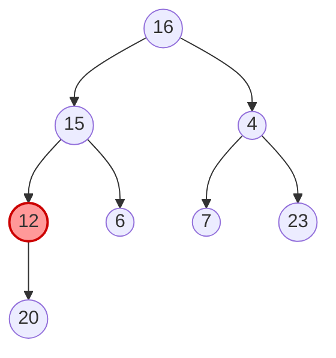

**2. Downheap from index 1 (value 15)**

Downheap at index 3 (12) and 2 (4) cause no changes. At index 1, `15` is larger than its smaller child `6`, so they are swapped.

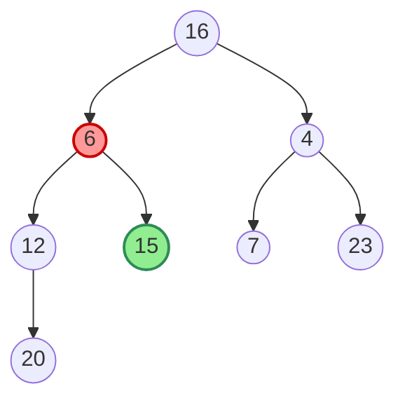

---

## Bottom-Up Heap Construction Example Trace (cont.)

**3. Downheap from index 0 (value 16)**

Downheap the root `16`. Its smaller child is `4`. Swap them. The `16` moves to index 2, but the subtree is still not a heap (`16 > 7`).

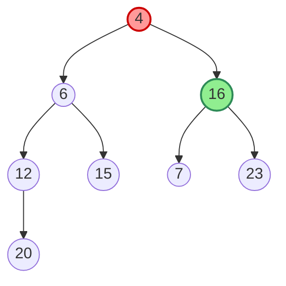

**4. Continue Downheap & Final Heap**

Continue the downheap for `16`. Its smaller child is `7`. Swap them. The heap property is now satisfied for the entire tree.

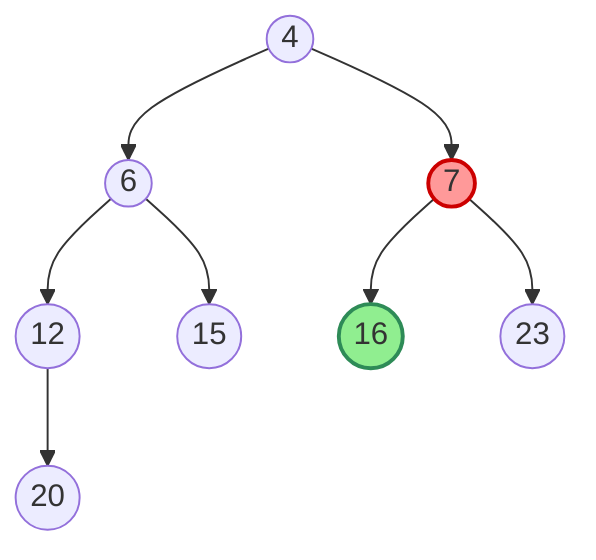

---

## Bottom-Up Heap Construction: Analysis

* **Observation:** In the bottom-up approach, elements tend to perform fewer swaps during downheap compared to the upheap process in repeated insertions. Many elements near the bottom levels don't move far, or at all.
* **Theorem:** Building a heap of `n` keys using the bottom-up construction method takes **$O(n)$** time.
* **Implication for Heap Sort:** If we use bottom-up construction ($O(n)$) followed by `n` `removeMin` operations ($O(n \log n)$), the overall Heap Sort time complexity remains **$O(n \log n)$**, but the constant factors involved in the construction phase are improved.

---

## Merging Two Heaps (Conceptual)

* **Problem:** Combine two heaps, `H₁` and `H₂`, into a single valid heap `H`.
* **Simple Approach:** Create a new heap `H`. Insert all elements from `H₁` into `H`, then insert all elements from `H₂` into `H`.
* **Complexity:** If `n₁` and `n₂` are the sizes, this takes $O(n₁ \log(n₁+n₂) + n₂ \log(n₁+n₂))$ time, roughly $O(n \log n)$ where `n = n₁ + n₂`.

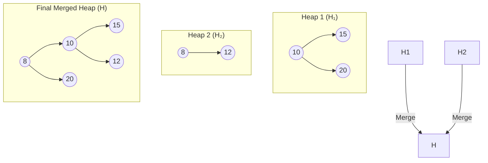

**Alternative Approach:** Efficient Merging Strategy ($O(n)$):**
1.  Concatenate the array representations of `H₁` and `H₂`.
2.  Apply the **bottom-up heap construction** algorithm to the new combined array.

---
layout: two-cols-header
transition: slide-up
---

## Summary: Heaps

::left::

*   **What is a Heap?** A binary tree that satisfies two properties:
    1.  **Heap-Order:** A node's key is less than or equal to its children's keys (for a min-heap).
    2.  **Completeness:** The tree is a complete binary tree, filled level-by-level.

*   **Implementation:** An array-based list is highly efficient due to the complete tree structure, allowing for $O(1)$ navigation between parent/child nodes.

*   **Height:** The height of a heap with `n` elements is always **$\bm{O(\log n)}$**.

::right::
<Transform scale="0.82">

**Performance**

| Operation | Performance | Method |
| :--- | :---: | :--- |
| `insert` | $O(\log n)$ | Upheap |
| `removeMin` | $O(\log n)$ | Downheap |
| `min`, `size`, `isEmpty` | $O(1)$ | Direct access |
| **Heap Sort** | **$\bm{O(n \log n)}$** | Build heap + n removals |
| **Bottom-up Build** | **$\bm{O(n)}$** | Optimized construction |

**Key Takeaway:** The heap is the ideal data structure for implementing an efficient **Priority Queue**, providing logarithmic time for insertions and removals.
</Transform>