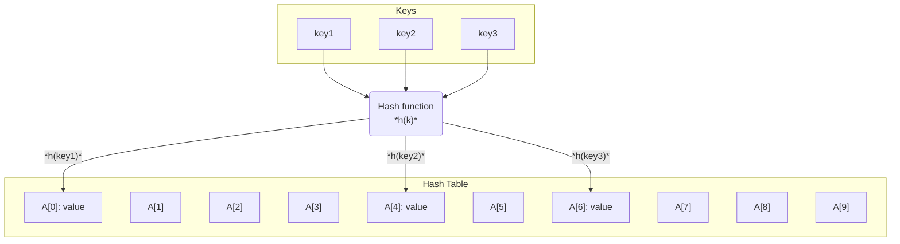
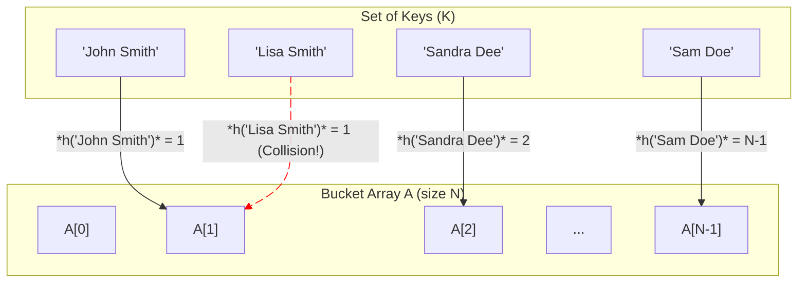
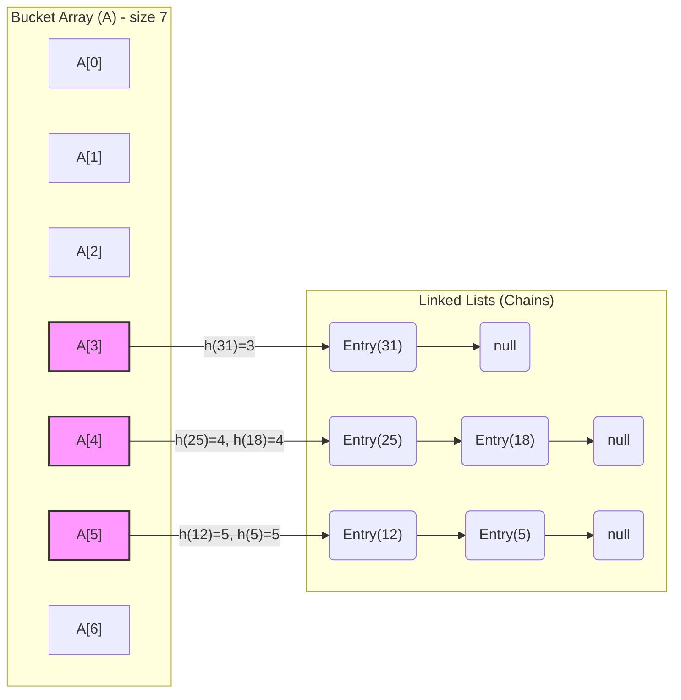
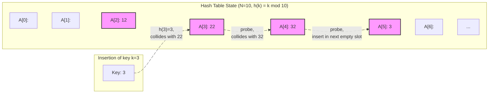
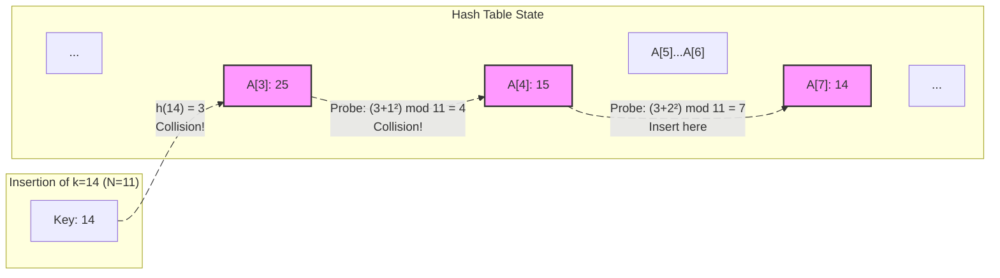
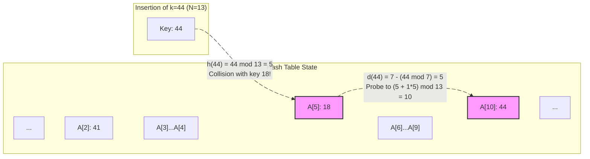

---
# Frontmatter for Slidev configuration
title: 'Hash Tables'
transition: slide-left
theme: seriph
layout: cover
background: https://cover.sli.dev
---

# Hash Tables
## {{ $slidev.configs.subject }}
### Semester {{ $slidev.configs.semester }}
 

### Presented by {{ $slidev.configs.presenter }}

---
hideInToc: false
---

## Outline

<toc mode="onlySiblings" minDepth="2" columns="2"/>

---

## Recall: The Map ADT

* **Purpose:** Stores searchable `(key, value)` entries with unique keys.
* **Core Operations:**
    * `get(k)`: Retrieve value by key.
    * `put(k, v)`: Insert/update entry.
    * `remove(k)`: Delete entry by key.
* **Other Operations:** `size()`, `isEmpty()`, `entrySet()`, `keySet()`, `values()`.
* **List-Based Implementation:** Simple but inefficient ($O(n)$ for core operations).

---

## Hash Tables: The Goal

* Aim for **$O(1)$** average time complexity for `get`, `put`, and `remove` operations.
* **Idea:** Use keys directly as indices into an array (like a simplified map where keys are 0 to N-1).
* **Challenge:** Real-world keys are often not small integers. We need a way to map arbitrary keys to array indices.

<!--

-->

---

## Hash Functions

* A **hash function h** maps keys `k` from a given set `K` to integer indices in the range `[0, N-1]`, where `N` is the size of the underlying array (the "bucket array").
* The array `A` indexed by the hash function is called a **hash table**.
* **Goal:** Map keys to indices quickly and distribute them evenly to minimize **collisions**.
* **Collision:** Occurs when two different keys $k₁$ and $k₂$ map to the same index: $h(k₁) = h(k₂)$.

---

## Hash Function Components

A hash function typically involves two parts:

1.  **Hash Code Map:** `h₁: K -> Z`
    * Maps keys `k` to arbitrary integers (can be positive, negative, or zero).

2.  **Compression Map:** `h₂: Z -> [0, N-1]`
    * Maps the integer hash codes to the valid index range `[0, N-1]` for the bucket array of size `N`.

* The final hash function is the composition: `h(k) = h₂(h₁(k))`.

---

## Hash Code Maps

* **Requirement:** For any two keys `k₁` and `k₂`, if `k₁ == k₂`, then `h₁(k₁) == h₁(k₂)`.
* **Desirable Property:** If `k₁ != k₂`, then `h₁(k₁)` should ideally be different from `h₁(k₂)`. (A good hash code minimizes collisions at this stage).

---

## Hash Code Examples

* **Memory Address:** Use the object's memory address (converted to an integer) as the hash code. This is the default in Java for objects that don't override `hashCode()`. Good for distinct objects, but `k₁ == k₂` might not imply the same address if `equals` is overridden.
* **Integer Casting:** Directly cast integer-like keys (e.g., `byte`, `short`, `int`, `char`) to `int`.
* **Component Sum:** For types with fixed-length numeric components (like `long`), sum the components using integer arithmetic (ignoring overflow). Example: `long` -> `(int)(high_bits + low_bits)`.
* **Polynomial Hash Codes:** Treat components of the key (like characters in a string) as coefficients of a polynomial `p(z)`. Evaluate `p(a)` for a fixed non-zero constant `a`. This spreads out hash codes well.
    * For string `s = c₀c₁...cₚ₋₁`: `h₁(s) = c₀aᵖ⁻¹ + c₁aᵖ⁻² + ... + cₚ₋₂a + cₚ₋₁`.
    * Horner's rule provides an efficient O(p) way to compute this.
    * Choosing `a=33, 37, 39, 41` often works well in practice.

---

## Polynomial Hashing in Java

* Java's `String.hashCode()` uses a polynomial hash code like:
    `s₀ * 31ⁿ⁻¹ + s₁ * 31ⁿ⁻² + ... + sₙ₋₁`
* Many other built-in Java classes (like `Integer`, `Float`, `Date`) provide well-designed `hashCode()` implementations.
* **Important:** If you override the `equals(Object other)` method in your custom class, you **must** also override `hashCode()` consistently. If `a.equals(b)` is true, then `a.hashCode()` must equal `b.hashCode()`.

---

## Compression Maps

* **Goal:** Map integer hash codes (which can be large or negative) into the range `[0, N-1]`.
* **Common Methods:**
    1.  **Division Method:** `h₂(y) = |y| mod N`.
        * Simple and fast.
        * **Caution:** Choosing `N` as a prime number not close to a power of 2 helps distribute keys more uniformly, especially if keys have patterns.
    2.  **MAD (Multiply, Add, and Divide):** `h₂(y) = |ay + b| mod N`.
        * `a` and `b` are non-negative integers with `a mod N != 0`.
        * Generally performs better than the simple division method.

---

## Collision Handling

* What happens when `h(k₁) = h(k₂)` for `k₁ != k₂`?
* **Strategies:**
    1.  **Separate Chaining:** Each bucket `A[i]` stores a reference to a secondary container (e.g., a list) holding all entries that hash to index `i`.
    2.  **Open Addressing (Probing):** Store entries directly in the bucket array `A`. If a collision occurs at index `i`, probe for alternative available slots using a defined sequence.

---
layout: two-cols-header
---

## Separate Chaining

:: left ::

* Each bucket `A[i]` points to a list (or other map implementation) storing entries `(k, v)` where `h(k) = i`.
* **To perform `get(k)`, `put(k, v)`, `remove(k)`:**
    1. Calculate the hash index `i = h(k)`.
    2. Delegate the operation to the secondary map stored at `A[i]`.
* **Load Factor:** $α = n / N$ (number of entries / number of buckets). Aim to keep `α` small (e.g., `α < 0.9`).
* **Performance:** Assuming a good hash function, operations take **$O(1 + α)$** expected time. If $α$ is constant, this is **$O(1)$** expected time.

:: right ::

---

## Open Addressing: Linear Probing

* Store entries directly in the bucket array `A`.
* **Collision Handling:** If bucket `A[i]` is occupied when trying to insert key `k` (where `h(k)=i`), try the next available slot in sequence: `A[(i + 1) mod N]`, `A[(i + 2) mod N]`, ...
* **Search (`get(k)`):** Start probing at `i = h(k)`. Continue probing `(i + j) mod N` until the key `k` is found, an empty slot is found (key not present), or the entire table is scanned.
* **Deletion (`remove(k)`):** Cannot simply empty the slot, as this could break search paths. Need to mark the slot with a special "AVAILABLE" marker (a "tombstone").
* **Problem:** Linear probing can lead to **clustering**, where occupied slots group together, increasing probe lengths and degrading performance.

---

## Open Addressing: Quadratic Probing

* **Collision Handling:** If bucket `A[i]` is occupied, probe using a quadratic sequence: `A[(i + 1²) mod N]`, `A[(i + 2²) mod N]`, `A[(i + 3²) mod N]`, ...
* Helps alleviate primary clustering compared to linear probing.
* **Secondary Clustering:** Can still occur if multiple keys initially hash to the same index `i`.
* **Theorem:** If `N` is prime and the load factor `α < 1/2`, quadratic probing will always find an empty slot.

---

## Open Addressing: Double Hashing

* **Collision Handling:** Use a *secondary* hash function `d(k)`. If bucket `A[i]` (where `i = h(k)`) is occupied, probe using the sequence: `A[(i + 1*d(k)) mod N]`, `A[(i + 2*d(k)) mod N]`, `A[(i + 3*d(k)) mod N]`, ...
* The secondary hash function `d(k)` should:
    * Never evaluate to 0.
    * Be different from the primary hash function `h(k)`.
* **Common choice:** `d(k) = q - (k mod q)`, where `q < N` is a prime number.
* Distributes probes more effectively, reducing clustering issues seen in linear and quadratic probing.

---
layout: two-cols
---

## Double Hashing Example

* `N = 13`
* `h(k) = k mod 13`
* `d(k) = 7 - (k mod 7)`
* Insert keys: 18, 41, 22, 44, 59, 32, 31, 73

| Key (k) | h(k) | d(k) | Probes (Indices)       | Final index  |
| :---- | :--- | :--- | :--------------------- | ----------: |
| 18    | 5    | 3    | 5                      | 5           |
| 41    | 2    | 1    | 2                      | 2           |
| 22    | 9    | 6    | 9                      | 9           |
| 44    | 5    | 5    | 5 → (5+5)%13 = 10     | 10          |

:: right ::

| Key (k) | h(k) | d(k) | Probes (Indices)       | Final index  |
| :---- | :--- | :--- | :--------------------- | ----------: |
| 59    | 7    | 4    | 7                      | 7           |
| 32    | 6    | 3    | 6                      | 6           |
| 31    | 5    | 4    | 5 → 9 → (5+2*4)%13 = 0 | 0           |
| 73    | 8    | 4    | 8                      | 8           |

---

## Performance of Hash Tables

* **Worst Case:** $O(n)$ time if all keys collide into the same bucket (or cluster badly in open addressing).
* **Expected/Average Case (with good hash function & load factor α):**
    * **Separate Chaining:** O(1 + α). If α is constant (e.g., < 0.9), this is **$O(1)$**.
    * **Open Addressing:** Depends heavily on the load factor and probing strategy. Roughly $O(1 / (1 - α))$. Performance degrades significantly as α approaches 1. Requires `α < 1`.
* **Space:** $O(n + N)$ - proportional to the number of entries plus the size of the bucket array.

* **Rehashing:** If the load factor `α` gets too high, performance degrades. We can resize the table (usually doubling `N` to the next prime) and re-insert all entries using the new hash function (based on the new `N`). This is an $O(n + N)$ operation but keeps the average performance good.

---
layout: two-cols
---

## Summary: Hast Tables

*   **Hash Tables** are incredibly powerful, providing **$O(1)$ average-case** performance for `get`, `put`, and `remove`.
    *   This is achieved by mapping keys to array indices via a **hash function**.
    *   **Collisions** are inevitable and handled with **Separate Chaining** or **Open Addressing**.
    *   Performance depends on a good hash function and a low **load factor** (managed by **rehashing**).

:: right ::
*   **The Limitation:** Hash tables are **unordered**.
    *   Cannot efficiently find the minimum/maximum key.
    *   Cannot find all keys within a range `[k₁, k₂]`.
    *   Iterating through keys yields no predictable order.
*   **What if we need to maintain order?**
    *   **Binary Search Trees (BSTs)** store entries in a way that preserves the natural ordering of keys.
    *   They provide **$O(\log n)$** performance for core operations but also support efficient ordered operations like finding min/max and range queries.
