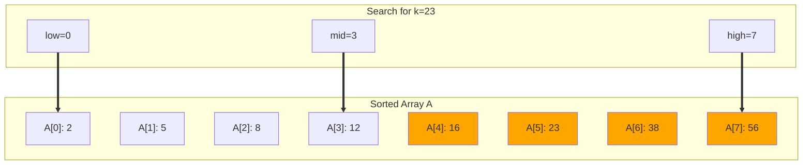
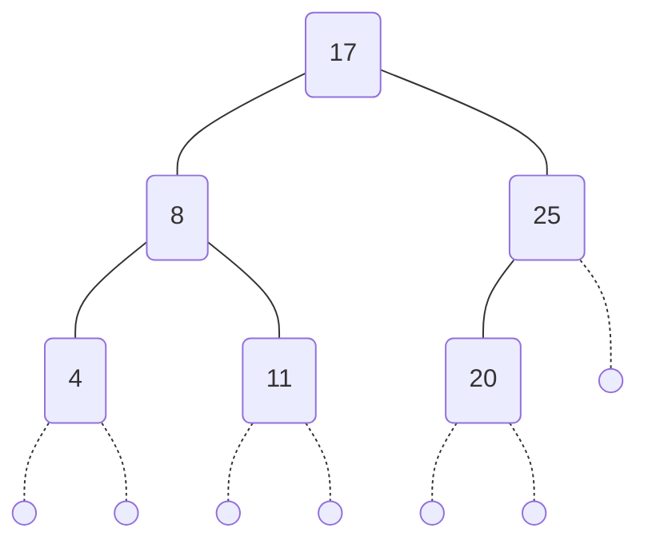
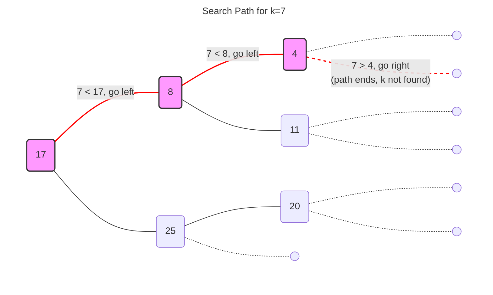
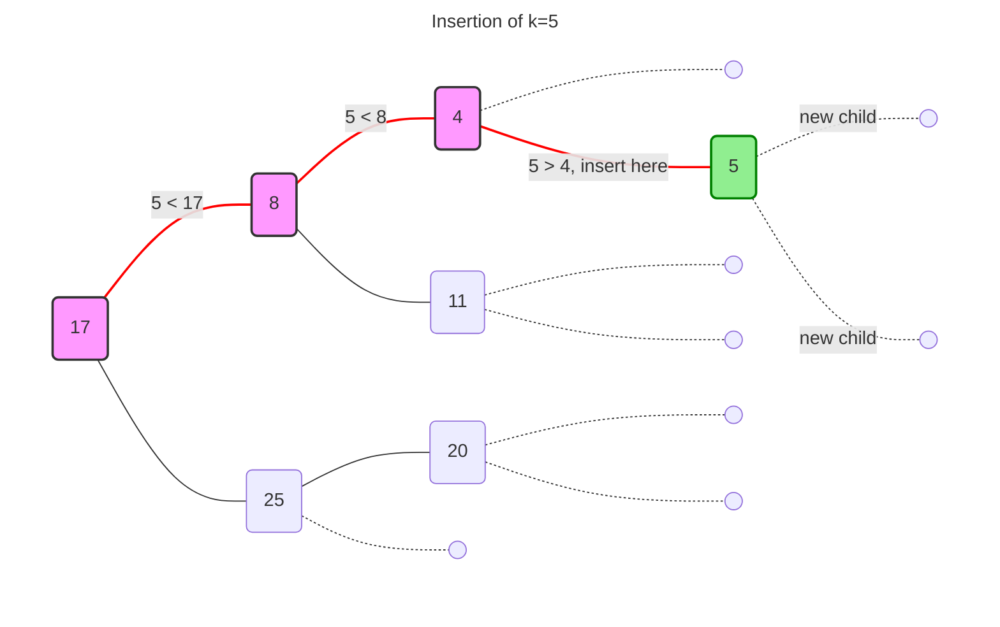
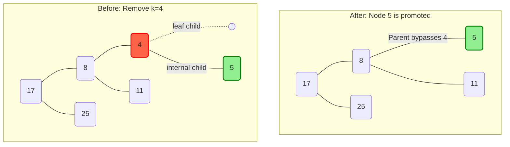
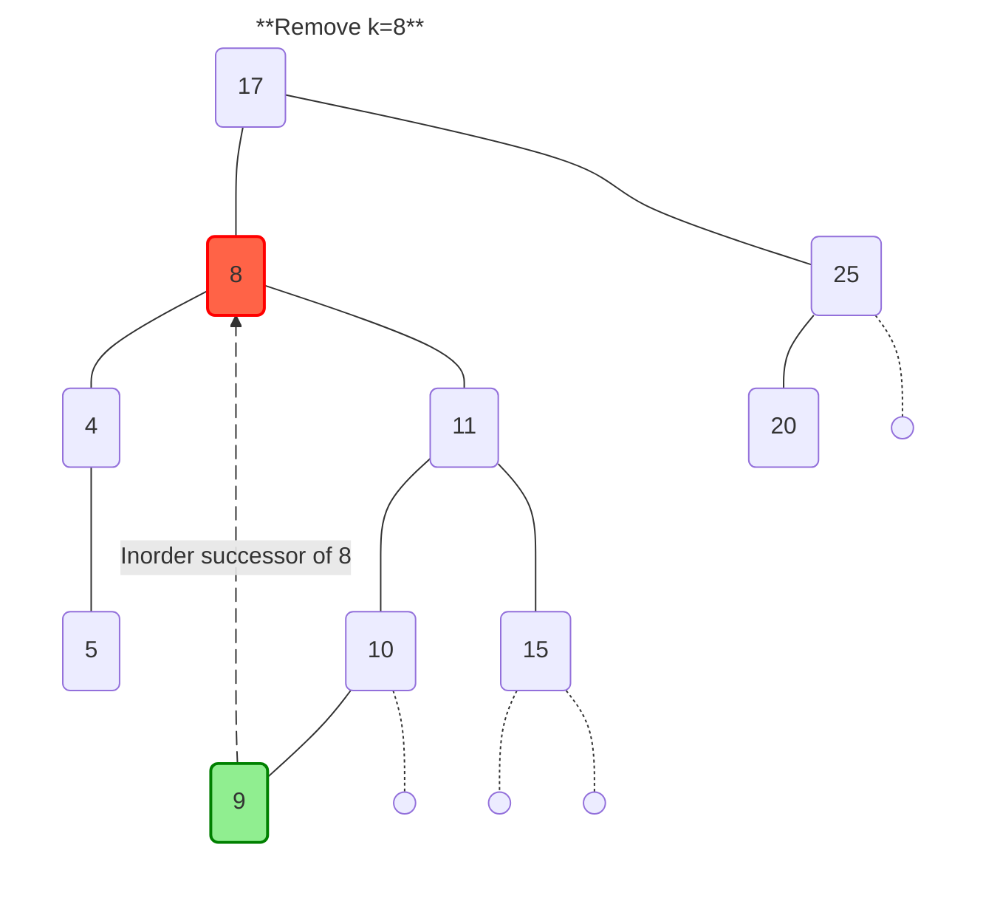

---
# Frontmatter for Slidev configuration
title: 'Binary Search Trees'
transition: slide-left
theme: seriph
layout: cover
background: https://cover.sli.dev
---

# Binary Search Trees
## {{ $slidev.configs.subject }}
### Semester {{ $slidev.configs.semester }}
<br>

### Presented by {{ $slidev.configs.presenter }}

---
hideInToc: false
---

## Outline

<toc mode="onlySiblings" minDepth="2" columns="1"/>


---

## Ordered Maps

* In ordered maps, keys are assumed to have a **total order** (they can be compared).
* Entries are stored based on the order of their keys.
* This structure allows for efficient **nearest neighbor queries**:
    * Finding the entry with the largest key less than or equal to a target `k`.
    * Finding the entry with the smallest key greater than or equal to a target `k`.

---

## Binary Search (Review)

* An efficient algorithm for searching in a *sorted* array (or list).
* **Process:**
    1. Compare the target key `k` with the middle element.
    2. If it's a match, we're done.
    3. If `k` is smaller, search the left half.
    4. If `k` is larger, search the right half.
* Each step halves the number of potential candidates.
* Time complexity: **$O(log n)$**.



---
layout: two-cols
---

## Binary Search Trees (BST)

* A **binary search tree** is a binary tree where entries `(key, value)` are stored at the internal nodes.
* It satisfies the **Binary Search Tree Property:** For any node `p`:
    * Keys in the *left* subtree of `p` are *less than or equal to* the key at `p`.
    * Keys in the *right* subtree of `p` are *greater than or equal to* the key at `p`.
* External nodes (leaves) typically don't store entries (they act as placeholders).
* An **inorder traversal** of a BST visits the keys in non-decreasing order.

:: right ::



---
layout: two-cols
---

## Searching in a BST

* **Goal:** Find an entry with key `k`.
* **Algorithm `TreeSearch(k, p)`:** (`p` = root)

```java
Algorithm TreeSearch(k, p):
  if p is an external node then
    return p // Key k not found, reached a leaf placeholder

  if k == key(p) then
    return p // Found key k at position p

  else if k < key(p) then // Recurse on the left child
    return TreeSearch(k, leftChild(p))

  else // k > key(p) // Recurse on the right child
    return TreeSearch(k, rightChild(p))

```

* The search path follows a single path down from the root.
* Time complexity: $O(h)$, where `h` is the height of the tree.

:: right ::



---
layout: two-cols
---

## Insertion into a BST

* **Goal:** Insert a new entry `(k, v)` while maintaining the BST property.
* **Algorithm:**
    1. Search for key `k` using `TreeSearch`. Let `w` be the leaf node reached.
    2. If `w` is an external node (placeholder):
        * Replace `w` with a new internal node storing `(k, v)`.
        * Add two new external nodes as children of this new node.
    3. If `w` is an internal node:
        * Update the value at `w` to `v`.
* Time complexity: $O(h)$.

:: right ::



---
layout: two-cols
---

## Deletion from a BST (Case 1: Leaf Child)

* **Goal:** Remove the entry with key `k`.
* **Algorithm Step 1:** Search for `k`. Let `v` be the node storing `k`.
* **Case 1:** If node `v` has at least one child `w` that is an external node (leaf):
    1. Remove `v` and its leaf child `w` from the tree.
    2. Promote the *other* child of `v` (which could be internal or external) to take `v`'s place in the tree (connect it to `v`'s parent).
* Time complexity: $O(h)$.

:: right ::



---
layout: two-cols
---

## Deletion from a BST (Case 2: Two Internal Children)

* **Case 2:** If the node `v` (storing key `k` to be removed) has two *internal* children:
    1. Find the node `w` that immediately *follows* `v` in an inorder traversal. Node `w` will be the leftmost node in `v`'s right subtree and is guaranteed to have at most one internal child.
    2. Copy the entry `(key(w), value(w))` from node `w` into node `v`.
    3. Remove node `w` using the logic from Case 1 (since `w` has at least one leaf child).
* Time complexity: $O(h)$.

:: right ::



---

## Performance of Binary Search Trees

* A BST with `n` entries has height `h`.
* **Space:** $O(n)$.
* **`get`, `put`, `remove`:** $O(h)$ time complexity.
* **Crucial Point:** The height `h` depends on the shape of the tree!
    * **Best Case (Balanced Tree):** `h` is $O(\log n)$. Operations are efficient.
    * **Worst Case (Skewed Tree):** `h` can be $O(n)$ (like a linked list). Operations degrade to $O(n)$.
* **Conclusion:** Standard BSTs work well on average if keys are inserted randomly, but performance can be poor for certain insertion sequences. **Balanced** search trees (like AVL trees, Red-Black trees) are needed to guarantee O(log n) worst-case performance.

---

## Map Implementation Comparison

| Implementation | `get`/`put`/`remove` (Avg) | `get`/`put`/`remove` (Worst) | Ordered Operations? | When to Use? |
| :--- | :---: | :---: | :---: | :--- |
| **Unsorted List** | $O(n)$ | $O(n)$ | No | Simple, for very small datasets. |
| **Hash Table** | **$O(1)$** | $O(n)$ | No | **Fastest access.** When order doesn't matter. |
| **Binary Search Tree** | $O(\log n)$ | $O(n)$ | **Yes** | When order is needed, and data is expected to be random. |

*   **Hash Tables** offer the best average-case performance but provide no key ordering.
*   **Binary Search Tree** provide a great compromise: very good performance ($O(\log n)$) and ordered key traversal.
