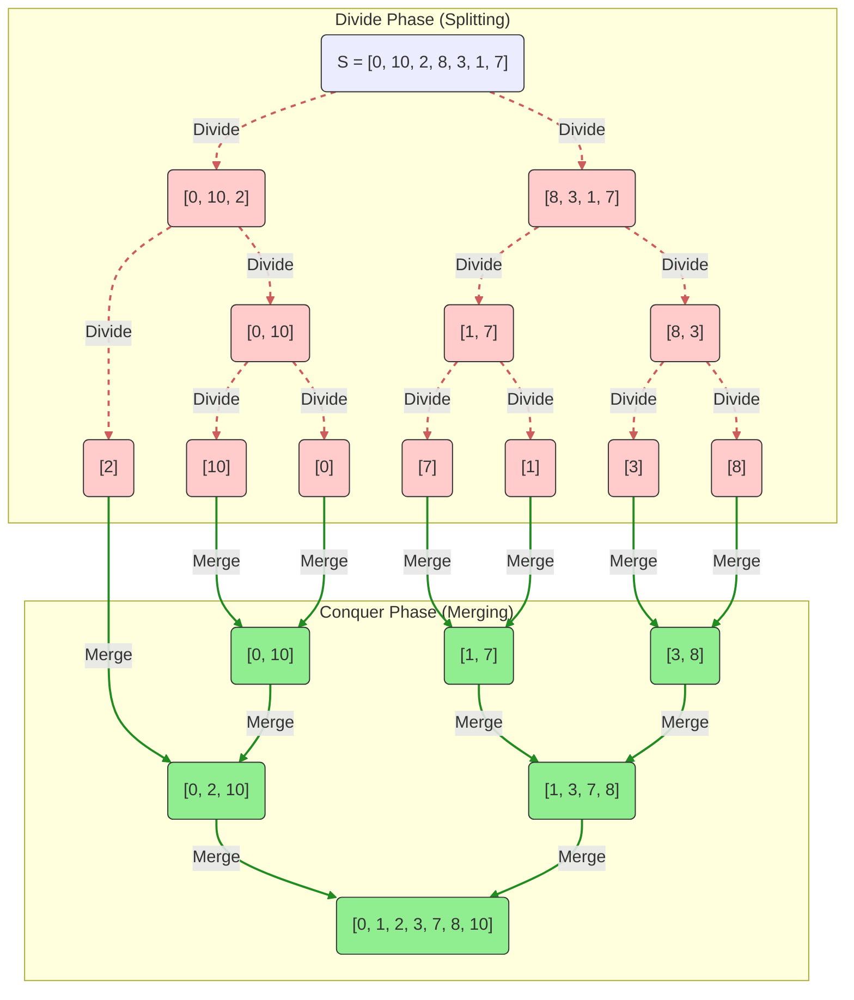
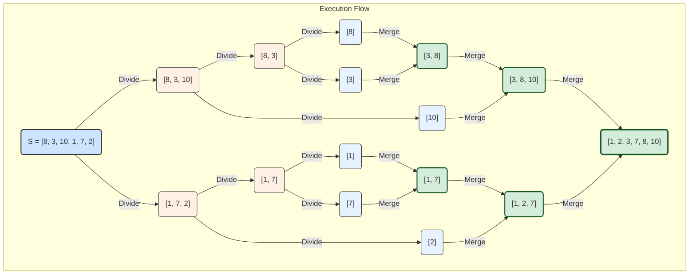
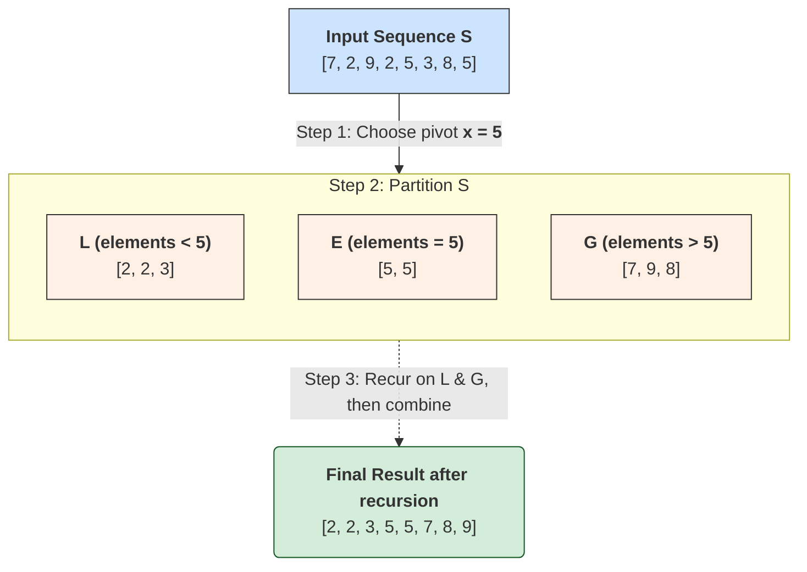
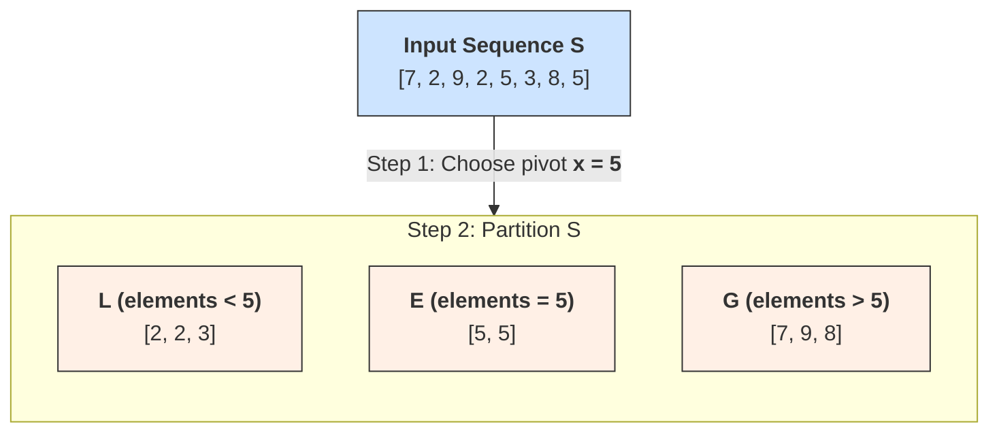
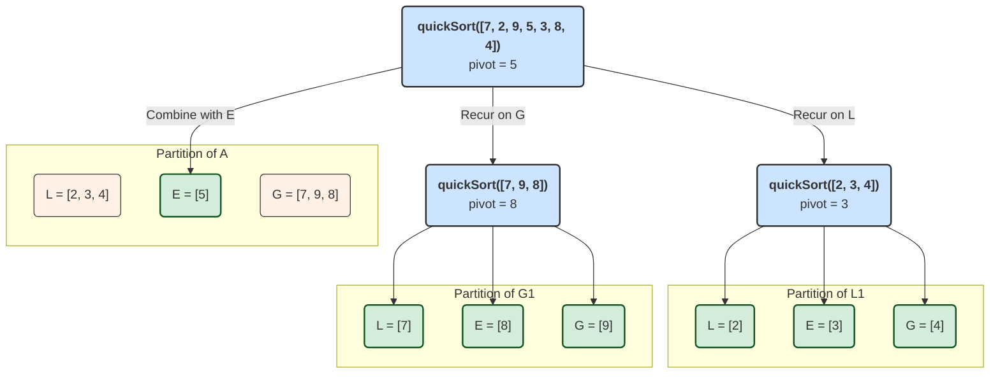
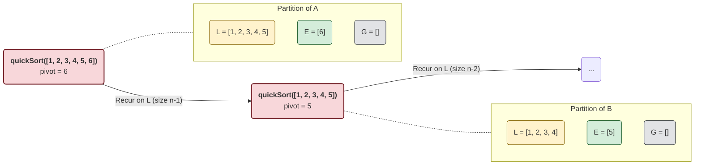
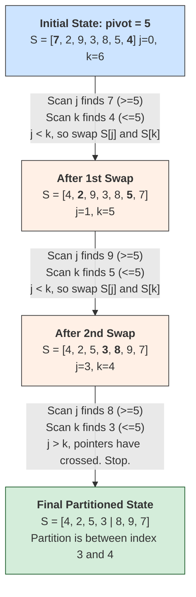

---
# Frontmatter for Slidev configuration
title: 'Merge Sort and Quick Sort'
transition: slide-left
theme: seriph
layout: cover
background: https://cover.sli.dev
---

# Merge Sort and Quick Sort
## {{ $slidev.configs.subject }}
### Semester {{ $slidev.configs.semester }}
 

### Presented by {{ $slidev.configs.presenter }}

---
hideInToc: false
---

## Outline

<toc mode="onlySiblings" minDepth="2" columns="1"/>

---

## Merge Sort: Overview

* A sorting algorithm based on the divide-and-conquer paradigm.
* **Key Characteristics:**
    * Achieves $O(n\log n)$ running time (like Heap Sort).
    * Does not require an auxiliary priority queue (unlike Heap Sort).
    * Accesses data sequentially, making it suitable for sorting large datasets that might reside on disk.  
* **Divide-and-Conquer Strategy**
    * A general algorithm design approach:
        1.  **Divide:** Split the input data `S` into two (or more) disjoint subsets, `S₁` and `S₂`.
        2.  **Recur:** Solve the subproblems associated with `S₁` and `S₂` recursively.
        3.  **Conquer:** Combine the solutions for `S₁` and `S₂` to form the final solution for `S`.
    * **Base Case:** The recursion stops when subproblems reach a trivial size (e.g., 0 or 1 element).

---
layout: two-cols
---

## Merge Sort: Algorithm Steps

1.  **Divide:** If the input sequence `S` has 0 or 1 element, it's already sorted (base case). Otherwise, split `S` into two sequences, `S₁` and `S₂`, of roughly equal size (n/2 elements each).
2.  **Recur:** Recursively sort `S₁` and `S₂`.
3.  **Conquer:** Merge the two sorted sequences `S₁` and `S₂` back into a single sorted sequence `S`.

:: right ::

---

## Merging Two Sorted Sequences

* The core "conquer" step involves merging two already sorted sequences, `A` and `B`, into a single sorted sequence `S`.
* **Algorithm:**
    1. Use pointers (or indices) `i` for `A` and `j` for `B`, both starting at the beginning.
    2. While both `A` and `B` have elements remaining:
        * Compare `A[i]` and `B[j]`.
        * Copy the smaller element to the next position in the sequence `S`.
        * Advance the pointer (`i` or `j`) corresponding to the sequence from which the element was copied.
    3. Once one sequence is exhausted, copy all remaining elements from the other sequence into `S`.
* This merge process takes **$O(n₁ + n₂)$** time, where `n₁` and `n₂` are the lengths of `A` and `B`.

```mermaid {scale: 0.4}
graph TD
    subgraph IS["Initial State"]
        style A1 fill:#e6f2ff,stroke:#333
        style B1 fill:#e6f2ff,stroke:#333
        style S1 fill:#fff0e6,stroke:#333
        A1["A: [<b>3</b>, 8, 12]<br/>i=0"]
        B1["B: [<b>5</b>, 7]<br/>j=0"]
        S1["S: [ ]"]
    end

    IS -- "Compare A[i] and B[j]<br/>3 < 5, so move A[i] to S" --> ST2

    subgraph ST2["Step 2"]
        style A2 fill:#e6f2ff,stroke:#333
        style B2 fill:#e6f2ff,stroke:#333
        style S2 fill:#fff0e6,stroke:#333
        S2["S: [3]"]
        A2["A: [3, <b>8</b>, 12]<br/>i=1"]
        B2["B: [<b>5</b>, 7]<br/>j=0"]
    end

    ST2 -- "Compare A[i] and B[j]<br/>5 < 8, so move B[j] to S" --> ST3

    subgraph ST3["Step 3"]
        style A3 fill:#e6f2ff,stroke:#333
        style B3 fill:#e6f2ff,stroke:#333
        style S3 fill:#fff0e6,stroke:#333
        S3["S: [3, 5]"]
        A3["A: [3, <b>8</b>, 12]<br/>i=1"]
        B3["B: [5, <b>7</b>]<br/>j=1"]
    end

    ST3 -- "Compare A[i] and B[j]<br/>7 < 8, so move B[j] to S" --> ST4

    subgraph ST4["Step 4"]
        style A4 fill:#e6f2ff,stroke:#333
        style B4 fill:#e6f2ff,stroke:#333
        style S4 fill:#fff0e6,stroke:#333
        S4["S: [3, 5, 7]"]
        A4["A: [3, <b>8</b>, 12]<br/>i=1"]
        B4["B: [5, 7]<br/>j=2 (exhausted)"]
    end

    ST4 -- "List B is exhausted.<br/>Copy all remaining elements from A." --> ST5

    subgraph ST5["Step 5: Final Result"]
        style S5 fill:#d4edda,stroke:#155724
        S5["S: [3, 5, 7, 8, 12]"]
    end

```

---
hide: true
---

## Merge Sort: Tree Representation

* The execution of merge sort can be visualized as a binary tree.
* Each node represents a recursive call and the sequence it processes.
* The leaves represent the base cases (sequences of size 0 or 1).
* The merging step corresponds to combining results from child nodes.

---

## Merge Sort: Performance Analysis

* Let $T(n)$ be the running time for sorting $n$ elements.
* **Recurrence Relation:**
    * $T(n) = 2 * T(n/2) + cn$ (if $n$ > 1)
    * $T(n) = b$ (if n <= 1)
    * Where $cn$ represents the time for dividing and merging (linear time).
* **Solving the Recurrence:** By analyzing the execution tree:
    * The height of the tree is $O(\log n)$.
    * The total work done at each level $i$ is $O(n)$.
    * Total time = Sum of work at all levels = $O(n\log n)$.
* **Conclusion:** Merge sort has a time complexity of **$O(n \log n)$**.

---

## Quick Sort: Overview

* Another sorting algorithm based on the divide-and-conquer strategy.
* Often faster in practice than Merge Sort, though its worst-case performance is $O(n²)$.
* **Key Characteristics:**
    * Sorts "in-place" (modifies the input array directly, minimal extra space).
    * Uses randomization to improve the likelihood of good performance.

---
layout: two-cols
---

## Quick Sort: Algorithm Steps

1.  **Divide:**
    * Choose a random element `x` from the input sequence `S`, called the **pivot**.
    * Partition `S` into three subsequences:
        * `L`: Elements less than `x`.
        * `E`: Elements equal to `x`.
        * `G`: Elements greater than `x`.
2.  **Recur:** Recursively sort sequences `L` and `G`.
3.  **Conquer:** Combine the sorted `L`, `E`, and `G` sequences back together. (This step is trivial as they are already in the correct relative order).

:: right ::

---

## Quick Sort: Partitioning

* The core step is partitioning the sequence `S` based on the chosen pivot `x`.
* **Goal:** Rearrange `S` so all elements `< x` come first, followed by elements `= x`, followed by elements `> x`.
* This can be done in **$O(n)$** time by scanning the sequence.

---

## Quick Sort: Tree Representation

* Similar to Merge Sort, the execution can be visualized as a tree.
* Each node represents a recursive call on a subsequence.
* The choice of pivot determines how the sequence is split at each node.

---

## Quick Sort: Worst-Case Scenario

* Occurs when the chosen pivot consistently results in highly unbalanced partitions (e.g., always picking the smallest or largest element).
* One subproblem might have size `n-1` and the other size 0.
* **Recurrence Relation:** $T(n) = T(n-1) + T(0) + cn ≈ T(n-1) + cn$.
* This leads to a total time complexity of **$O(n²)$**.
  

---

## Quick Sort: Expected Performance

* **Randomization:** Choosing the pivot randomly makes the worst-case scenario very unlikely.
* **Expected Running Time:** With randomized pivots, the expected time complexity of Quick Sort is **$O(n \log n)$**.
* **Intuition:** On average, a random pivot will split the sequence into reasonably balanced subsequences (e.g., roughly 1/4 and 3/4), leading to logarithmic depth in the execution tree.
* The total expected work across all levels remains $O(n \log n)$.

---

## In-Place Quick Sort

* A variation that modifies the input array directly, using O(1) extra space (excluding the recursion stack).
* **In-Place Partitioning:** A clever technique to partition the subarray `S[l...r]` around a pivot `x` without using auxiliary arrays.
    * Uses two indices, `j` starting from `l` and `k` starting from `r`.
    * Scan `j` rightwards until `S[j] >= x`.
    * Scan `k` leftwards until `S[k] <= x`.
    * If `j < k`, swap `S[j]` and `S[k]`.
    * Repeat until `j` and `k` cross.
    * This partitions the array into elements `<= x` and elements `>= x`. (A further step can separate the `= x` elements if needed).
* **Recursive Calls:** Recurse on the subarrays corresponding to `L` and `G`.

---
layout: two-cols-header
---

## Summary: Merge Sort vs. Quick Sort

:: left ::

### Merge Sort

*   **Time Complexity:** **$O(n \log n)$** in all cases (worst, average, best).
*   **Space Complexity:** **$O(n)$** for the auxiliary array needed for merging.
*   **In-place:** No, the standard algorithm is not in-place.
*   **Stability:** Stable (maintains relative order of equal elements).
*   **Key Idea:** Always divides the array in half, does the main work in the "conquer" (merge) step.
*   **Use Case:** Excellent for external sorting (data on disk) and when worst-case guarantees are essential.

:: right ::

### Quick Sort

*   **Time Complexity:**
    *   **$O(n \log n)$** on average and in the best case.
    *   **$O(n^2)$** in the worst case (rare with random pivot).
*   **Space Complexity:** **$O(\log n)$** for the recursion stack in the in-place version.
*   **In-place:** Yes, common implementations.
*   **Stability:** Not stable.
*   **Key Idea:** Divides the array based on a pivot, does the main work in the "divide" (partition) step.
*   **Use Case:** Generally faster in practice for in-memory arrays due to better cache performance and lower constant factors.
