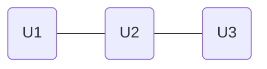
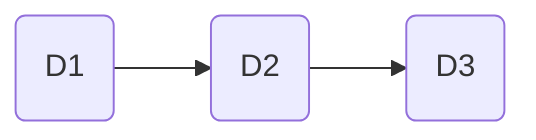
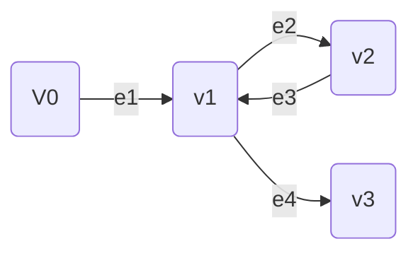
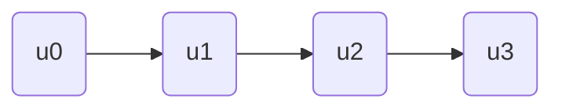
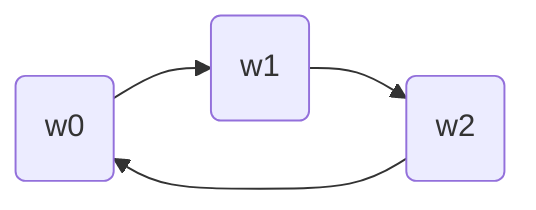
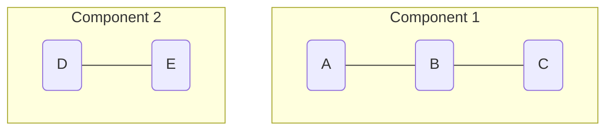
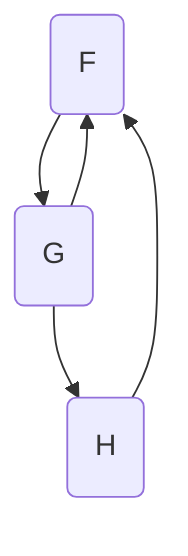
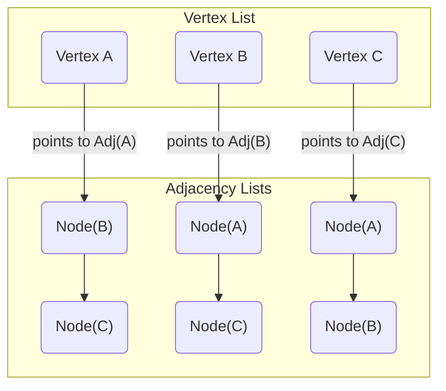
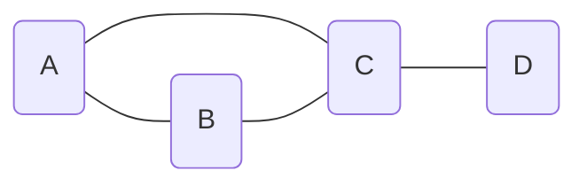
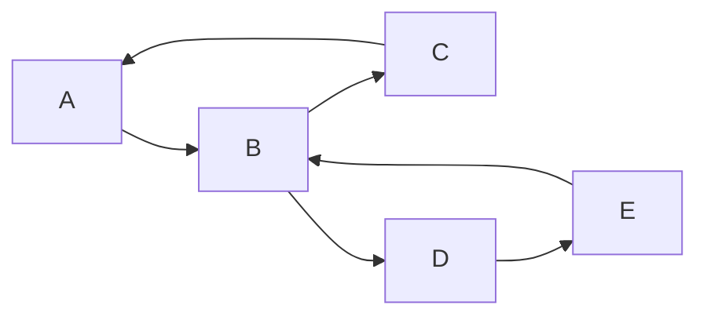

---
# Frontmatter for Slidev configuration
title: 'Graphs'
transition: slide-left
theme: seriph
layout: cover
background: https://cover.sli.dev
---

# Graphs
## {{ $slidev.configs.subject }}
### Semester {{ $slidev.configs.semester }}
<br>

### Presented by {{ $slidev.configs.presenter }}

---
hideInToc: false
---

## Outline

<toc mode="onlySiblings" minDepth="2" columns="3"/>

---
layout: two-cols
---

## What is a Graph?

* A **graph** `G` is a structure composed of two main parts:
    * A set `V` of **vertices** (nodes).
    * A collection `E` of **edges**, where each edge connects a pair of vertices.
* Both vertices and edges can store data elements.
* **Example:** Modeling flight routes - vertices are airports (storing airport codes), edges are flight paths (storing mileage).

:: right ::


---

## Types of Edges

* **Directed Edge:** An ordered pair `(u, v)`, where `u` is the **origin** and `v` is the **destination**. Represents a one-way connection (e.g., a specific flight).
* **Undirected Edge:** An unordered pair `(u, v)`, representing a two-way connection (e.g., a general flight route exists between two cities).
* **Directed Graph (Digraph):** A graph where all edges are directed.
* **Undirected Graph:** A graph where all edges are undirected.

<div class="grid grid-cols-2 gap-8 items-start">
<div>

**Undirected Graph**
* Edges like `(U1, U2)` are unordered, representing a two-way relationship.


</div>
<div>

**Directed Graph (Digraph)**
* Edges like `(D1, D2)` are ordered, representing a one-way relationship from D1 to D2.


</div>
</div>
---
layout: two-cols
---

## Graph Terminology

* **Endpoints:** The two vertices connected by an edge.
* **Incident:** An edge is incident on its endpoints.
* **Adjacent Vertices:** Two vertices connected by an edge.
* **Degree (Undirected):** The number of edges incident on a vertex `v`, denoted `deg(v)`.
* **Out-degree (Directed):** The number of edges originating *from* vertex `v`, denoted `out_degree(v)`.
* **In-degree (Directed):** The number of edges terminating *at* vertex `v`, denoted `in_degree(v)`.
* **Parallel Edges:** Two or more edges connecting the same pair of vertices.

:: right ::

* **Self-Loop:** An edge connecting a vertex to itself.
* **Simple Graph:** A graph with no parallel edges or self-loops.

<br>


---

## Graph Properties

Let $n$ be the number of vertices ($|V|$) and $m$ be the number of edges ($|E|$).

* **Property 1 (Sum of Degrees):** $Σ \text{deg}(v) = 2m$ (for undirected graphs). Each edge contributes to the degree of two vertices.
* **Property 2 (Sum of In/Out-Degrees):** `Σ out_degree(v) = Σ in_degree(v) = m` (for directed graphs). Each edge has one origin and one destination.
* **Property 3 (Edge Bounds - Undirected Simple Graph):** In a simple undirected graph with `n >= 1` vertices, `0 <= m <= n(n-1)/2`. The maximum number of edges occurs when every vertex is connected to every other vertex.
* **Property 4 (Edge Bounds - Directed Simple Graph):** In a simple directed graph with `n >= 1` vertices, `0 <= m <= n(n-1)`. Each pair `(u, v)` can have two directed edges (`(u,v)` and `(v,u)`).

* **Notation:** We typically use `n` for the number of vertices and `m` for the number of edges.

---

## Paths and Cycles

* **Path:** A sequence of alternating vertices and edges `(v₀, e₁, v₁, e₂, ..., eₖ, vₖ)` such that edge `eᵢ` connects vertices `vᵢ₋₁` and `vᵢ`.
* **Simple Path:** A path where all vertices (except possibly the first and last) are distinct.
* **Cycle:** A path where the start and end vertices are the same (`v₀ = vₖ`) and the path is simple otherwise.
* **Directed Path/Cycle:** Follows the direction of edges.

<div class="grid grid-cols-3 gap-4 items-start">
<div>

**Path**
<p class="text-sm">A sequence of vertices and edges. Vertices can be repeated (e.g., <b>v1</b>).</p>

</div>
<div>

**Simple Path**
<p class="text-sm">A path where all vertices are distinct.</p>

</div>
<div>

**Cycle**
<p class="text-sm">A simple path that starts and ends at the same vertex.</p>

</div>
</div>

---

## Connectivity

* **Connected (Undirected):** An undirected graph is connected if there is a path between any two distinct vertices.
* **Connected Components:** The maximal connected subgraphs of an unconnected graph.
* **Strongly Connected (Directed):** A directed graph is strongly connected if there is a directed path from `u` to `v` AND a directed path from `v` to `u` for every pair of vertices `(u, v)`.
* **Subgraph:** A graph `H` whose vertices and edges are subsets of another graph `G`.
* **Spanning Subgraph:** A subgraph `H` of `G` that includes *all* vertices of `G`.

---

## Connectivity: Examples


<div class="grid grid-cols-2 gap-8 items-start">
<div>

**Connected Components**
<p class="text-sm">An unconnected graph with two maximal connected subgraphs (components).</p>


</div>
<div>

**Strongly Connected Graph**
<p class="text-sm">For any two vertices `u` and `v`, there is a path from `u` to `v` and from `v` to `u`.</p>


</div>
</div>

---

## Vertices and Edges as Objects

* We can model graphs using object-oriented principles.
* Define `Vertex` and `Edge` classes (or interfaces).
* Each `Vertex` object stores its element and potentially references to incident edges.
* Each `Edge` object stores its element and references to its endpoint vertices.

---
layout: two-cols-header
---

## The Graph ADT

Defines core operations for manipulating graph structures:
:: left ::
<Transform scale="0.9">

* **Accessor Methods:**
    * `numVertices()`, `numEdges()`: Return counts.
    * `vertices()`: Return an iterable collection of all vertices.
    * `edges()`: Return an iterable collection of all edges.
* **Edge-Specific Accessors:**
    * `getEdge(u, v)`: Return the edge connecting `u` and `v` (null if none).
    * `endVertices(e)`: Return an array/pair containing the endpoints of edge `e`.
    * `opposite(v, e)`: Given vertex `v` and incident edge `e`, return the *other* endpoint of `e`.
</Transform>

:: right ::

<Transform scale="0.9">

* **Vertex-Specific Accessors:**
    * `outDegree(v)`, `inDegree(v)`: Return degrees (relevant for directed/undirected).
    * `outgoingEdges(v)`, `incomingEdges(v)`: Return iterables of edges incident to `v`.
* **Update Methods:**
    * `insertVertex(element)`: Create and add a new vertex, return it.
    * `insertEdge(u, v, element)`: Create and add a new edge between `u` and `v`, return it.
    * `removeVertex(v)`: Remove vertex `v` and all its incident edges.
    * `removeEdge(e)`: Remove edge `e`.

</Transform>

---
layout: two-cols-header
---

## Graph Implementation: Edge List Structure
:: left ::
* **Concept:** Maintain separate collections (e.g., lists) for vertices and edges.
    * **Vertex Object:** Stores its element and potentially its position within the vertex list.
    * **Edge Object:** Stores its element, references to its two endpoint `Vertex` objects, and potentially its position within the edge list.


:: right ::
* **Performance:**
    * Finding vertices/edges incident to a vertex requires iterating through the *entire* edge list ($O(m)$ time).
    * `getEdge(u, v)` also takes $O(m)$ time.
    * Vertex/edge insertion/removal is generally fast ($O(1)$) if using lists that support fast end operations).
    * Space: $O(n + m)$.


---
layout: two-cols
---

## Graph Implementation: Adjacency List Structure

<Transform scale="0.8">


* **Concept:** Augments the edge list by storing, *with each vertex*, a list of its adjacent vertices (or incident edges).
    * **Vertex Object:** Stores element, position, and a reference to its adjacency list.
    * **Edge Object:** Stores element, endpoints, positions in relevant adjacency lists, position in the main edge list.
* **Performance:**
    * Finding incident edges/adjacent vertices for `v` is efficient: O(degree(v)) time.
    * `getEdge(u, v)` takes O(min(deg(u), deg(v))) time.
    * Vertex/edge insertion/removal is generally $O(1)$ amortized time.
    * Space: $O(n + m)$. (Standard representation for sparse graphs).
</Transform>

:: right ::



---
layout: two-cols-header
---

## Graph Implementation: Adjacency Matrix Structure

* **Concept:** Use a 2D array (matrix) `A` where `A[i][j]` stores information about the edge between vertex `vᵢ` and vertex `vⱼ`.

:: left ::

* Vertices are mapped to indices 0 to n-1.
* `A[i][j]` can store:
    * A boolean (edge exists or not).
    * An integer (e.g., edge weight).
    * A reference to the `Edge` object.
* **Performance:**
    * `getEdge(u, v)` takes $O(1)$ time.
    * Finding incident edges/adjacent vertices for `v` requires scanning a row/column ($O(n)$ time).
    * Vertex/edge insertion/removal is O(1).
    * Space: **$O(n²)$**. Efficient only for *dense* graphs where `m` is close to `n²`.

:: right ::

**Corresponding Adjacency Matrix**

`M[i][j] = 1` if an edge exists, `0` otherwise.

<Transform scale="0.8">

<table class="w-full text-center text-sm"><thead>
  <tr class="font-bold"><td></td><td>A</td><td>B</td><td>C</td><td>D</td></tr></thead>
  <tbody> 
  <tr><td class="font-bold">A</td><td>0</td><td>1</td><td>1</td><td>0</td></tr>
  <tr><td class="font-bold">B</td><td>1</td><td>0</td><td>1</td><td>0</td></tr>
  <tr><td class="font-bold">C</td><td>1</td><td>1</td><td>0</td><td>1</td></tr>
  <tr><td class="font-bold">D</td><td>0</td><td>0</td><td>1</td><td>0</td></tr>
  </tbody>
</table>

</Transform>

---

## Performance Trade-offs
<Transform scale="0.8">

| **Operation**           | Edge List | Adjacency List | Adjacency Matrix |
| :------------------ | :-------- | :------------- | :--------------- |
| Space               | $O(n+m)$    | $O(n+m)$         | $O(n²)$            |
| `numVertices`, `numEdges` | $O(1)$ | $O(1)$ | $O(1)$ |
| `vertices`, `edges` | $O(n), O(m)$| $O(n), O(m)$ | $O(n), O(n²)$ |
| `getEdge`           | $O(m)$      | $O(\text{min}(\text{deg}\space u, \text{deg}\space v))$ | $O(1)$ |
| `incidentEdges(v)`  | $O(m)$      | $O(\text{deg}\space v)$       | $O(n)$             |
| `areAdjacent(u,v)`  | $O(m)$      | $O(\text{min}(\text{deg}\space u, \text{deg}\space v))$ | $O(1)$ |
| `insertVertex`      | $O(1)$      | $O(1)$           | $O(n²)$ |
| `insertEdge`        | $O(1)$      | $O(1)$           | $O(1)$             |
| `removeVertex(v)`   | $O(m)$      | $O(\text{deg}\space v)$       | $O(n²)$ |
| `removeEdge(e)`     | $O(1)$      | $O(1)$           | $O(1)$             |

</Transform>

---

## Graph Traversal: Depth-First Search (DFS)

* **Concept:** Explores the graph by going as deep as possible along a path before backtracking. Similar to preorder traversal of a tree.
* Uses recursion and marks vertices/edges as visited/unvisited.
* **Algorithm `DFS(G, u)`:** (Start at vertex `u`)

```text
Algorithm DFS(G, u):
  Mark u as VISITED
  Perform pre-visit action on u // Optional

  for each edge e incident on u:
    if edge e is UNEXPLORED then
      v = opposite(u, e)
      if vertex v is UNEXPLORED then
        Mark e as DISCOVERY edge
        DFS(G, v) // Recursive call
      else
        Mark e as BACK edge // Edge leads to an already visited vertex

  Perform post-visit action on u // Optional

```

* **Output:** Labels edges as "discovery" (forming a spanning tree) or "back" edges.

---

## Example: Depth-First Search (DFS)

<div class="grid grid-cols-2 gap-4 items-center">
<div>

**Original Graph**

</div>
<div>

**DFS Result (starting from A)**
<p class="text-sm">Discovery edges form a spanning tree. A back edge indicates a cycle.</p>

</div>
</div>

---

## DFS Properties

DFS from a vertex `v` explores as deeply as possible before backtracking. This leads to several characteristic properties.

*   **Completeness:** `DFS(G, v)` visits all vertices and edges in the connected component of `v`.

*   **Spanning Forest:** The *discovery edges* form a spanning forest (or a spanning tree if the graph is connected). The DFS tree is typically deep and narrow.

*   **Cycle Detection:** A non-discovery edge `(u, w)` is a **back edge** if `w` is an ancestor of `u` in the DFS tree. The presence of a back edge indicates a cycle.

*   **Time Complexity:** $O(n + m)$ when using an adjacency list representation.


---

## DFS Applications

* Finding paths between vertices.
* Finding connected components.
* Finding cycles in a graph.
* Computing spanning forests/trees.

---
layout: two-cols
---

## Path Finding using DFS

* Adapt DFS to find a path from `u` to `z`.
* Use a stack `S` to keep track of the current path.
* When moving from `v` to `w`, push `w` onto `S`.
* If `w == z`, the path is found (contents of `S`).
* If backtracking from `v`, pop `v` from `S`.

:: right ::

```text
Algorithm pathDFS(G, v, z, S): // S is the stack
  Mark v as VISITED
  Push v onto S
  if v == z then
    return true // Path found

  for each edge e incident on v:
    if edge e is UNEXPLORED then
      w = opposite(v, e)
      if vertex w is UNEXPLORED then
        Mark e as DISCOVERY
        if pathDFS(G, w, z, S) then
          return true // Path found downstream
      // else: Mark e as BACK (optional)

  Pop v from S // Backtracking
  return false // Path not found from v

```

---
layout: two-cols
---
## Cycle Finding using DFS

* Adapt DFS to detect cycles.
* A back edge `(v, w)` indicates a cycle involving the path in the DFS tree from `w` to `v` plus the back edge `(v, w)`.
* Modify the path-finding DFS: When a back edge `(v, w)` is encountered, the cycle consists of the elements currently on the stack from `w` up to `v`, plus `w` again.

:: right ::

```text
Algorithm cycleDFS(G, v, S): // S is the stack
  Mark v as VISITED
  Push v onto S

  for each edge e incident on v:
    if edge e is UNEXPLORED then
      w = opposite(v, e)
      if vertex w is UNEXPLORED then
        Mark e as DISCOVERY
        result = cycleDFS(G, w, S)
        if result is not null then return result // Cycle found downstream
      else // Edge e is a BACK edge to visited vertex w
        // Construct cycle from stack S from w to v
        cycle_path = extract_stack_segment(S, w, v)
        return cycle_path

  Pop v from S // Backtracking
  return null // No cycle found involving v

```

---
layout: two-cols
---

## Graph Traversal: Breadth-First Search (BFS)

* **Concept:** Explores the graph layer by layer, visiting all neighbors at the current "distance" before moving to the next layer.
* Uses a **queue** to manage vertices to be visited.
* **Output:** Partitions edges into "discovery" and "cross" edges. Also computes distances (shortest path length) from the start vertex `s`.


:: right ::
* **Algorithm `BFS(G, s)`:** (Start at vertex `s`)


```text
Algorithm BFS(G, s):
  Initialize all vertices/edges as UNEXPLORED
  Create an empty queue Q
  Mark s as VISITED
  Enqueue s into Q

  while Q is not empty:
    u = Q.dequeue()
    Perform visit action on u // Optional

    for each edge e incident on u:
      if edge e is UNEXPLORED then
        v = opposite(u, e)
        if vertex v is UNEXPLORED then
          Mark v as VISITED
          Mark e as DISCOVERY edge
          Enqueue v into Q
        else
          Mark e as CROSS edge // Edge connects vertices already visited but not parent/child

```

---

## Example: Breadth-First Search (BFS)

<div class="grid grid-cols-2 gap-4 items-center">
<div>

**Original Graph**

</div>
  <div>

**BFS Result (starting from A)**

<p class="text-sm">Discovery edges form a spanning tree. Cross edges connect vertices at the same or adjacent levels.</p>


  </div>
  </div>

---
layout: default
---

## BFS Properties

BFS from a source `s` has several key properties related to path lengths and the structure of the resulting spanning tree.

*   **Completeness:** `BFS(G, s)` visits all vertices and edges in the connected component of `s`.
*   **Spanning Tree:** The discovery edges form a spanning tree ($T_s$) for the connected component of `s`.
*   **Shortest Paths:** BFS discovers paths with the minimum number of edges from `s` to all other reachable vertices. The `level` of a vertex corresponds to the length of this shortest path.
*   **Level Property:** For any edge `(u, v)`, the levels of `u` and `v` differ by at most 1.
    *   `level(v) <= level(u) + 1`
*   **Cross Edges:** A non-discovery edge `(u, v)` (a cross edge) connects vertices `u` and `v` where either `level(v) = level(u)` or `level(v) = level(u) + 1`.
*   **Time Complexity:** $O(n + m)$ with an adjacency list.

---

## BFS Applications

* Finding paths with the minimum number of edges (shortest paths in unweighted graphs).
* Finding connected components.
* Computing spanning forests/trees.
* Testing bipartiteness.

---

## DFS vs. BFS Comparison

| Feature         | DFS                                 | BFS                                     |
| :------------------ | :---------------------------------- | :-------------------------------------- |
| Data Structure  | Stack (implicit via recursion)      | Queue                                   |
| Exploration     | Goes deep first                     | Explores layer by layer                 |
| Spanning Tree   | Typically deep and narrow           | Typically shallow and wide              |
| Shortest Paths  | No (finds *a* path)                 | Yes (finds shortest path in edge count) |
| Memory (Worst)  | $O(n)$ (recursion depth)              | $O(n)$ (queue size, can be large)         |

---

## Spanning Trees: DFS vs. BFS

<div class="grid grid-cols-3 gap-4 items-start text-center mt-4">
<div>

**Original Graph**

</div>
<div>

**DFS Spanning Tree**
<p class="text-sm">Explores as deep as possible first, resulting in a "tall" tree.</p>

</div>
<div>

**BFS Spanning Tree**
<p class="text-sm">Explores layer by layer, resulting in a "wide" tree.</p>

</div>
</div>
---

## Digraphs (Directed Graphs)

* All concepts (paths, cycles, traversals) apply, but edge directions must be respected.
* **Reachability:** Can vertex `w` be reached from vertex `v`? Solved by DFS or BFS starting from `v`.
* **Strong Connectivity:** Can `u` reach `v` AND `v` reach `u` for all pairs? Requires more complex algorithms (e.g., running DFS twice or using Kosaraju's/Tarjan's algorithm).
<br><br>


---

## Transitive Closure

* **Concept:** Computes reachability for *all* pairs of vertices.
* **Output:** A graph `G*` where an edge `(u, v)` exists in `G*` if and only if there is a directed path from `u` to `v` in the original graph `G`.
* **Algorithms:** 
    1.  Run DFS/BFS starting from *each* vertex `v`. Time: $O(n(n+m))$.
    2.  **Floyd-Warshall Algorithm:** Dynamic programming approach. Computes reachability iteratively. Time: $O(n³)$. More suitable for dense graphs.

---
layout: two-cols
---

## Floyd-Warshall Algorithm


* **Idea:** Number vertices 1 to `n`. Compute graph `Gₖ` where edges represent paths using only intermediate vertices from 1, ..., k.
* **Iteration:** `G₀ = G`. Compute `Gₖ` from `Gₖ₋₁`. An edge `(i, j)` exists in `Gₖ` if:
    * It exists in `Gₖ₋₁` OR
    * Both edges `(i, k)` and `(k, j)` exist in `Gₖ₋₁`.
* Final result is `Gₙ`.
* Uses boolean adjacency matrices.

:: right ::

```text
Algorithm FloydWarshall(G):
  Initialize G₀ = AdjacencyMatrix(G)
  for k from 1 to n:
    Initialize Gₖ = Gₖ₋₁
    for i from 1 to n (where i != k):
      for j from 1 to n (where j != i, k):
        // Check if path i -> k -> j exists
        if Gₖ₋₁[i][k] AND Gₖ₋₁[k][j] then
          Gₖ[i][j] = true // Add edge (i, j) if path exists

  return Gₙ // The transitive closure matrix

```

* Time complexity: $O(n³)$.

---
layout: two-cols
---

### Floyd-Warshall: Initial State (G₀)

Here is the initial directed graph `G`. The vertices are numbered 1 to 4.

The transitive closure will be built by iteratively considering each vertex as an intermediate point in a path.

:: right ::

**G₀ = G**
```mermaid
graph TD
    subgraph V["V = {1, 2, 3, 4}"]
        1((1))
        2((2))
        3((3))
        4((4))
    end
    2 --> 1
    1 --> 3
    3 --> 2
    1 --> 4
    4 --> 3
    
    style V fill-opacity:0,stroke:#0,stroke-width:0
```

---
layout: two-cols
---

### Floyd-Warshall: Iteration k=1 (G₁)

**Intermediate Vertex: 1**

We check for paths of the form `i -> 1 -> j`.
* Path `2 -> 1 -> 3` exists. Add edge `(2, 3)`.
* Path `2 -> 1 -> 4` exists. Add edge `(2, 4)`.

The new edges are shown in red.

:: right ::

**G₁**
```mermaid
graph TD
    subgraph V["V = {1, 2, 3, 4}"]
        1((1))
        2((2))
        3((3))
        4((4))
    end
    2 --> 1
    1 --> 3
    3 --> 2
    1 --> 4
    4 --> 3
    2 -- "new" --> 3
    2 -- "new" --> 4

    linkStyle 5 stroke:red,stroke-width:2px
    linkStyle 6 stroke:red,stroke-width:2px
    style V fill-opacity:0,stroke:#0,stroke-width:0

```

---
layout: two-cols
---

### Floyd-Warshall: Iteration k=2 (G₂)

**Intermediate Vertex: 2**

We check for paths of the form `i -> 2 -> j` using edges from `G₁`.
* Path `3 -> 2 -> 1` exists. Add edge `(3, 1)`.
* Path `3 -> 2 -> 3` exists. Add edge `(3, 3)` (a cycle).
* Path `3 -> 2 -> 4` exists. Add edge `(3, 4)`.

:: right ::

**G₂**
```mermaid {scale: 0.9}
graph TD
    subgraph V["V = {1, 2, 3, 4}"]
        1((1))
        2((2))
        3((3))
        4((4))
    end
    2 --> 1
    1 --> 3
    3 --> 2
    1 --> 4
    4 --> 3
    2 --> 3
    2 --> 4
    3 -- "new" --> 1
    3 -- "new" --> 3
    3 -- "new" --> 4

    linkStyle 7 stroke:red,stroke-width:2px
    linkStyle 8 stroke:red,stroke-width:2px
    linkStyle 9 stroke:red,stroke-width:2px
    style V fill-opacity:0,stroke:#0,stroke-width:0

```

---
layout: two-cols
---

### Floyd-Warshall: Iteration k=3 (G₃)

**Intermediate Vertex: 3**

We check for paths of the form `i -> 3 -> j` using edges from `G₂`.
* `1 -> 3 -> 1` adds `(1, 1)`.
* `1 -> 3 -> 2` adds `(1, 2)`.
* `2 -> 3 -> 2` adds `(2, 2)`.
* `4 -> 3 -> 1` adds `(4, 1)`.
* `4 -> 3 -> 2` adds `(4, 2)`.
* `4 -> 3 -> 4` adds `(4, 4)`.
Many existing paths are reconfirmed, like `1 -> 3 -> 4`.

:: right ::

**G₃**
```mermaid
graph TD
    1((1)); 2((2)); 3((3)); 4((4));
    2-->1; 1-->3; 3-->2; 1-->4; 4-->3; 2-->3; 2-->4; 3-->1; 3-->3; 3-->4;
    1 -- "new" --> 1
    1 -- "new" --> 2
    2 -- "new" --> 2
    4 -- "new" --> 1
    4 -- "new" --> 2
    4 -- "new" --> 4

    linkStyle 10 stroke:red,stroke-width:2px
    linkStyle 11 stroke:red,stroke-width:2px
    linkStyle 12 stroke:red,stroke-width:2px
    linkStyle 13 stroke:red,stroke-width:2px
    linkStyle 14 stroke:red,stroke-width:2px
    linkStyle 15 stroke:red,stroke-width:2px
```

---
layout: two-cols
---

### Floyd-Warshall: Iteration k=4 (G₄)

**Intermediate Vertex: 4**

We check for paths of the form `i -> 4 -> j` using edges from `G₃`. No new edges are added in this iteration, as all possible paths are already accounted for. `G₄` is the final transitive closure of the graph.

:: right ::

**G₄ - Final Transitive Closure**
```mermaid
graph TD
    1((1)); 2((2)); 3((3)); 4((4));
    1-->1; 1-->2; 1-->3; 1-->4;
    2-->1; 2-->2; 2-->3; 2-->4;
    3-->1; 3-->2; 3-->3; 3-->4;
    4-->1; 4-->2; 4-->3; 4-->4;
```


---
layout: default
---

## Summary

*   **Graphs** are fundamental structures modeling relationships, composed of **vertices** and **edges**.
*   Edges can be **directed** or **undirected**, leading to different graph types.
*   We use specific **terminology** (degree, path, cycle) to describe graph characteristics.
*   The **Graph ADT** defines a common interface for graph operations.
*   Graphs can be implemented using **edge lists**, **adjacency lists**, or **adjacency matrices**, each with different performance trade-offs.
*   **DFS** and **BFS** are two fundamental traversal algorithms with distinct properties and applications.
    *   DFS is recursive, stack-based, and good for path-finding and cycle detection via back edges.
    *   BFS is iterative, queue-based, and finds shortest paths in unweighted graphs.
*   **Transitive Closure** computes all-pairs reachability, with the **Floyd-Warshall algorithm** being a classic solution.
