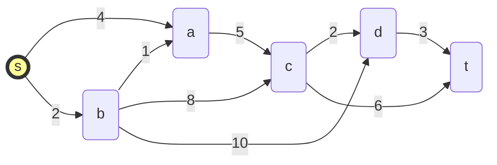
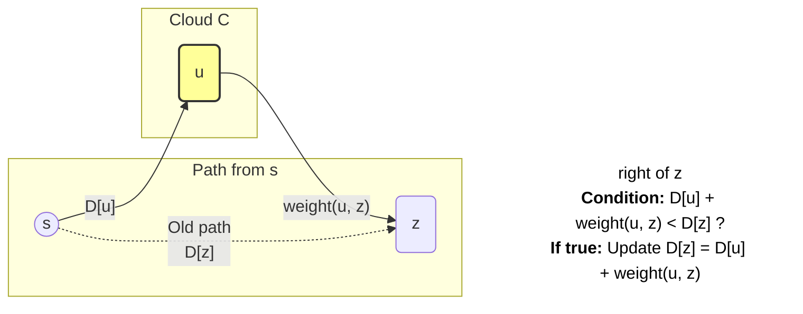
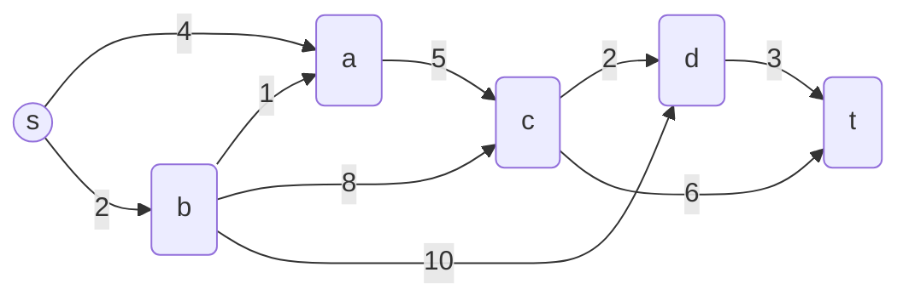
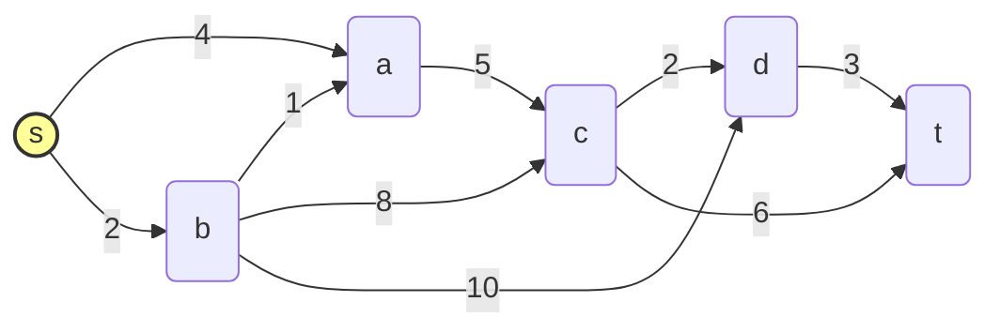
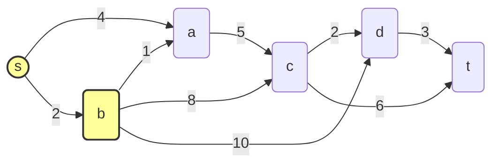
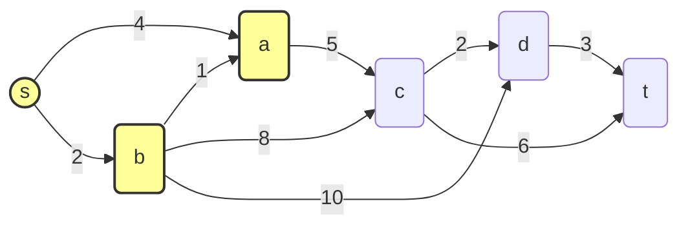
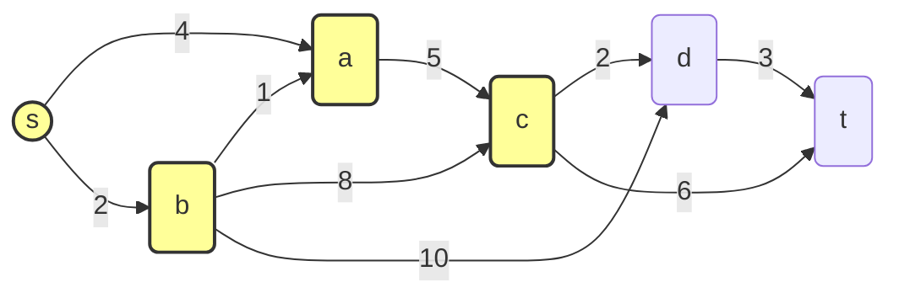
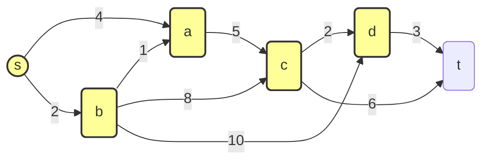
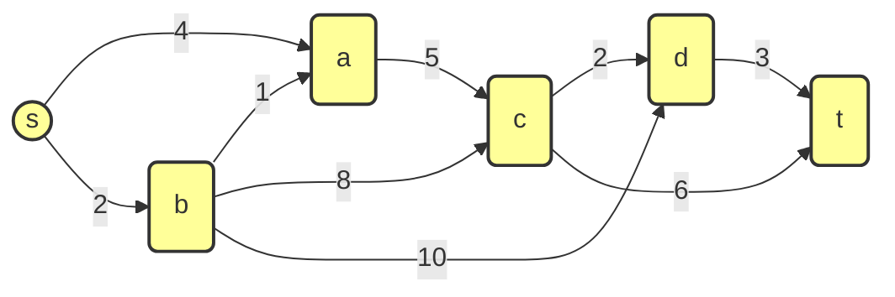

---
# Frontmatter for Slidev configuration
title: "Shortest Paths"
transition: slide-left
theme: seriph
layout: cover
background: https://cover.sli.dev
---

# Shortest Paths
## {{ $slidev.configs.subject }}
### Semester {{ $slidev.configs.semester }}
<br>

### Presented by {{ $slidev.configs.presenter }}


---
hideInToc: false
---

## Outline

<toc mode="onlySiblings" minDepth="2" columns="1"/>

---


## Shortest Paths Problem

* **Goal:** Find the path with the minimum total weight (cost, distance) between vertices in a weighted graph.
* **Input:** A weighted graph `G` (edge weights are non-negative) and a starting vertex `s`.
* **Output:** The length (total weight) of the shortest path from `s` to every other reachable vertex `v`. Optionally, the path itself.
* **Weight of a Path:** The sum of the weights of the edges composing the path.<br><br>



---

## Dijkstra's Algorithm: The Greedy Approach

* Solves the **single-source shortest path** problem for graphs with non-negative edge weights.
* **Core Idea:** Maintain an estimate `D[v]` of the shortest path distance from the source `s` to every other vertex `v`. Iteratively improve these estimates.
* **"Cloud" of Vertices:** Maintain a set `C` (the "cloud") of vertices for which the shortest path from `s` has already been definitively found.
* **Greedy Strategy:** In each step, add the vertex `u` *outside* the cloud (`u ∉ C`) that has the *smallest* current distance estimate `D[u]` to the cloud `C`.

---

## Edge Relaxation

* The fundamental step in updating distance estimates.
* Consider an edge `e = (u, z)` where `u` is already in the cloud `C` and `z` is not.
* **Relaxation Check:** Is the path from `s` to `u` *plus* the edge `(u, z)` shorter than the current best known path to `z`?
    * `if D[u] + weight(u, z) < D[z] then`
        * `D[z] = D[u] + weight(u, z)` (Update the distance estimate for `z`)
        * Record that the path to `z` now comes via `u`.




---
layout: two-cols
---

## Dijkstra's Algorithm: Steps

1.  **Initialization:**
    * Create a map `D` to store distance estimates.
    * `D[s] = 0` for the source vertex `s`.
    * `D[v] = ∞` for all other vertices `v ≠ s`.
    * Create a Priority Queue `PQ` storing entries `(D[v], v)` for all vertices `v`. Initially, `(0, s)` and `(∞, v)` for others.
    * The "cloud" `C` is implicitly represented by vertices already removed from `PQ`.
:: right ::
2.  **Iteration:** While `PQ` is not empty:
    * Remove the entry `(d, u)` with the minimum key `d` from `PQ` (using `removeMin`). Vertex `u` is the closest vertex outside the cloud. `D[u] = d` is now the final shortest path distance to `u`.
    * (Add `u` to the conceptual cloud `C`).
    * **Relax Outgoing Edges:** For each edge `e = (u, v)` outgoing from `u`:
        * Check if `v` is still effectively in the `PQ` (i.e., its final distance hasn't been determined).
        * `if D[u] + weight(u, v) < D[v] then`
            * Update `D[v] = D[u] + weight(u, v)`.
            * Update the priority of `v` in the `PQ` to the new `D[v]`.

---

## Dijkstra's Algorithm: Pseudocode

```text
Algorithm DijkstraShortestPaths(G, s):
  Input: Weighted graph G with non-negative weights, source vertex s
  Output: Map D associating each reachable vertex v with its shortest path distance D[v] from s

  Initialize distance map D: D[s] = 0, D[v] = infinity for v != s
  Initialize Priority Queue PQ. For each vertex v, add entry (D[v], v) to PQ.
  Initialize empty map 'cloud' // Tracks vertices whose final distance is known

  while not PQ.isEmpty():
    (d, u) = PQ.removeMin() // Get vertex u closest to s outside the cloud
    cloud.put(u, d)      // Add u to the cloud with final distance d

    // Perform edge relaxation for outgoing edges from u
    for each edge e = (u, v) outgoing from u:
      // Check if v is not yet in the cloud
      if cloud.get(v) is null then
        // Relaxation step
        if D[u] + weight(e) < D[v] then
          D[v] = D[u] + weight(e)
          // Update v's priority in PQ (e.g., changeKey or remove/add)
          PQ.updatePriority(v, D[v]) // Conceptual operation

  return D // Map containing final shortest path distances

```

---

## Example Trace of Dijkstra's Algorithm

### Dijkstra's Trace: Step 0 (Initialization)
<br>
<div class="grid grid-cols-2 gap-4">
<div>



</div>
<div>

| Vertex | D (Distance) | PQ (Priority, Vertex) |
| :----: | :----------: | :-------------------: |
| **s**  | **0**        | **(0, s)**            |
| a      | ∞            | (∞, a)                |
| b      | ∞            | (∞, b)                |
| c      | ∞            | (∞, c)                |
| d      | ∞            | (∞, d)                |
| t      | ∞            | (∞, t)                |

</div>
</div>

---

### Dijkstra's Trace: Step 1 (Process `s`)

<div class="grid grid-cols-2 gap-4">
<div>

**Action:** Remove `(0, s)` from PQ. Add `s` to cloud. Relax edges `(s,a)` and `(s,b)`.



</div>
<div>

| Vertex | D (Distance) | PQ (Priority, Vertex) |
| :----: | :----------: | :-------------------: |
| s      | 0            |                       |
| a      | <span class="text-red-500">4</span> | (4, a)                |
| **b**  | <span class="text-red-500">**2**</span> | **(2, b)**            |
| c      | ∞            | (∞, c)                |
| d      | ∞            | (∞, d)                |
| t      | ∞            | (∞, t)                |

</div>
</div>

---

### Dijkstra's Trace: Step 2 (Process `b`)

<div class="grid grid-cols-2 gap-4">
<div>

**Action:** Remove `(2, b)` from PQ. Add `b` to cloud. Relax edges `(b,a)`, `(b,c)`, `(b,d)`.



</div>
<div>

| Vertex | D (Distance) | PQ (Priority, Vertex) |
| :----: | :----------: | :-------------------: |
| s      | 0            |                       |
| **a**  | <span class="text-red-500">**3**</span> | **(3, a)**            |
| b      | 2            |                       |
| c      | <span class="text-red-500">10</span>| (10, c)               |
| d      | <span class="text-red-500">12</span>| (12, d)               |
| t      | ∞            | (∞, t)                |

</div>
</div>

---

### Dijkstra's Trace: Step 3 (Process `a`)

<div class="grid grid-cols-2 gap-4">
<div>

**Action:** Remove `(3, a)` from PQ. Add `a` to cloud. Relax edge `(a,c)`.



</div>
<div>

| Vertex | D (Distance) | PQ (Priority, Vertex) |
| :----: | :----------: | :-------------------: |
| s      | 0            |                       |
| a      | 3            |                       |
| b      | 2            |                       |
| **c**  | <span class="text-red-500">**8**</span> | **(8, c)**            |
| d      | 12           | (12, d)               |
| t      | ∞            | (∞, t)                |

</div>
</div>

---

### Dijkstra's Trace: Step 4 (Process `c`)

<div class="grid grid-cols-2 gap-4">
<div>

**Action:** Remove `(8, c)` from PQ. Add `c` to cloud. Relax edges `(c,d)` and `(c,t)`.



</div>
<div>

| Vertex | D (Distance) | PQ (Priority, Vertex) |
| :----: | :----------: | :-------------------: |
| s      | 0            |                       |
| a      | 3            |                       |
| b      | 2            |                       |
| c      | 8            |                       |
| **d**  | <span class="text-red-500">**10**</span>| **(10, d)**           |
| t      | <span class="text-red-500">14</span>| (14, t)               |

</div>
</div>

---

### Dijkstra's Trace: Step 5 (Process `d`)

<div class="grid grid-cols-2 gap-4">
<div>

**Action:** Remove `(10, d)` from PQ. Add `d` to cloud. Relax edge `(d,t)`.



</div>
<div>

| Vertex | D (Distance) | PQ (Priority, Vertex) |
| :----: | :----------: | :-------------------: |
| s      | 0            |                       |
| a      | 3            |                       |
| b      | 2            |                       |
| c      | 8            |                       |
| d      | 10           |                       |
| **t**  | <span class="text-red-500">**13**</span>| **(13, t)**           |

</div>
</div>

---

### Dijkstra's Trace: Final State

<div class="grid grid-cols-2 gap-4">
<div>

**Action:** Remove `(13, t)` from PQ. PQ is now empty. Algorithm terminates.



</div>
<div>

| Vertex | D (Final Distance) |
| :----: | :----------------: |
| s      | 0                  |
| a      | 3                  |
| b      | 2                  |
| c      | 8                  |
| d      | 10                 |
| t      | 13                 |

</div>
</div> 


---

## Performance Analysis

* Let `n` be the number of vertices and `m` be the number of edges.
* **Initialization:** $O(n)$ to initialize D, $O(n)$ or $O(n \log n)$ to build the initial PQ (depending on PQ implementation).
* **Main Loop:** Executes `n` times (once for each vertex).
    * `removeMin`: Depends on PQ implementation.
    * **Edge Relaxation:** The `for` loop iterates over all outgoing edges from the vertex `u` removed. Over the entire algorithm, each edge `e = (u, v)` is considered exactly once when `u` is removed from the PQ.
    * **Priority Update:** Depends on PQ implementation.
* **Total Time Complexity (using a Heap-based Priority Queue):**
    * `n` `removeMin` operations: $O(n \log n)$
    * `m` edge relaxations potentially causing `m` priority updates (e.g., `changeKey`): $O(m \log n)$
    * **Overall: $O((n + m) \log n)$**. If the graph is connected, `m >= n-1`, so this simplifies to **$O(m \log n)$**.
* **Using an Unsorted List for PQ:** `removeMin` takes $O(n)$, updates are $O(1)$. Total time: $O(n² + m)$ = **$O(n²)$**.

---

## Reconstructing the Shortest Paths

* Dijkstra's algorithm directly computes the *distances* `D[v]`.
* To find the actual *path*, we need to store predecessor information during relaxation.
* **Modification:** When updating `D[v] = D[u] + weight(u, v)`, store `u` as the predecessor of `v` on the current best path (e.g., in a separate `predecessor` map).
* **Path Reconstruction:** To find the path from `s` to `t`, start at `t` and backtrack using the `predecessor` map until `s` is reached. Reverse the sequence obtained.

```text
Algorithm ReconstructPath(s, t, predecessorMap):
  Initialize empty list path
  curr = t
  while curr != s:
    Add curr to front of path
    curr = predecessorMap.get(curr)
    if curr is null and t != s: return null // Path doesn't exist
  Add s to front of path
  return path

```

* Storing and retrieving predecessors adds minimal overhead to the main algorithm.

---

## Summary

*   **Shortest Path Problem:** Finding the minimum weight path between two vertices in a weighted graph.
*   **Dijkstra's Algorithm:** Solves the single-source shortest path problem for graphs with non-negative edge weights.
    *   **Greedy Approach:** Iteratively expands a "cloud" of vertices with known shortest paths.
    *   **Edge Relaxation:** Key step to update distance estimates to neighboring vertices.
    *   **Priority Queue:** Essential for efficiently selecting the next closest vertex outside the cloud.
*   **Time Complexity:** $O(m \log n)$ with a heap-based priority queue.
*   **Path Reconstruction:** Requires storing predecessor information during the algorithm's execution.

