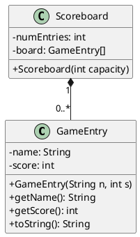
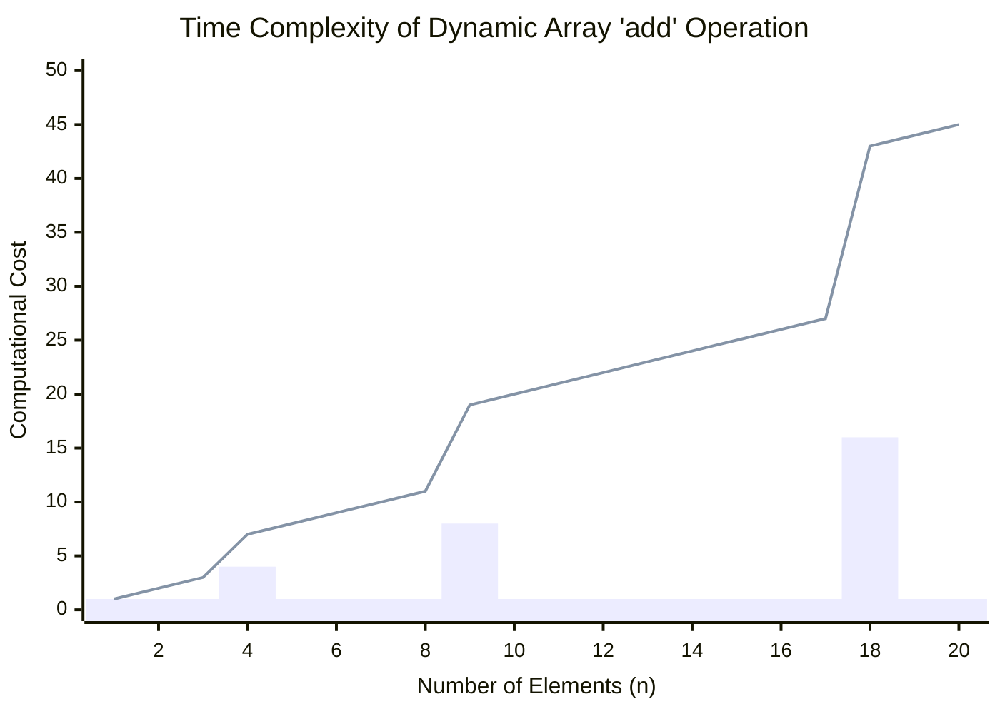

# Arrays and ArrayList
## Algorithm and Data Structures
### Semester 1/2025
### Dr. Ruslee Sutthaweekul
---
hideInToc: false
---

## Outline

<toc mode="onlySiblings" minDepth="2" columns="2"/>

---


## Arrays: The Basics

An array provides a way to store a sequence of items, where all items are of the same data type.

* **Cell:** Each storage location within an array.
* **Index:** A unique number (starting from 0) used to access a specific cell.
* **Element:** The value stored within a particular cell.
* The **length** (capacity) of an array dictates the total number of elements it can hold.
    * In Java, you can get an array's length using `.length` (e.g., `myArray.length`). 
    * We access the element at index `k` using square brackets: `a[k]`.

<Transform scale="0.7">


</Transform>

---

## Creating Arrays: Method 1 (Literal Assignment)

One way to create and initialize an array is by using a literal assignment when you declare it:

```java
elementType[] arrayName = {initialValue_0, initialValue_1, ..., initialValue_N-1};
```

* `elementType`: Any valid Java type (primitive or class).
* `arrayName`: A valid Java variable name.
* The initial values provided must match the `elementType`.

---

## Creating Arrays: Method 2 (Using `new`)

The second common method uses the `new` operator:

```java
new elementType[length]
```

* This approach doesn't use a traditional constructor like classes do.
* `length`: A positive integer specifying the size (capacity) of the array.
* The `new` operator creates the array in memory and returns a reference to it, which is typically assigned to an array variable.

Example:
```java
int[] scores = new int[10]; // Creates an integer array of size 10
```

---

## Storing Different Data Types

Arrays are versatile:

* They can hold **primitive types**, like characters:

    ```java
        // Declare and initialize a character array
        char[] sampleChars = {'S', 'A', 'M', 'P', 'L', 'E'};
    ```

* They can also store **references to objects**:

    ```java
        // This array holds references to three different String objects.
        String[] names = {"Janet", "Jonas", "Joseph"};
    ```

---
layout: two-cols
---


## Java Example: `GameEntry` Class

Let's define a simple class to store a player's name and their high score.

<Transform scale="0.9">

```java 
public class GameEntry {
    private String name; // Player's name
    private int score;   // Player's score

    /** Constructor for GameEntry */
    public GameEntry(String n, int s) {
        name = n;
        score = s;
    }

    /** Accessor for the name field */
    public String getName() { return name; }

    /** Accessor for the score field */
    public int getScore() { return score; }

    /** Provides a string representation */
    public String toString() {
        return "(" + name + ", " + score + ")";
    }
}
```

</Transform>

:: right ::

<Transform scale="0.75">


</Transform>
---
layout: two-cols
---

## Java Example: `Scoreboard` Class

Now, let's use an array to manage a list of high scores using `GameEntry` objects. We'll keep the array sorted by score.

```java
/** Manages high scores using a non-decreasing sorted array. */
public class Scoreboard {
    private int numEntries = 0;      // Tracks the actual number of scores stored
    private GameEntry[] board;       // The array holding GameEntry objects

    /** Creates an empty scoreboard with a specified capacity. */
    public Scoreboard(int capacity) {
        board = new GameEntry[capacity]; // Initialize the array
    }

    // Methods for adding/removing entries will follow...
}

```

:: right ::

<div style="padding-left:150px;padding-top:50px">



</div>

---

## Adding an Entry to a Sorted Array

To insert a new entry `e` at a specific index `i` in our sorted `board` array, we first need to make space.

1.  Shift existing entries `board[i]` through `board[n-1]` one position to the right (towards higher indices).
2.  Place the new entry `e` into the now-empty `board[i]`.


---

## Java Example: `add` Method for Scoreboard

This method adds a new `GameEntry` if it's a high score or if there's space. It maintains the sorted order.

```java
/** Adds a new score if it qualifies or if the board isn't full. */
public void add(GameEntry e) {
    int newScore = e.getScore();

    // Check if the board has space OR if the new score is high enough
    if (numEntries < board.length || newScore > board[numEntries - 1].getScore()) {
        if (numEntries < board.length) { // If there's space, increment count
            numEntries++;
        }

        // Start from the end and shift scores lower than newScore to the right
        int j = numEntries - 1;
        while (j > 0 && board[j - 1].getScore() < newScore) {
            board[j] = board[j - 1]; // Shift element right
            j--;                     // Move to the next position left
        }
        board[j] = e; // Place the new entry in its correct sorted position
    }
}
```

---

## Removing an Entry from an Array

To remove an entry `e` currently at index `i`:

1.  Identify the element to remove at `board[i]`.
2.  Shift all subsequent elements (`board[i+1]` through `board[n-1]`) one position to the left to fill the gap.
3.  Update the count of actual entries and potentially nullify the last previously occupied slot.


---

## Java Example: `remove` Method (Conceptual)

Here's how you might implement the removal logic:

```java
/** Removes the entry at index i and shifts subsequent entries left. */
public GameEntry remove(int i) throws IndexOutOfBoundsException {
    if (i < 0 || i >= numEntries) {
        throw new IndexOutOfBoundsException("Invalid index: " + i);
    }

    GameEntry temp = board[i]; // Store the entry to be removed

    // Shift elements to the left
    for (int j = i; j < numEntries - 1; j++) {
        board[j] = board[j + 1];
    }

    board[numEntries - 1] = null; // Clear the last previously used slot
    numEntries--;                 // Decrement the count of entries
    return temp;                  // Return the removed entry
}

// Note: This method assumes 'numEntries' correctly tracks the number of actual entries.
```

---

## Array Operations: Access and Modification

* **Accessing:** `element = arrayName[index];`
    * Time complexity: O(1) - very fast.
* **Modifying:** `arrayName[index] = newValue;`
    * Time complexity: O(1).

```java
int[] numbers = {10, 20, 30, 40, 50};

int thirdNumber = numbers[2]; // thirdNumber becomes 30
System.out.println("Third number: " + thirdNumber);

numbers[0] = 15; // Modify the first element
System.out.println("First number now: " + numbers[0]);

// Attempting to access an out-of-bounds index will cause an
// ArrayIndexOutOfBoundsException at runtime.
// System.out.println(numbers[5]); // This would cause an error

```

---

## Limitations of Basic Arrays

* **Fixed Size:** Once an array is created, its size (length/capacity) cannot be changed.
    * If you need more space, you have to create a new, larger array and copy elements over.
    * If you allocate too much space, it's wasted.
* **Manual Management for Insertions/Deletions:** Inserting or deleting an element in the middle requires manually shifting other elements, which can be inefficient (O(n)).

These limitations lead to the need for more flexible data structures.

---
layout: two-cols
---

## Dynamic Arrays: Overcoming Fixed Size

A **dynamic array** (or resizable array) is a data structure that manages a fixed-size array internally but makes it appear to have an unlimited capacity.

*   It automatically grows when it runs out of space.
*   This solves the "fixed size" problem of basic arrays.

How does it work? By creating a new, larger array and copying the contents when the current one is full.

::right::


---

## How Dynamic Arrays Grow

Let's consider an `add` operation.

1.  Check if the internal array is full (`size == capacity`).
2.  **If it is full:**
    a. Allocate a new, larger array. A common strategy is to **double the capacity**.
    b. Copy all `n` elements from the old array to the new, larger array.
    c. The old array is discarded, and we now use the new one.
3.  Add the new element at the next available position (`A[size]`).
4.  Increment the `size`.

This resizing step is the key to the dynamic behavior.

---
layout: two-cols
---


## Analyzing the `add` Operation

*   **Best Case:** If the array is not full, adding an element takes **O(1)** time.
*   **Worst Case:** If the array *is* full, the `add` operation triggers a resize. This involves copying `n` elements, so the operation takes **O(n)** time.

This worst-case `O(n)` time seems inefficient. Does this mean dynamic arrays are slow?

Not necessarily. We need to look at the **amortized** cost.

:: right ::

* add operation of a dynamic array

<div style="padding-left:20px">

```java

public void add(int element) {
    // Check if the array needs to be resized
    if (size == data.length) {
        resize();
    }
    // Add the new element and increment the size
    data[size] = element;
    size++;
}

private void resize() {
    int newCapacity = data.length * 2;
    // The Arrays.copyOf method creates a new array and copies the elements
    data = Arrays.copyOf(data, newCapacity);
    System.out.println("Resized to new capacity: " + newCapacity); // For demonstration
}

```

</div>

---
layout: two-cols
---

## Amortized Analysis of Growth

While a single `add` can be slow (`O(n)`), these expensive resize operations don't happen with every insertion.

*   If we **double the capacity** each time we resize, the cost of that `O(n)` copy is spread out over many "cheap" `O(1)` additions that came before it.
*   This is called **amortized analysis**.
*   The average time to perform an `add` operation over a long sequence of additions is **amortized O(1)**.

This makes dynamic arrays very efficient in practice, which is why they are so widely used.

:: right ::

<div style="padding-top:100px;padding-left:20px">


</div>

---

## Introduction to Java `ArrayList`

* The `ArrayList` class is Java's implementation of a **resizable array** or **dynamic array**.
* It's part of the **Java Collections Framework** (in the `java.util` package).
* It implements the `List` interface.
* **Key Features:**
    * **Dynamic Size:** Automatically grows or shrinks as you add or remove elements.
    * **Stores Objects:** Can store objects of any type (uses Generics for type safety).
    * **Ordered:** Maintains the insertion order of elements.
    * **Allows Duplicates:** You can store the same element multiple times.

---

## Creating an `ArrayList`

You need to import `java.util.ArrayList` (and often `java.util.List`).

```java
import java.util.ArrayList;
import java.util.List; // Good practice to code to the interface

public class ArrayListExample {
    public static void main(String[] args) {
        // Creating an ArrayList of Strings
        List<String> names = new ArrayList<>(); // Diamond operator for type inference

        // Creating an ArrayList of Integers
        // Note: Use wrapper class Integer for primitive int
        ArrayList<Integer> numbers = new ArrayList<Integer>();

        // Can also initialize with some capacity, though it grows automatically
        List<Double> values = new ArrayList<>(20); // Initial capacity of 20
    }
}

```

* **Generics (`<Type>`):** Specify the type of objects the `ArrayList` will hold (e.g., `<String>`, `<Integer>`). This provides type safety.

---
layout: two-cols
---

## Common `ArrayList` Methods

<transform scale="0.8">

* **`add(E element)`:** Appends the element to the end of the list.
    * Amortized O(1) time.
* **`add(int index, E element)`:** Inserts the element at the specified index, shifting subsequent elements.
    * O(n) time in the worst case.
* **`get(int index)`:** Returns the element at the specified index.
    * O(1) time.
* **`set(int index, E element)`:** Replaces the element at the specified index with the new element. Returns the old element.
    * O(1) time.
* **`remove(int index)`:** Removes the element at the specified index, shifting subsequent elements. Returns the removed element.
    * O(n) time in the worst case.
</transform>

::right::

<transform scale="0.85">


* **`remove(Object o)`:** Removes the first occurrence of the specified element. Returns `true` if an element was removed.
    * O(n) time.
* **`size()`:** Returns the number of elements in the list.
    * O(1) time.
* **`isEmpty()`:** Returns `true` if the list contains no elements.
    * O(1) time.
* **`clear()`:** Removes all elements from the list.
* **`contains(Object o)`:** Returns `true` if the list contains the specified element.
    * O(n) time.

</transform>

---

## `ArrayList` Example Usage

<Transform scale="0.8">

```java {*}{lines:'true'}
import java.util.ArrayList;
import java.util.List;

public class StudentList {
    public static void main(String[] args) {
        List<String> students = new ArrayList<>();

        // Adding students
        students.add("Alice");
        students.add("Bob");
        students.add(0, "Charlie"); // Add Charlie at the beginning
        System.out.println("Students: " + students); // Output: [Charlie, Alice, Bob]

        // Getting a student
        String firstStudent = students.get(0);
        System.out.println("First student: " + firstStudent); // Output: Charlie

        // Modifying a student
        students.set(1, "Alicia");
        System.out.println("Students after update: " + students); // Output: [Charlie, Alicia, Bob]

        // Removing a student
        String removedStudent = students.remove(2); // Removes Bob
        System.out.println("Removed student: " + removedStudent); // Output: Bob
        System.out.println("Students after removal: " + students); // Output: [Charlie, Alicia]

        System.out.println("Number of students: " + students.size()); // Output: 2
        System.out.println("Is the list empty? " + students.isEmpty()); // Output: false
    }
}

```

</Transform>

---

## Iterating Through an `ArrayList`

There are several ways to iterate over the elements:

1.  **For-each loop (Enhanced for loop):** Simplest and most common.

    ```java
    List<String> fruits = new ArrayList<>();
    fruits.add("Apple");
    fruits.add("Banana");
    fruits.add("Cherry");

    System.out.println("Fruits (for-each):");
    for (String fruit : fruits) {
        System.out.println(fruit);
    }
    ```

2.  **Traditional `for` loop with index:** Useful if you need the index.

    ```java
    System.out.println("\nFruits (indexed for loop):");
    for (int i = 0; i < fruits.size(); i++) {
        System.out.println("Index " + i + ": " + fruits.get(i));
    }
    ```

---

3.  **Using an `Iterator`:** Provides more control, including safe removal during iteration.

    ```java
    import java.util.Iterator;
    // ... inside main or another method
    System.out.println("\nFruits (Iterator):");
    Iterator<String> it = fruits.iterator();
    while (it.hasNext()) {
        String fruit = it.next();
        System.out.println(fruit);
        // if (fruit.equals("Banana")) {
        //     it.remove(); // Safely removes "Banana"
        // }
    }
    // System.out.println("Fruits after iterator removal: " + fruits);
    ```

---

##   `Basic Arrays` vs. `ArrayList`

<transform scale="0.6">

| **Feature**             | Basic Array                                  | **`ArrayList`**                                       |
| :------------------ | :------------------------------------------- | :------------------------------------------------ |
| **Size** | Fixed at creation                            | Dynamic, resizable                                |
| **Type** | Primitives or Objects                        | Objects only (uses wrapper classes for primitives) |
| **Flexibility** | Low (manual resizing, shifting)              | High (built-in methods for add, remove, etc.)    |
| **Performance (get/set)** | O(1)                                         | O(1)                                              |
| **Performance (add/remove at end)** | N/A (fixed size) / O(1) if space exists | Amortized O(1)                                    |
| **Performance (add/remove at front and in middle)** | O(n) (manual shift)                        | O(n) (automatic shift)                            |
| **Memory** | Can be precise if size known                 | Might have some unused capacity (for growth)      |
| **Utility Methods** | Minimal (only `.length`)                     | Rich set of methods from `List` interface         |
| **Usage** | When size is fixed and known, performance-critical for primitives | General-purpose dynamic lists of objects          |

`ArrayList` is generally preferred when the number of elements is not known beforehand or can change frequently.
</transform>

---

## Summary

*   **Arrays** are fundamental for storing sequences of data with fast **O(1)** access, but they have a **fixed size**.
*   Inserting or deleting from a standard array is inefficient (**O(n)**) because it requires manually shifting elements.
*   **Dynamic Arrays** (like Java's `ArrayList`) solve the fixed-size problem by automatically resizing a hidden internal array.
*   While resizing can be slow (**O(n)**), **amortized analysis** shows that adding an element to the end is, on average, very fast (**amortized O(1)**).
*   `ArrayList` provides a flexible and powerful way to manage dynamic lists of objects, making it one of the most commonly used data structures in Java.