```mermaid {scale:0.64}


block-beta

    block:border

    columns 4

    head

    block:node1
        element
        next
    end

    space
     B(("'b'"))
    tail(("tail"))
    A(("'a'"))

    block:node2
        element2("element")
        next2("next")
    end

    nn(("new_node"))
    space
    T(("'c'"))
    space
    space
    space
    space
    block:newnode
        elementnewnode("element")
        nextnewnode("next")
    end
    null
    
    
    end

    next --> node2
    next2 --> newnode
    head(("...")) --> node1
    element --> A
    element2 --> B
    nextnewnode --> null(("∅"))
    elementnewnode --> T
    tail --"tail=new_node"--> newnode

    style nn stroke-dasharray: 5 5,fill:#eef
    style tail fill:#969,stroke:#333,stroke-width:4px
    style border fill:#fff,stroke:#333

```

```mermaid {scale:0.56}

block-beta

    block:border
    columns 5

    
    A(("'a'"))
    head

    space
    space
    tail(("tail"))
    space
    space
    
    block:node2
        element2("element")
        next2("next")
    end

    space
    space
    remove(("rm_e"))
    space
    B(("'b'"))

    block:node3
        element3("element")
        next3("next")
    end
    
    null

    space
    space
    space
    
    C(("'c'"))

    end


    next2 --> node3
    next3 --> null(("∅"))
    head(("head")) --> node2

    element2 --> B
    element3 --> C
    tail --> node3
    remove -- "return rm_e" --> A

    style remove stroke-dasharray: 5 5,stroke-width:4,stroke:#777,fill:#eef
    style border fill:#fff,stroke:#333
    style A fill:#969,stroke:#333,stroke-width:4px



```

# Singly Linked List
## {{ $slidev.configs.subject }}
### Semester {{ $slidev.configs.semester }}
<br>

### Presented by {{ $slidev.configs.presenter }}


---
hideInToc: false
---

## Outline

<toc mode="onlySiblings" minDepth="2" columns="2"/>


---
src: ./lect-7-Lists.md#6-7,9-10
---

---
dragPos:
  square: 660,125,162,67
  node2: 884,139,74,40
  node1: 666,122,167,70
---

## Singly Linked Lists: Introduction

A singly linked list is a data structure built from a sequence of nodes.

* It starts with a reference called the **head**.
* Each **node** contains:
    * An **element** (the data stored).
    * A **next** reference (or link) pointing to the subsequent node in the sequence.
* The last node's `next` reference points to `null`.

```mermaid

block-beta

    columns 5

    head

    block:node1
        element
        next
    end

    space
    space
    tail(("tail"))
    space
    A(("'a'"))
    
    block:node2
        element2("element")
        next2("next")
    end

    space
    space
    space
    space
    B(("'b'"))

    block:node3
        element3("element")
        next3("next")
    end
    
    null

    space
    space
    space
    
    C(("'c'"))

    next --> node2
    next2 --> node3
    next3 --> null(("∅"))
    head(("head")) --> node1
    element --> A
    element2 --> B
    element3 --> C
    tail --> node3

    
    style head fill:#fee,stroke:#333
    style tail fill:#fee,stroke:#333


```



<!--

-->


<v-drag-arrow pos="801,157,85,0"/>
<v-drag-arrow pos="594,161,68,-1"/>

---
dragPos:
  node1: -32,0,0,0
---

## Implementing Nodes: A Nested Class

<div style="padding-right:250px">

We often define the `Node` structure as a private static nested class within the linked list class itself. This encapsulates the node's details.

```java {*}{maxHeight:'350px',lines:false}
// Outer SinglyLinkedList class declaration
public class SinglyLinkedList<E> {

    //----- nested Node class -----
    private static class Node<E> {
        private E element;         // Data stored in this node
        private Node<E> next;      // Reference to the next node

        // Constructor for Node
        public Node(E e, Node<E> n) {
            element = e;
            next = n;
        }

        // Accessor methods for Node fields
        public E getElement() { return element; }
        public Node<E> getNext() { return next; }

        // Modifier method for the next reference
        public void setNext(Node<E> n) { next = n; }
    } //----------- end of nested Node class -----------

    // Remainder of the SinglyLinkedList class implementation follows...
}
```

</div>

<div style="position:fixed;right:20px;top:200px">


</div>


---
layout: two-cols
---

## SinglyLinkedList Class Structure

The main `SinglyLinkedList` class manages the nodes.

```java {*}{maxHeight:'380px',lines:true}
public class SinglyLinkedList<E> {
    // (Nested Node class defined here previously)

    // Instance variables for the list
    private Node<E> head = null;   // Reference to the first node (null if empty)
    private Node<E> tail = null;   // Reference to the last node (null if empty)
    private int size = 0;          // Count of nodes in the list

    // Constructor for an empty list
    public SinglyLinkedList() { }

    // Basic accessor methods
    public int size() { return size; }
    public boolean isEmpty() { return size == 0; }

    /** Returns the first element without removing it. */
    public E first() {
        if (isEmpty()) return null;
        return head.getElement();
    }

    /** Returns the last element without removing it. */
    public E last() {
        if (isEmpty()) return null;
        return tail.getElement();
    }

    // Update methods (addFirst, addLast, removeFirst) will follow...
}
```

:: right ::

<div style="padding-left:10px">


</div>

<div style="position:fixed;bottom:30px">


</div>


---
layout: two-cols
---
## Adding an Element to the Front (Head)

1.  **Allocate:** Create a new node containing the element.
2.  **Link New Node:** Set the `next` reference of the new node to point to the current `head`.
3.  **Update Head:** Change the list's `head` reference to point to the newly created node.

<br>

```java
    Node<E> new_node = new Node<>(element, null);
        
```

<br>


:: right ::


<!--

-->

---
layout: two-cols
---

## Adding an Element to the End (Tail)

1.  **Allocate:** Create a new node with the element and its `next` reference set to `null`.
2.  **Link Old Tail:** Set the `next` reference of the current `tail` node to point to the new node. (Handle the case where the list was initially empty).
3.  **Update Tail:** Change the list's `tail` reference to point to the newly added node.

```mermaid {scale:0.7}
block-beta

    columns 3
    newnode(("new_node"))
    space
    block:node
        element
        next
    end
    space
    T(("'c'"))
    null(("∅"))

    newnode --> node
    element --> T
    next --> null

    style node fill:#77f,stroke-width:4px,stroke:#333

```

<br>




:: right ::



<!--


-->

---


## Java Implementation: `addFirst` and `addLast`

<Transform scale="0.9">

```java {*}{lines:true}
public class SinglyLinkedList<E> {
    // ... (Node class, head, tail, size, constructor, accessors) ...

    /** Adds element e to the front of the list. */
    public void addFirst(E e) {
        head = new Node<>(e, head); // Create new node pointing to old head
        if (size == 0) {
            tail = head;           // If list was empty, new node is also the tail
        }
        size++;
    }

    /** Adds element e to the end of the list. */
    public void addLast(E e) {
        Node<E> newest = new Node<>(e, null); // New node will be the tail
        if (isEmpty()) {
            head = newest;         // If list was empty, new node is also the head
        } else {
            tail.setNext(newest);  // Link the previous tail to the new node
        }
        tail = newest;             // Update the list's tail reference
        size++;
    }

    // ... (removeFirst method) ...
}
```
</Transform>

---
layout: two-cols
---

## Removing the First Element (Head)

1.  **Target:** Identify the node currently pointed to by `head`.
2.  **Update Head:** Change the `head` reference to point to the *next* node in the sequence (`head.next()`).
3.  **Cleanup:** The original head node is now unreferenced and can be garbage collected. (Handle the case where the list becomes empty).

```mermaid {scale:0.55}

block-beta

    columns 5

    head

    block:node1
        element
        next
    end

    space
    space
    tail(("tail"))
    space
    A(("'a'"))
    
    block:node2
        element2("element")
        next2("next")
    end

    space
    space
    space
    space
    B(("'b'"))

    block:node3
        element3("element")
        next3("next")
    end
    
    null

    space
    space
    space
    
    C(("'c'"))

    next --> node2
    next2 --> node3
    next3 --> null(("∅"))
    head(("head")) --> element
    element --> A
    element2 --> B
    element3 --> C
    tail  --> node3



```

<br>



:: right ::



<!--


-->
---
layout: two-cols
---

## Java Implementation: `removeFirst`

```java
public class SinglyLinkedList<E> {
    // ... (Node class, head, tail, size, constructor, accessors, add methods) ...

    /** Removes and returns the first element of the list. */
    public E removeFirst() {
        if (isEmpty()) {
            return null; // Nothing to remove
        }
        E removedElement = head.getElement(); // Get data from the first node
        head = head.getNext();                // Update head to the next node
        size--;
        if (size == 0) {
            tail = null; // Special case: list is now empty, update tail
        }
        return removedElement; // Return the data that was removed
    }
} // End of SinglyLinkedList class
```

:: right ::

<div style="padding-left:100px">


</div>

---
routeAlias: remove_tail
---


## Removing from the Tail

* Removing the last element efficiently in a *singly* linked list is problematic ⚠️.
* To update the `tail` reference correctly, you need access to the node *before* the current tail.
* There's no direct way to get the previous node without traversing the list from the `head`.

```mermaid

block-beta

    columns 5

    head

    block:node1
        element
        next
    end

    space
    space
    tail(("tail"))
    space
    A(("'a'"))
    
    block:node2
        element2("element")
        next2("next")
    end

    space
    space
    space
    space
    B(("'b'"))

    block:node3
        element3("element")
        next3("next")
    end
    
    null

    space
    space
    space
    
    C(("'c'"))

    next --> node2
    next2 --> node3
    next3 --> null(("∅"))
    head(("head")) --> element
    element --> A
    element2 --> B
    element3 --> C
    tail  --> node3

    style node3 stroke-dasharray: 5 5,stroke-width:4,stroke:#f77,fill:#fee



```

* This traversal takes time proportional to the list's length, making tail removal inefficient (not constant time).<br><br>



<!-- 
-->

<v-drag-arrow pos="481,275,1,41"/>

---

## `Basic Arrays` vs. `ArrayList` vs. `Singly Linked List`

<transform scale="0.9">

| **Feature** | Basic Array | `ArrayList` | Singly Linked List |
| :--- | :--- | :--- | :--- |
| **Size** | Fixed at creation | Dynamic, resizable | Dynamic, node-based |
| **Type** | Primitives or Objects | Objects only | Objects only |
| **Flexibility** | Low (manual resizing, shifting) | High (built-in methods) | High (pointer manipulation) |
| **Performance (get/set by index)**| $O(1)$ | $O(1)$ | $O(n)$ (requires traversal) |
| **Performance (add at front)** | $O(n)$ (manual shift) | $O(n)$ (automatic shift) | $O(1)$ |
| **Performance (remove at front)** | $O(n)$ (manual shift) | $O(n)$ (automatic shift) | $O(1)$ |

</transform>

---

<transform scale="0.82">

| **Feature** | Basic Array | `ArrayList` | Singly Linked List |
| :--- | :--- | :--- | :--- |
| **Performance (add at end)** | N/A (fixed size) | Amortized $O(1)$ | $O(1)$ (with tail pointer) |
| **Performance (remove at end)**| N/A (fixed size) | $O(1)$ | $O(n)$ (needs traversal for previous node) |
| **Performance (add/remove in middle)**| $O(n)$ (shift) | $O(n)$ (shift) | $O(n)$ (traversal) |
| **Memory** | Low overhead | Moderate overhead (unused capacity)| High overhead (pointer per node) |
| **Usage**| Fixed-size collections, performance-critical access | General-purpose dynamic lists | Frequent insertions/deletions at the start; implementing queues/stacks |

`ArrayList` is generally preferred when you need a dynamic array with fast **index-based access**.<br> 
`LinkedList` excels when you have frequent **additions** and **removals** at the beginning of the list.
</transform>

---

## Summary

*   **Structure:** A singly linked list is a sequence of **nodes**, where each node holds an element and a reference (pointer) to the next node.
*   **Key Pointers:** The list is managed by `head` and `tail` references.
*   **Strengths 👍:**
    *   Excellent performance for adding and removing at the **front (head)**: `addFirst` and `removeFirst` are **$O(1)$** operations.
    *   Adding to the **end (tail)** is also **$O(1)$** if a `tail` pointer is maintained.
*   **Weaknesses 👎:**
    *   Accessing an element by index is slow: **$O(n)$**, as it requires traversing from the head.
    *   Removing from the tail is inefficient: **$O(n)$**, because you must find the second-to-last node.
    *   Higher memory overhead than arrays due to the storage of `next` pointers.
*   **Best Use Case:** Ideal for scenarios requiring frequent insertions and deletions at the beginning of the sequence, such as implementing a `Queue` or `Stack`.
