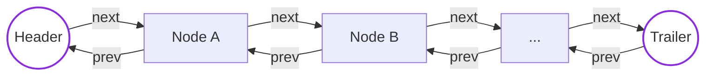
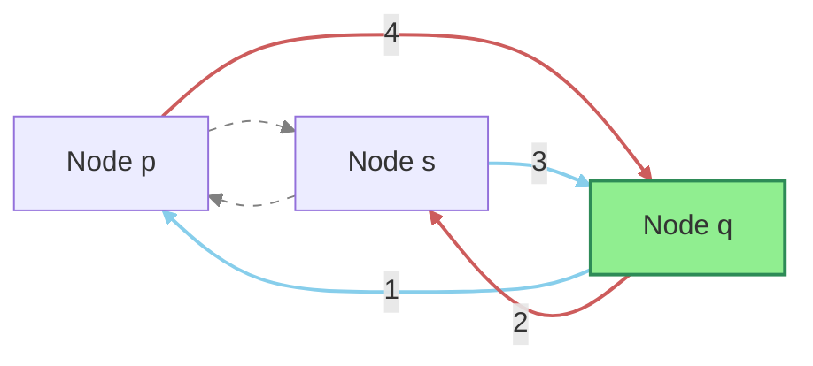
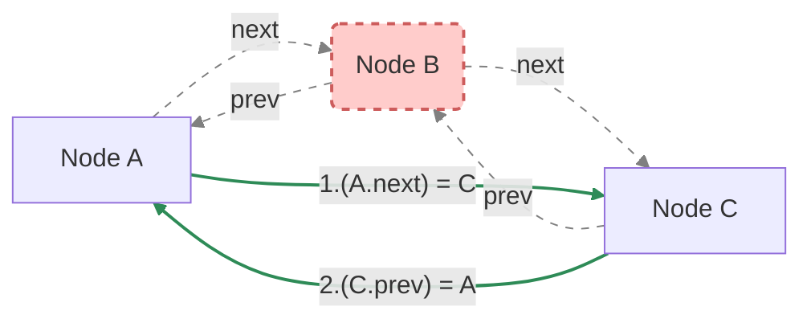

---
# Cover Page Slide (Implicitly created by Slidev from metadata)
title: 'Doubly Linked Lists'
transition: slide-left
theme: seriph
layout: cover
background: https://cover.sli.dev

# Based on Presentation for use with the textbook Data Structures and Algorithms in Java, 6th edition, by M. T. Goodrich, R. Tamassia, and M. H. Goldwasser, Wiley, 2014
---

# Doubly Linked Lists & <br> Double-Ended Queues

### Algorithm and Data Structures
### semester 1/2025
### Dr. Ruslee Sutthaweekul

---
hideInToc: false
---

## Outline

<toc mode="onlySiblings" minDepth="2" columns="1"/>

---


## Doubly Linked Lists: Overview


* Unlike singly linked lists, doubly linked lists allow traversal in both forward and backward directions.

* **Nodes Contain:**
    * The data element.
    * A `prev` link to the previous node.
    * A `next` link to the next node.
* **Sentinels:** Special `header` and `trailer` nodes are often used at the beginning and end. These don't store user data but simplify insertion and deletion logic, especially at the ends.


<br>    

<div style="margin:auto">



</div>

---

## Insertion in a Doubly Linked List

To insert a new node `q` between an existing node `p` and its successor `s`:

1.  Set `q`'s `prev` link to point to `p`.
2.  Set `q`'s `next` link to point to `s`.
3.  Set the `prev` link of `s` to point to `q`.
4.  Set `p`'s `next` link to point to `q`.

<div style="margin:auto; padding-top: 1em;">

</div>


---

## Deletion in a Doubly Linked List

To remove an existing node `p`:

1.  Set the `next` link of `p`'s predecessor to point to `p`'s successor.
2.  Set the `prev` link of `p`'s successor to point to `p`'s predecessor.
3.  Node `p` is now bypassed and can be garbage collected.

<div style="margin:auto; padding-top: 1em;">

</div>

---

## Doubly Linked List Node in Java

We define the `Node` structure, typically as a private static nested class.

```java {*}{maxHeight:'350px'}
/** A basic doubly linked list implementation. */
public class DoublyLinkedList<E> {

    //----- nested Node class -----
    private static class Node<E> {
        private E element;      // Data stored at this node
        private Node<E> prev;   // Reference to the previous node
        private Node<E> next;   // Reference to the subsequent node

        /** Constructor for Node */
        public Node(E e, Node<E> p, Node<E> n) {
            element = e;
            prev = p;
            next = n;
        }

        // Accessor methods
        public E getElement() { return element; }
        public Node<E> getPrev() { return prev; }
        public Node<E> getNext() { return next; }

        // Modifier methods
        public void setPrev(Node<E> p) { prev = p; }
        public void setNext(Node<E> n) { next = n; }
    } //----------- end of nested Node class -----------

    // ... rest of DoublyLinkedList class ...
}
```

---

## Doubly Linked List Class Structure (Java)

The main class manages the list using sentinel nodes.

```java {*}{maxHeight:'350px'}
public class DoublyLinkedList<E> {
    // (Nested Node class defined previously)

    // Instance variables - Sentinel nodes
    private Node<E> header;     // Header sentinel node
    private Node<E> trailer;    // Trailer sentinel node
    private int size = 0;       // Number of actual elements in the list

    /** Constructs a new empty list with sentinels. */
    public DoublyLinkedList() {
        header = new Node<>(null, null, null);    // Header node
        trailer = new Node<>(null, header, null); // Trailer node points back to header
        header.setNext(trailer);                  // Header points forward to trailer
    }

    /** Returns the number of elements. */
    public int size() { return size; }

    /** Checks if the list is empty. */
    public boolean isEmpty() { return size == 0; }

    /** Returns the first element (or null if empty). */
    public E first() {
        if (isEmpty()) return null;
        return header.getNext().getElement(); // Element after header
    }

    /** Returns the last element (or null if empty). */
    public E last() {
        if (isEmpty()) return null;
        return trailer.getPrev().getElement(); // Element before trailer
    }

    // ... update methods ...
}
```

---

## Public Update Methods (Java)

These methods provide the primary interface for adding/removing elements. They often utilize private helper methods.

```java {*}{maxHeight:'350px'}
public class DoublyLinkedList<E> {
    // ... (Node class, sentinels, size, constructor, basic accessors) ...

    /** Adds element e to the front of the list. */
    public void addFirst(E e) {
        addBetween(e, header, header.getNext()); // Insert after header
    }

    /** Adds element e to the end of the list. */
    public void addLast(E e) {
        addBetween(e, trailer.getPrev(), trailer); // Insert before trailer
    }

    /** Removes and returns the first element (or null if empty). */
    public E removeFirst() {
        if (isEmpty()) return null;
        return remove(header.getNext()); // Remove node after header
    }

    /** Removes and returns the last element (or null if empty). */
    public E removeLast() {
        if (isEmpty()) return null;
        return remove(trailer.getPrev()); // Remove node before trailer
    }

    // ... private helper methods addBetween and remove ...
}
```

---

## Private Helper Methods (Java)

These internal methods handle the core logic of linking and unlinking nodes.

```java {*}{maxHeight:'350px'}
public class DoublyLinkedList<E> {
    // ... (public methods and instance variables) ...

    /** Inserts element e between the given predecessor and successor nodes. */
    private void addBetween(E e, Node<E> predecessor, Node<E> successor) {
        // Create the new node, linking it to predecessor and successor
        Node<E> newest = new Node<>(e, predecessor, successor);
        predecessor.setNext(newest); // Link predecessor to newest
        successor.setPrev(newest);   // Link successor back to newest
        size++;
    }

    /** Removes the given node from the list and returns its element. */
    private E remove(Node<E> node) {
        Node<E> predecessor = node.getPrev();
        Node<E> successor = node.getNext();
        predecessor.setNext(successor); // Link predecessor to successor
        successor.setPrev(predecessor); // Link successor back to predecessor
        size--;
        return node.getElement(); // Return the removed element
    }

} // End of DoublyLinkedList class
```

---

## The Deque (Double-Ended Queue) ADT

*   A **Deque** (pronounced "deck") is a generalization of a queue that supports insertion and deletion at both the front and the rear.
*   It is more versatile than both stacks and queues.
*   **Core Operations:**
    *   `addFirst(e)`: Adds an element to the front.
    *   `addLast(e)`: Adds an element to the rear.
    *   `removeFirst()`: Removes and returns the element from the front.
    *   `removeLast()`: Removes and returns the element from the rear.
*   **Accessor Operations:** `first()`, `last()`.
*   **A Deque can be used as a Stack:** by using only `addFirst` and `removeFirst`.
*   **A Deque can be used as a Queue:** by using `addLast` and `removeFirst`.

---

## Deque Interface in Java

This interface formalizes the Deque ADT. Like our Stack and Queue, it should throw exceptions for invalid operations on an empty deque.

```java
public interface Deque<E> {
  int size();
  boolean isEmpty();
  E first() throws EmptyDequeException;
  E last() throws EmptyDequeException;
  void addFirst(E e);
  void addLast(E e);
  E removeFirst() throws EmptyDequeException;
  E removeLast() throws EmptyDequeException;
}
```

---

## Implementing a Deque with a Doubly Linked List

A doubly linked list is the perfect data structure for implementing a Deque. The sentinel nodes make insertions and deletions at both ends highly efficient.

| Deque Method    | DoublyLinkedList Method | Complexity |
| :-------------- | :---------------------- | :--------- |
| `addFirst(e)`   | `addFirst(e)`           | $O(1)$     |
| `addLast(e)`    | `addLast(e)`            | $O(1)$     |
| `removeFirst()` | `removeFirst()`         | $O(1)$     |
| `removeLast()`  | `removeLast()`          | $O(1)$     |
| `first()`       | `first()`               | $O(1)$     |
| `last()`        | `last()`                | $O(1)$     |

*All core Deque operations can be implemented in constant time.*

---

## Summary: Doubly Linked Lists & Deques

*   **Doubly Linked List:**
    *   Nodes have `next` and `prev` pointers, allowing for bidirectional traversal.
    *   **Sentinels** (header and trailer) are used to simplify code and eliminate special cases for insertions/deletions at the ends.
    *   All insertions and deletions at either end, or next to a known node, are $O(1)$.
*   **Deque (Double-Ended Queue):**
    *   A versatile ADT supporting $O(1)$ insertion and deletion at both front and rear.
    *   Can be used to implement both Stacks and Queues.
    *   A **doubly linked list** provides a natural and highly efficient implementation for the Deque ADT.