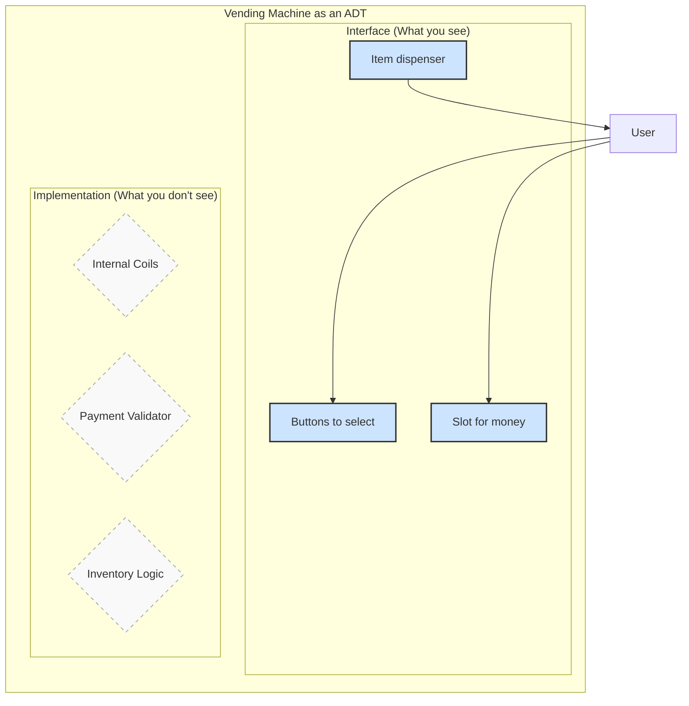
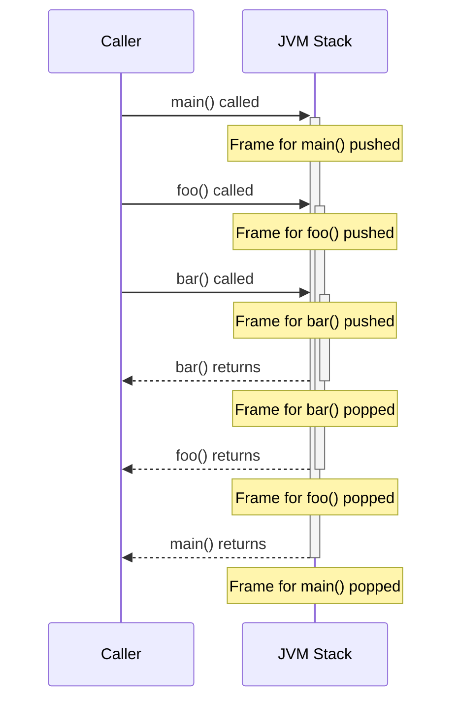
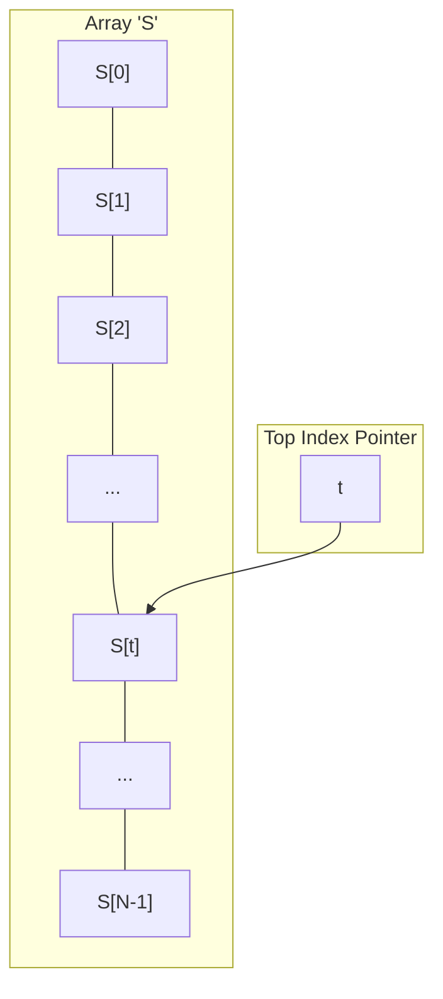
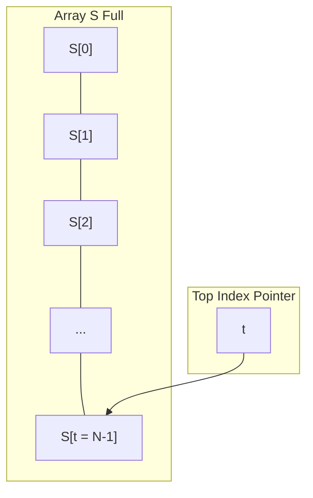

---
# Cover Page / Title Slide (Level 1)
title: 'Stacks'
transition: slide-left
theme: seriph
layout: cover
background: https://cover.sli.dev

# Based on Presentation for use with the textbook Data Structures and Algorithms in Java, 6th edition, by M. T. Goodrich, R. Tamassia, and M. H. Goldwasser, Wiley, 2014
---

# Stacks
## {{ $slidev.configs.subject }}
### Semester {{ $slidev.configs.semester }}
<br>

### Presented by {{ $slidev.configs.presenter }}

---
hideInToc: false
---

## Outline

<toc mode="onlySiblings" minDepth="2" columns="4"/>


---

## Abstract Data Types (ADTs) 

### The "What," Not the "How"

Think of an ADT as a **blueprint for a machine**. It defines **what** the machine does from the outside, completely ignoring the complex engineering inside.

It's a conceptual model that specifies three key aspects:
1.  **Data:** What kind of items or information does it manage?
2.  **Operations:** What actions can you perform with it?
3.  **Errors:** What can go wrong during those operations?

The ADT is the public-facing **interface**; the underlying implementation is kept private.

---
layout: two-cols
---

## The Vending Machine ADT

A vending machine is a perfect real-world ADT. You only need to know how to use its interface, not how it works internally.

*   **The "What" (The ADT Interface):**
    *   **Data:** Holds drinks & snacks.
    *   **Operations:** `selectItem(code)`, `insertMoney(amount)`.
    *   **Errors:** "Item Sold Out," "Insufficient Funds."

*   **The "How" (The Hidden Implementation):**
    *   The complex system of coils, payment validators, and inventory logic that makes it all work. As a user, you don't need to see or understand this part.

::right::

<div style="position:fixed;right:30px;width:450px;height:450px;top:20px">


</div>

<div style="position:fixed;bottom:20px;right:30px;width:200;width:200px">

</div>

---

## The Stack ADT

* Operates on a **Last-In, First-Out (LIFO)** principle.
* **Core Operations:**
    * `push(object)`: Adds an element to the top of the stack.
    * `pop()`: Removes and returns the top element of the stack.
* **Helper Operations:**
    * `top()`: Returns the top element of the stack without removing it.
    * `size()`: Returns the number of elements in the stack.
    * `isEmpty()`: Returns a boolean indicating whether the stack is empty.
* **Error Conditions:**
    * Attempting to `pop()` or `top()` an empty stack should result in an error (typically by throwing an exception).

<div style="position:fixed;right:50px;width:250px;height:250px;top:80px">

</div>

---

## Stack Interface Definition in Java

* This is a Java interface representing our Stack ADT concept.
* This interface defines the standard Stack ADT, using exceptions for error handling.
* `pop` and `top` operations will throw an `EmptyStackException` if the stack is empty.
* This approach is generally preferred over returning `null` as it makes error conditions explicit.

```java
public interface Stack<E> {
  /** Returns the number of elements in the stack. */
  int size();

  /** Tests whether the stack is empty. */
  boolean isEmpty();

  /** Returns, but does not remove, the element at the top of the stack. */
  E top() throws EmptyStackException;

  /** Inserts an element at the top of the stack. */
  void push(E element);

  /** Removes and returns the element at the top of the stack. */
  E pop() throws EmptyStackException;
}
```

---
layout: two-cols
---

## Stack Operation Example
<Transform :scale="0.9">

| Method Call | Return Value | Stack Contents |
| :---------- | :----------- | :------------- |
| push(5)     |              | (5)            |
| push(3)     |              | (5, 3)         |
| size()      | 2            | (5, 3)         |
| pop()       | 3            | (5)            |
| isEmpty()   | false        | (5)            |
| pop()       | 5            | ()             |
| isEmpty()   | true         | ()             |
| pop()       | throws Exception | ()             |

</Transform>
:: right ::

<Transform :scale="0.9">

| Method Call | Return Value | Stack Contents |
| :---------- | :----------- | :------------- |
| push(7)     |              | (7)            |
| push(9)     |              | (7, 9)         |
| top()       | 9            | (7, 9)         |
| push(4)     |              | (7, 9, 4)      |
| size()      | 3            | (7, 9, 4)      |
| pop()       | 4            | (7, 9)         |
| push(6)     |              | (7, 9, 6)      |
| push(8)     |              | (7, 9, 6, 8)   |
| pop()       | 8            | (7, 9, 6)      |

</Transform>
---

## Handling Errors with Exceptions

* An operation on a data structure may fail. For example, calling `pop()` on an empty stack is an error.
* In Java, the preferred way to handle such errors is to throw an **exception**.
* For our Stack ADT, `pop()` and `top()` will throw an `EmptyStackException` if the stack is empty.
* This makes error handling explicit and robust, as the calling method must either handle the exception or propagate it.

---

## Using Exceptions in Java

When a method declares that it `throws` an exception, you must handle it. The standard way is using a `try...catch` block.

*   **`try` block:** Enclose the code that might throw an exception (e.g., `stack.pop()`).
*   **`catch` block:** "Catches" the exception if it occurs and defines how to handle it (e.g., print an error message).

```java {*}{maxHeight:'250px',lines:true}
public class StackTester {
    public static void main(String[] args) {
        Stack<Integer> myStack = new ArrayStack<>(5);
        myStack.push(10);
        myStack.push(20);

        try {
            System.out.println("Top element is: " + myStack.top()); // Safe
            System.out.println("Popped: " + myStack.pop());       // Safe
            System.out.println("Popped: " + myStack.pop());       // Safe
            System.out.println("Popped: " + myStack.pop());       // This will fail
        } catch (EmptyStackException e) {
            System.err.println("Error: Tried to pop from an empty stack.");
            // In a real application, you might log this error or show a user-friendly message.
        }
        System.out.println("Program continues after handling the exception.");
    }
}
```

---

## Applications of Stacks

* **Direct Uses:**
    * Tracking visited pages in a web browser's history.
    * Managing the undo sequence in text editors.
    * Handling the chain of method calls in the Java Virtual Machine (JVM).
* **Indirect Uses:**
    * As helper data structures within other algorithms.
    * As components used to build more complex data structures.

---
layout: two-cols
---


## Application: The JVM Method Stack

* The Java Virtual Machine (JVM) uses a stack to manage active method calls.
* When a method is invoked:
    * A **frame** is pushed onto the stack.
    * This frame stores the method's local variables, return value placeholder, and the program counter (tracking the current execution point).
* When a method finishes:
    * Its frame is popped off the stack.
    * Control returns to the method represented by the new top frame.
* This mechanism naturally supports **recursion**.

:: right ::

<div style="position:fixed;right:100px">





</div>


---
layout: two-cols
---

## Array-Based Stack Implementation

* A straightforward way to implement a stack is using an array (`S`).
* Elements are added sequentially (e.g., from index 0 upwards).
* A variable (`t`) tracks the index of the topmost element.

```text
Algorithm size():
  return t + 1

Algorithm pop():
  if isEmpty() then
    throw EmptyStackException()
  else
    elementToReturn = S[t]
    t = t - 1
    return elementToReturn
```

:: right ::

<div style="position:fixed;right:100px">



</div>

---
layout: two-cols
---

## Array-Based Stack: Handling Fullness

* A potential issue: the underlying array can become full.
* If a `push` operation is attempted when `t` is already at the last index (`S.length - 1`), the array cannot hold more elements.
* In this implementation, attempting to push onto a full stack would typically cause an error (e.g., throw an `IllegalStateException` or similar).

```text
Algorithm push(o):
  if t = S.length - 1 then
    throw IllegalStateException("Stack is full")
  else
    t = t + 1
    S[t] = o
```

:: right ::

<div style="position:fixed;right:100px">




</div>

---

## Array-Based Stack Snippet (Java)

```java {*}{maxHeight:'380px'}
public class ArrayStack<E> implements Stack<E> {
    public static final int CAPACITY = 1000; // Default capacity
    private E[] data;        // Generic array used for storage
    private int t = -1;      // Index of the top element (-1 if empty)

    // Constructor with default capacity
    public ArrayStack() { this(CAPACITY); }

    // Constructor with given capacity
    public ArrayStack(int capacity) {
        data = (E[]) new Object[capacity]; // Safe cast; compiler may warn
    }

    @Override
    public int size() { return (t + 1); }

    @Override
    public boolean isEmpty() { return (t == -1); }

    @Override
    public void push(E e) throws IllegalStateException {
        if (size() == data.length) throw new IllegalStateException("Stack is full");
        data[++t] = e; // Increment t before storing new item
    }

    @Override
    public E top() {
        if (isEmpty()) throw new EmptyStackException();
        return data[t];
    }

    @Override
    public E pop() {
        if (isEmpty()) throw new EmptyStackException();
        E answer = data[t];
        data[t] = null; // Dereference to help garbage collection
        t--;
        return answer;
    }
}
```

*(Note: Added more methods from the interface for completeness)*

---

## Array-Based Stack: Performance & Limits

<Transform :scale="0.85">

* **Performance:**
    * Let $n$ be the number of elements in the stack.
    * Space complexity: $O(n)$ - space used is proportional to the number of elements.
    * Time complexity: $O(1)$ - each operation (push, pop, top, size, isEmpty) takes constant time on average.
* **Limitations:**
    * **Fixed Capacity:** The most significant limitation is that the maximum capacity of the stack is fixed at the time of its creation. This means you must pre-determine the maximum number of elements the stack will ever hold.
    * **Potential for `IllegalStateException`:** If a `push` operation is attempted when the array is already full, it will result in an `IllegalStateException` (or similar error), preventing further insertions. This can be problematic if the exact maximum size is unknown or fluctuates.
    * **Wasted Space:** If the allocated array capacity is much larger than the actual number of elements stored, memory is wasted.
    * **Resizing Overhead (if implemented):** While it's possible to implement a resizing mechanism (like doubling the array size when full), this adds complexity and can lead to occasional $O(n)$ time complexity for `push` operations during resizing, although the amortized time remains $O(1)$. Without resizing, the fixed capacity is a hard limit.

</Transform>


---
layout: two-cols-header
---

## Linked-Based Stack Implementation
:: left ::
A `LinkedStack` can be created by adapting the `SinglyLinkedList` class.


The **adapter pattern** modifies an existing class so its methods match those of a related, but different, interface.

- We define a new class that contains an instance of the existing class as a hidden field.
- We then implement the methods of the new class by calling methods on the hidden instance.

For our `LinkedStack`, the "top" of the stack will be the "front" (or head) of the linked list, because insertions and deletions at the front are done in constant time.

:: right ::

| **Stack Method** | **SinglyLinkedList Method** |
|---|---|
| `push(e)` | `list.addFirst(e)` |
| `pop()` | `list.removeFirst()` |
| `top()` | `list.first()` |
| `size()` | `list.size()` |
| `isEmpty()` | `list.isEmpty()` |


---

## LinkedStack Implementation (Java) - Adapter Pattern

This implementation uses the Adapter pattern, leveraging the `SinglyLinkedList` class to provide stack functionality.

```java {*}{maxHeight:'350px'}
public class LinkedStack<E> implements Stack<E> {

    private SinglyLinkedList<E> list = new SinglyLinkedList<>(); // The adaptee
    
    public LinkedStack() { }

    @Override
    public int size() { return list.size(); }

    @Override
    public boolean isEmpty() { return list.isEmpty(); }

    @Override
    public void push(E e) {
        list.addFirst(e); // Push corresponds to adding to the front of the list
    }

    @Override
    public E top() {
        if (isEmpty()) throw new EmptyStackException();
        return list.get(0); // Top corresponds to getting the first element
    }

    @Override
    public E pop() {
        if (isEmpty()) throw new EmptyStackException();
        return list.removeFirst(); // Pop corresponds to removing from the front
    }
}
```

---

## Linked-List Stack: Performance (Adapter Pattern)

*   **Performance:**
    *   Let $n$ be the number of elements in the stack.
    *   Space complexity: $O(n)$ - each element requires a new node object within the underlying `SinglyLinkedList`.
    *   Time complexity: $O(1)$ - all operations (`push`, `pop`, `top`, `size`, `isEmpty`) take constant time because they delegate to `SinglyLinkedList` methods (`addFirst`, `removeFirst`, `size`, `isEmpty`, `get(0)`) which are all $O(1)$ for a singly linked list with head and tail references.
*   **Advantages:**
    *   No fixed capacity; the stack can grow as long as memory is available.
    *   No need to worry about `IllegalStateException` for a full stack.
    *   **Code Reusability:** Leverages an existing data structure (`SinglyLinkedList`) for implementation, promoting cleaner and more modular code.


---
layout: two-cols-header
---

## Application: Matching Parentheses & HTML Tag

<Transform :scale="0.88">

* Problem: Check if delimiters like `()`, `{}`, `[]` are correctly paired and nested in a string.
* **Examples (Parentheses):**
    * Correct: `()(( )){([( )])}`
    * Correct: `((( )(( )){([( )])}`
    * Incorrect: `)(( )){([( )])}` (Closing parenthesis before opening)
    * Incorrect: `({[ ])}` (Mismatched types)
    * Incorrect: `(` (Unmatched opening)

* **Examples (HTML Tags):**                                                                                                                                                                       
    * Correct: `<body><p>Hello <b>World</b></p></body>`                                                                                                                                           
    * Correct: `<outer><inner>Content</inner></outer>`                                                                                                                                            
    * Incorrect: `<div><span></div>` (Mismatched nesting)                                                                                                                                         
    * Incorrect: `<p>Text</p></b>` (Unopened closing tag)                                                                                                                                         
    * Incorrect: `<a><b></c></a>` (Mismatched tags)    

</Transform>

---

## Parentheses Matching 

Uses a stack to track opening delimiters.

```java {*}{maxHeight:'350px',lines:true}
public static boolean isMatched(String expression) {
    final String opening = "({["; // Allowed opening delimiters
    final String closing = ")}]"; // Corresponding closing delimiters
    Stack<Character> buffer = new ArrayStack<>(); // Or LinkedStack

    for (char c : expression.toCharArray()) {
        if (opening.indexOf(c) != -1) { // If it's an opening delimiter...
            buffer.push(c);             // ...push it onto the stack.
        } else if (closing.indexOf(c) != -1) { // If it's a closing delimiter...
            if (buffer.isEmpty()) {     // ...and stack is empty, mismatch.
                return false;
            }
            // Check if the closing delimiter matches the top of the stack
            if (closing.indexOf(c) != opening.indexOf(buffer.pop())) {
                return false; // Mismatched delimiter type
            }
        }
    }
    // If stack is empty at the end, all delimiters were matched.
    return buffer.isEmpty();
}
```

*(Note: Used ArrayStack based on previous context, LinkedStack also works)*


---
layout: two-cols-header
---

## Visualizing Parentheses Matching

:: left ::
<Transform scale="0.92">

Let's trace the expression: `({[]})`

| Character | Action | Stack (Bottom -> Top) |
| :--- | :--- | :--- |
| `(` | Push `(` | `(` |
| `{` | Push `{` | `(`, `{` |
| `[` | Push `[` | `(`, `{`, `[` |
| `]` | Pop `[`. Matches. | `(`, `{` |
| `}` | Pop `{`. Matches. | `(` |
| `)` | Pop `(`. Matches. | (empty) |


**Final Check:** The stack is empty. The string is **matched**.

</Transform>


::right::
<Transform scale="0.92">

Another Example: `({[}])`

| Character | Action | Stack (Bottom -> Top) |
| :--- | :--- | :--- |
| `(` | Push `(` | `(` |
| `{` | Push `{` | `(`, `{` |
| `[` | Push `[` | `(`, `{`, `[` |
| `}` | Pop `[`. **Mismatch!** `}` != `[` | `(`, `{` |


**Result:** The expression is **not matched**. The moment `pop()` returns a value that doesn't correspond to the current closing delimiter, the algorithm stops and returns `false`.

</Transform>

---

## HTML Tag Matching 

Uses a stack to keep track of opened tags.

```java {*}{maxHeight:'380px', lines:true}
public static boolean isHTMLMatched(String html) {
    Stack<String> buffer = new ArrayStack<>(); // Use a stack for tag names
    int j = html.indexOf('<'); // Find the first '<'

    while (j != -1) {
        int k = html.indexOf('>', j + 1); // Find the matching '>'
        if (k == -1) {
            return false; // Invalid tag structure
        }
        String tag = html.substring(j + 1, k); // Extract the tag name

        if (!tag.startsWith("/")) { // If it's an opening tag...
            buffer.push(tag);       // ...push it onto the stack.
        } else { // If it's a closing tag...
            if (buffer.isEmpty()) {
                return false; // No opening tag to match
            }
            // Check if the closing tag matches the tag on top of the stack
            if (!tag.substring(1).equals(buffer.pop())) {
                return false; // Mismatched tag names
            }
        }
        j = html.indexOf('<', k + 1); // Find the next '<'
    }
    // If the stack is empty, all tags were matched.
    return buffer.isEmpty();
}
```

---

## Application: Evaluating Arithmetic Expressions

* Example: `14 – 3 * 2 + 7` should be evaluated as `(14 – (3 * 2)) + 7`.
* Need to consider:
    * **Operator Precedence:** `*` and `/` have higher precedence than `+` and `-`.
    * **Associativity:** Operators of the same precedence are usually evaluated left-to-right (e.g., `x - y + z` is `(x - y) + z`).
* **Idea:** Use two stacks. One for values (`valStk`) and one for operators (`opStk`). Process tokens, performing operations based on precedence rules.

---

## Algorithm for Evaluating Expressions

Uses two stacks: `valStk` for numbers, `opStk` for operators.

```text {*}{maxHeight:'350px',lines:true}
Algorithm doOp(): // Performs one operation
  x = valStk.pop()
  y = valStk.pop()
  op = opStk.pop()
  valStk.push( y op x ) // Apply operator

Algorithm repeatOps( refOp ): // Performs ops based on precedence
  // While stack has operands & top op has >= precedence than refOp
  while ( valStk.size() > 1 AND prec(refOp) <= prec(opStk.top()) ):
    doOp()

Algorithm EvalExp():
  Input: Stream of tokens (numbers, operators)
  Output: Value of the expression

  // Use $ as a special end-of-input marker with lowest precedence
  while there’s another token z:
    if isNumber(z):
      valStk.push(z)
    else: // It's an operator
      repeatOps(z) // Perform higher/equal precedence ops first
      opStk.push(z)

  repeatOps($) // Perform remaining operations
  return valStk.top() // Final result
```

*(Note: `prec(op)` is a function returning precedence level)*

---

## Expression Evaluation Example Trace
Expression: `14 – 3 * 2 + 7` (processed token by token)

| Token | Action | `valStk` | `opStk` | Comment |
|:---|:---|:---|:---|:---|
| 14 | push(14) | (14) | () | Push value |
| – | push(–) | (14) | (–) | `opStk` was empty |
| 3 | push(3) | (14, 3) | (–) | Push value |
| * | push(*) | (14, 3) | (–, *) | `prec(*)` > `prec(–)` |
| 2 | push(2) | (14, 3, 2) | (–, *) | Push value |
| + | `prec(+)` <= `prec(*)` -> doOp(*) | (14, 6) | (–) | Pop *, 3, 2; push 6 |

---

## Expression Evaluation Example Trace (Cont.)
Expression: `14 – 3 * 2 + 7` (processed token by token)

| Token | Action | `valStk` | `opStk` | Comment |
|:---|:---|:---|:---|:---|
| | `prec(+)` <= `prec(–)` -> doOp(–) | (8) | () | Pop –, 6, 14; push 8 |
| | push(+) | (8) | (+) | Now push + |
| 7 | push(7) | (8, 7) | (+) | Push value |
| end | `opStk` not empty -> doOp(+) | (15) | () | Pop +, 7, 8; push 15 |
| | return top | 15 | | Final result |

*(Note: Simplified trace, actual precedence check might vary slightly)*


---

## Application: Computing Spans

* **Problem:** Given an array `X`, find the **span** `S[i]` for each element `X[i]`.
* The span `S[i]` is the maximum number of *consecutive* elements `X[j]` immediately preceding `X[i]` (including `X[i]`) such that `X[j] <= X[i]`.
* Used in applications like financial analysis (e.g., number of consecutive days stock price was less than or equal to today's price).

**Example:**
X = [6, 3, 4, 5, 2]
S = [1, 1, 2, 3, 1]

---

## Computing Spans: Quadratic Algorithm

A straightforward, but less efficient, approach.

```text
Algorithm spans1(X):
  Input: array X of n integers
  Output: array S of spans of X

  S = new array of size n
  for i from 0 to n - 1:
    s = 1 // Initialize span for X[i]
    // Look backwards while preceding elements are <= X[i]
    while s <= i AND X[i - s] <= X[i]:
      s = s + 1
    S[i] = s // Store the calculated span
  return S
```

* This algorithm involves nested loops (the `while` loop inside the `for` loop).
* In the worst case, the inner loop might run up to `i` times for each `i`.
* The total time complexity is **$O(n²)$**.

---

## Computing Spans: Using a Stack

* A more efficient approach uses a stack to store indices of elements.
* The stack helps find the nearest preceding element `X[j]` that is *greater* than the current element `X[i]`.
* **Process:**
    1.  Scan the array `X` from left to right (index `i`).
    2.  While the stack is not empty and the element at the index on top of the stack (`X[stack.top()]`) is less than or equal to the current element `X[i]`, pop from the stack. (These popped elements cannot be the boundary for `X[i]`'s span).
    3.  If the stack becomes empty, it means all preceding elements are less than or equal to `X[i]`. The span `S[i]` is `i + 1`.
    4.  If the stack is not empty, the index `j` remaining on top is the index of the first preceding element *greater* than `X[i]`. The span `S[i]` is `i - j`.
    5.  Push the current index `i` onto the stack.

---

## Computing Spans: Linear Time Algorithm

```text {*}{maxHeight:'300px'}
Algorithm spans2(X):
  Input: array X of n integers
  Output: array S of spans of X

  S = new array of size n
  A = new empty stack // Stack stores indices

  for i from 0 to n - 1:
    // Pop indices j while X[j] <= X[i]
    while (NOT A.isEmpty() AND X[A.top()] <= X[i]):
      A.pop()

    // Determine span based on stack state
    if A.isEmpty():
      S[i] = i + 1 // No preceding element is greater
    else:
      S[i] = i - A.top() // A.top() is index of first preceding element > X[i]

    A.push(i) // Push current index onto stack

  return S
```

* Each array index `i` is pushed onto the stack exactly once.
* Each index is popped from the stack at most once.
* The total time spent in the `while` loop across all iterations of the `for` loop is proportional to `n`.
* Therefore, the overall time complexity is **$O(n)$**.

---

## Visualizing The Span Algorithm

<Transform :scale="0.77">


Let's trace the algorithm with `X = [6, 3, 4, 5, 2]`. The stack stores *indices*.

| i | X[i] | Stack (before loop) | `while(X[stack.top()] <= X[i])` | Stack (after loop) | Span `S[i]` Calculation | `S[i]` |
|:-:|:----:|:-------------------:|:--------------------------------|:------------------:|:--------------------------|:------:|
| 0 | 6 | `[]` | Loop doesn't run | `[]` | `isEmpty()` -> `0 + 1` | **1** |
| 1 | 3 | `[0]` | `X[0]<=X[1]` (6<=3) is false | `[0]` | `1 - top()` -> `1 - 0` | **1** |
| 2 | 4 | `[0, 1]` | `X[1]<=X[2]` (3<=4) is true -> pop 1 | `[0]` | `2 - top()` -> `2 - 0` | **2** |
| 3 | 5 | `[0, 2]` | `X[2]<=X[3]` (4<=5) is true -> pop 2 | `[0]` | `3 - top()` -> `3 - 0` | **3** |
| 4 | 2 | `[0, 3]` | `X[3]<=X[4]` (5<=2) is false | `[0, 3]` | `4 - top()` -> `4 - 3` | **1** |

After each step, `i` is pushed onto the stack. The final stack would be `[0, 3, 4]`.

</Transform>


---
transition: slide-up
---

## Summary: Stacks

*   **Principle:** Last-In, First-Out (LIFO).
*   **Core Operations:** `push`, `pop`, `top`, `isEmpty`, `size`.
*   **Implementations:**
    *   **Array-Based:**
        *   **Pros:** Simple, memory-efficient.
        *   **Cons:** Fixed capacity.
        *   **Performance:** $O(1)$ for all operations.
    *   **Linked-Based:**
        *   **Pros:** Dynamic capacity.
        *   **Cons:** Slightly more memory overhead per element.
        *   **Performance:** $O(1)$ for all operations.
*   **Key Applications:** Managing function calls (JVM), undo/redo, parsing expressions, and algorithm components.
