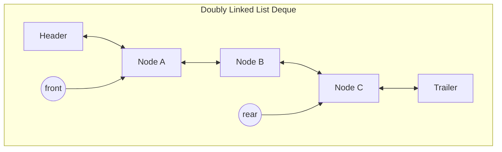

---
# Frontmatter for Slidev configuration
title: 'Double-Ended Queues (Deque)'
transition: slide-left
theme: seriph
layout: cover
background: https://cover.sli.dev
---

# Double-Ended Queues (Deque)
### Algorithm and Data Structures
### semester 1/2025
### Dr. Ruslee Sutthaweekul

---
hideInToc: false
---

## Outline

<toc mode="onlySiblings" minDepth="2" columns="1"/>

---
layout: two-cols-header
---

## The Double-Ended Queue (Deque) ADT
<br>
<br>

*   A **Deque** (pronounced "deck") is a queue-like data structure that supports element insertion and removal at **both ends** (front and rear).
*   It generalizes both a standard Queue (insert at rear, remove from front) and a Stack (insert at front, remove from front).
:: left ::
*   **Core Operations:**
    *   `addFirst(e)`: Inserts an element at the front.
    *   `addLast(e)`: Inserts an element at the rear.
    *   `removeFirst()`: Removes and returns the element from the front.
    *   `removeLast()`: Removes and returns the element from the rear.
:: right ::
*   **Helper Operations:**
    *   `first()`: Returns the front element without removing it.
    *   `last()`: Returns the rear element without removing it.
    *   `size()`, `isEmpty()`: Same as a standard queue.

---
layout: two-cols
---

## Deque Operation Example

| Method Call      | Return Value | Deque Contents (Front to Rear) |
| :--------------- | :----------- | :----------------------------- |
| `addFirst(5)`    |              | (5)                            |
| `addLast(3)`     |              | (5, 3)                         |
| `addFirst(7)`    |              | (7, 5, 3)                      |
| `removeFirst()`  | 7            | (5, 3)                         |
| `last()`         | 3            | (5, 3)                         |
| `removeLast()`   | 3            | (5)                            |
| `addLast(8)`     |              | (5, 8)                         |

:: right ::

| Method Call      | Return Value | Deque Contents (Front to Rear) |
| :--------------- | :----------- | :----------------------------- |
| `removeFirst()`  | 5            | (8)                            |
| `removeFirst()`  | 8            | ()                             |
| `isEmpty()`      | true         | ()                             |


*   A Deque can be used as a **Queue** by only using `addLast` and `removeFirst`.
*   A Deque can be used as a **Stack** by only using `addFirst` and `removeFirst` (or `addLast` and `removeLast`).

---

## Deque Implementation: Circular Array

*   A Deque can also be implemented using a circular array, similar to a standard queue.
*   This approach has a fixed capacity (`N`).
*   We still use an index `f` for the front and a variable `sz` for the size.
*   **Operations require careful index management:**
    *   `addFirst(e)`: The front index `f` is decremented (circularly) and the new element is placed there. `f = (f - 1 + N) % N`.
    *   `addLast(e)`: The rear index `r` is calculated as `(f + sz) % N`, and the element is placed there.
    *   `removeFirst()`: The front index `f` is incremented (circularly). `f = (f + 1) % N`.
    *   `removeLast()`: The size `sz` is decremented, effectively "removing" the last element without moving indices.


---
layout: two-cols-header
---

## Deque Implementation: Doubly Linked List

<br>

*   A **doubly linked list** is the most natural and efficient data structure for implementing a Deque.
*   Each node has references to both the `previous` and `next` nodes.
*   We use `header` and `trailer` sentinel nodes to simplify the logic for adding to or removing from an empty/full list.

:: left ::


:: right ::

*   `addFirst` is an insert after the `header`.
*   `addLast` is an insert before the `trailer`.
*   `removeFirst` is a remove from after the `header`.
*   `removeLast` is a remove from before the `trailer`.

---

## Deque Interface in Java

This interface formalizes the Deque ADT.

```java
public interface Deque<E> {
  int size();
  boolean isEmpty();
  E first() throws EmptyDequeException;
  E last() throws EmptyDequeException;
  void addFirst(E e);
  void addLast(E e);
  E removeFirst() throws EmptyDequeException;
  E removeLast() throws EmptyDequeException;
}
```

---
layout: two-cols
---

## Deque Implementation: The Adapter Pattern

*   We can implement our `Deque` by **adapting** a `DoublyLinkedList`.
    *   The `LinkedDeque` class (target) implements the `Deque` interface.
    *   It contains a private instance of `DoublyLinkedList` (adaptee).
    *   Each `Deque` method is implemented by calling the corresponding method on the `DoublyLinkedList` instance.
*   This promotes code reuse and separates the Deque abstraction from its underlying implementation.

:: right ::

```java{*}{maxHeight:'450px',lines:false}
// An implementation of the Deque interface using a DoublyLinkedList as the adaptee.
public class LinkedDeque<E> implements Deque<E> {
    private DoublyLinkedList<E> list = new DoublyLinkedList<>(); // The adapted list

    @Override
    public int size() { return list.size(); }

    @Override
    public boolean isEmpty() { return list.isEmpty(); }

    @Override
    public void addFirst(E e) { list.addFirst(e); }

    @Override
    public void addLast(E e) { list.addLast(e); }

    @Override
    public E removeFirst() { return list.removeFirst(); }

    @Override
    public E removeLast() { return list.removeLast(); }

    @Override
    public E first() { return list.first(); }

    @Override
    public E last() { return list.last(); }
}
```

---

## Doubly Linked List Deque: Performance

*   Because we have direct access to both the head and tail of the list (via sentinels), all operations can be performed in constant time.
*   **Performance:**
    *   Space complexity: $O(n)$.
    *   Time complexity: **$O(1)$** for all Deque operations (`addFirst`, `addLast`, `removeFirst`, `removeLast`, etc.).
*   This is highly efficient and avoids the fixed-capacity issue of an array-based implementation.

---
layout: two-cols
---

## Summary: Deque

*   **Principle:** A double-ended queue. Insert/remove from either end.
*   **Generalizes:** Stacks and Queues.
*   **Core Operations:** `addFirst`, `addLast`, `removeFirst`, `removeLast`.
*   **Implementations:**
    *   **Circular Array:**
        *   **Pros:** Memory-efficient.
        *   **Cons:** Fixed capacity, complex index logic.
        *   **Performance:** $O(1)$ for all operations.
    *   **Doubly Linked List (Ideal):**
        *   **Pros:** Dynamic capacity, highly efficient.
        *   **Performance:** $O(1)$ for all operations.
:: right ::

*   **Applications:**
    *   Implementing a "undo" history in editors.
    *   Stealing work in scheduling algorithms (work-stealing schedulers).
    *   Managing sliding window problems.
