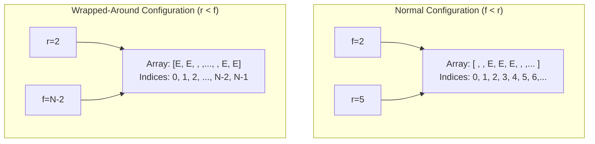
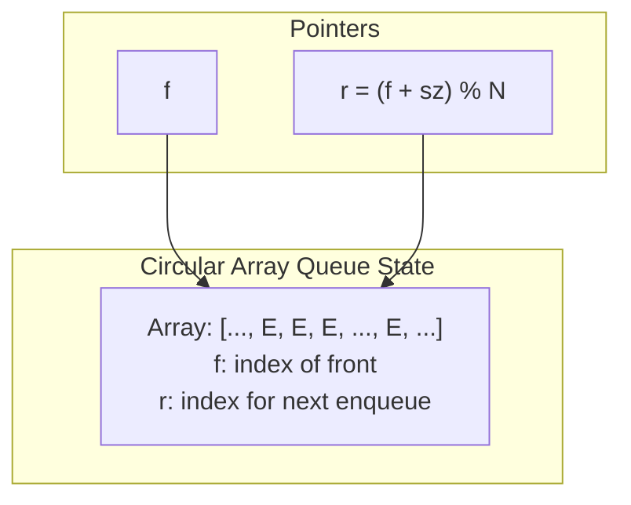
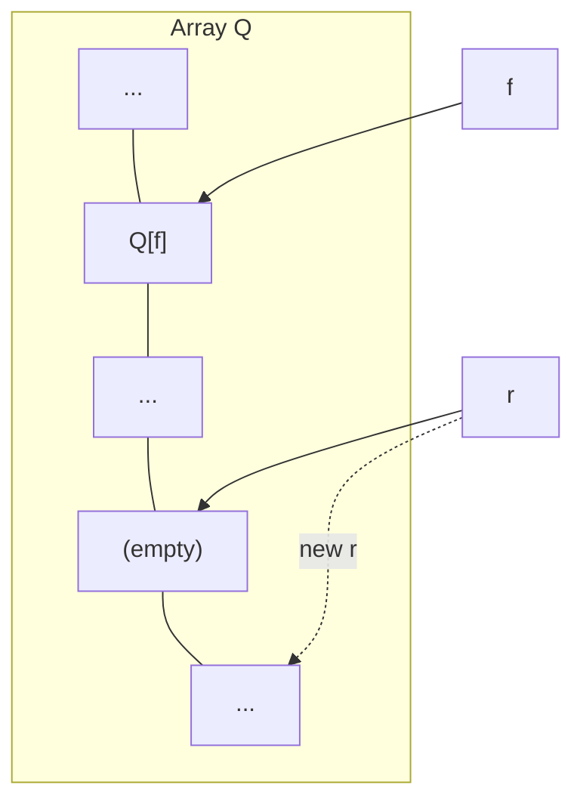
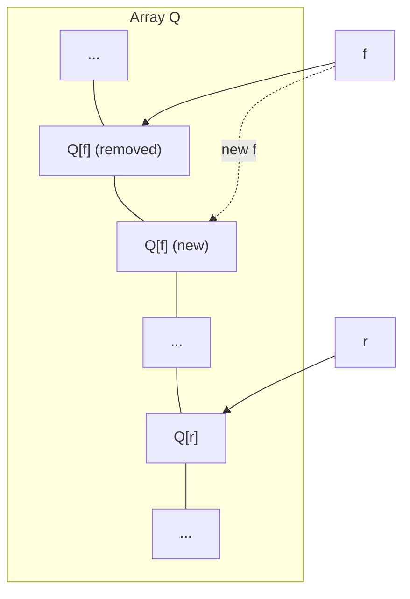
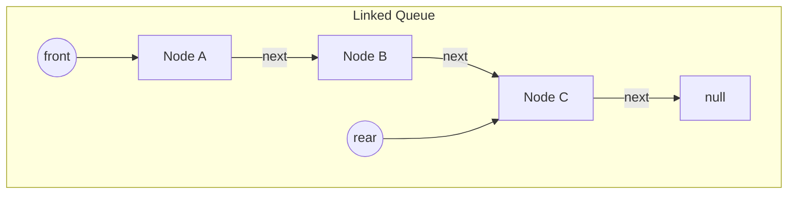
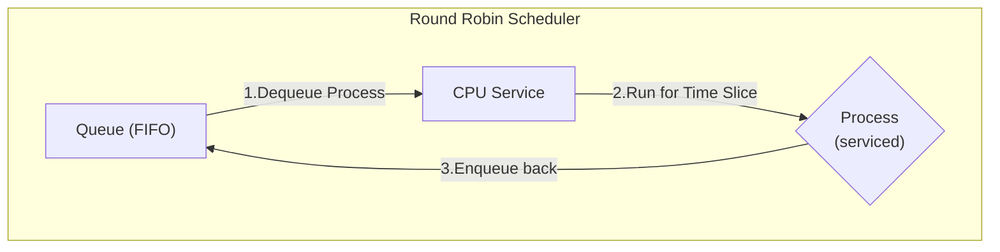
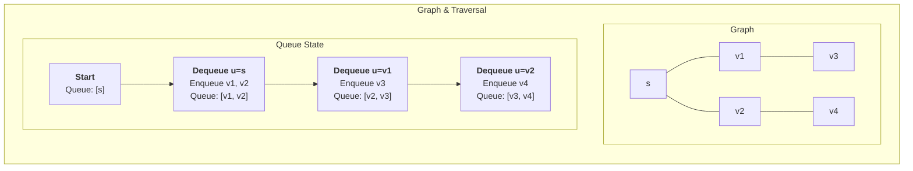
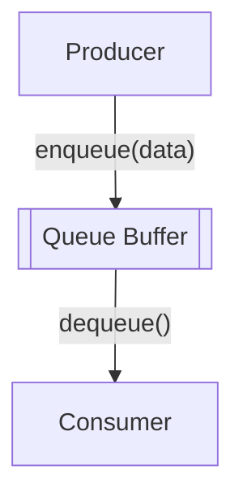

---
# Frontmatter for Slidev configuration
title: 'Queues'
transition: slide-left
theme: seriph
layout: cover
background: https://cover.sli.dev
---

# Queues
### Algorithm and Data Structures
### semester 1/2025
### Dr. Ruslee Sutthaweekul

---
hideInToc: false
---

## Outline

<toc mode="onlySiblings" minDepth="2" columns="2"/>


---


## The Queue Abstract Data Type (ADT)


* A **Queue** stores a collection of arbitrary objects. It follows a **First-In, First-Out (FIFO)** principle. Insertions happen at the **rear** (end), and removals occur at the **front**.
* **Core Operations:**
    * `enqueue(object)`: Inserts an element at the rear of the queue.
    * `dequeue()`: Removes and returns the element from the front of the queue.
* **Helper Operations:**
    * `first()`: Returns the front element without removing it.
    * `size()`: Returns the number of elements currently in the queue.
    * `isEmpty()`: Checks if the queue contains any elements.
* **Error Conditions:**
    * Attempting to `dequeue()` or `first()` on an empty queue should result in an error (typically by throwing an exception).

<div style="position:fixed;right:50px;width:200px;height:200px;top:150px">

</div>

---
layout: two-cols
---

## Queue Operation Example

<Transform :scale="0.9">

| Method Call | Return Value | Queue Contents (Front to Rear) |
| :---------- | :----------- | :----------------------------- |
| enqueue(5)  |              | (5)                            |
| enqueue(3)  |              | (5, 3)                         |
| dequeue()   | 5            | (3)                            |
| enqueue(7)  |              | (3, 7)                         |
| dequeue()   | 3            | (7)                            |
| first()     | 7            | (7)                            |
| dequeue()   | 7            | ()                             |

</Transform>


:: right ::

<Transform :scale="0.9">


| Method Call | Return Value | Queue Contents (Front to Rear) |
| :---------- | :----------- | :----------------------------- |
| dequeue()   | throws Exception | ()                         |
| isEmpty()   | true         | ()                             |
| enqueue(9)  |              | (9)                            |
| enqueue(7)  |              | (9, 7)                         |
| size()      | 2            | (9, 7)                         |
| enqueue(3)  |              | (9, 7, 3)                      |
| enqueue(5)  |              | (9, 7, 3, 5)                   |
| dequeue()   | 9            | (7, 3, 5)                      |


</Transform>


---

## Applications of Queues

* **Direct Uses:**
    * Managing waiting lists (e.g., customer service).
    * Handling access to shared resources like printers (print queues).
    * Scheduling tasks in operating systems (multiprogramming).
* **Indirect Uses:**
    * As an auxiliary data structure within various algorithms (e.g., Breadth-First Search).
    * As a component for building more complex data structures.

---

## Array-Based Queue Implementation

* Uses a fixed-size array (`N`) in a **circular** manner to store elements.
* Two key variables:
    * `f`: Index of the front element.
    * `sz`: Current number of elements stored in the queue.
* The position immediately after the rear element (where the next enqueue would occur) is calculated as `r = (f + sz) % N`. The modulo operator (`%`) handles the wrap-around.



---
layout: two-cols
---

## Array-Based Queue: Basic Operations

Using the `f` (front index) and `sz` (size) variables:

```text
Algorithm size():
  return sz

Algorithm isEmpty():
  return (sz == 0)
```

:: right ::




---
layout: two-cols
---


## Array-Based Queue: Enqueue Operation

Adds an element `o` to the rear.

```text
Algorithm enqueue(o):
  // Check if the array is full (size equals capacity)
  if size() == N then // N is the array capacity
    throw IllegalStateException("Queue is full")
  else
    // Calculate rear index using modulo arithmetic
    r = (f + sz) % N
    Q[r] = o // Place the new element at the rear
    sz = sz + 1 // Increment the size
```

* Throws an exception if the queue is full (cannot add more elements). The specific exception depends on the implementation.


:: right ::




---
layout: two-cols
---


## Array-Based Queue: Dequeue Operation

Removes and returns the element from the front.

```text
Algorithm dequeue():
  if isEmpty() then
    throw EmptyQueueException() // Or a similar exception
  else
    o = Q[f] // Get the element at the front index
    f = (f + 1) % N // Move front index forward (circularly)
    sz = sz - 1 // Decrement the size
    return o // Return the removed element
```

* Returns `null` if the queue was empty (as per our ADT definition).


:: right ::



---

## Queue Interface Definition in Java

This interface formalizes the Queue ADT in Java.

```java
public interface Queue<E> {
  /** Returns the number of elements in the queue. */
  int size();

  /** Tests whether the queue is empty. */
  boolean isEmpty();

  /** Returns, but does not remove, the element at the front of the queue. */
  E first() throws EmptyQueueException;

  /** Inserts an element at the rear of the queue. */
  void enqueue(E e);

  /** Removes and returns the element at the front of the queue. */
  E dequeue() throws EmptyQueueException;
}
```

* Consistent with our ADT definition where `first()` and `dequeue()` return `null` on an empty queue.

---

## Array-Based Queue Implementation (Java Snippet)

```java {*}{maxHeight:'380px'}
/** Implementation of the Queue ADT using a fixed-length circular array. */
public class ArrayQueue<E> implements Queue<E> {

    // Default capacity if none specified
    public static final int CAPACITY = 1000;

    // Instance variables
    private E[] data;       // Generic array for storage
    private int f = 0;      // Index of the front element
    private int sz = 0;     // Current number of elements

    // Constructors
    public ArrayQueue() { this(CAPACITY); } // Default capacity

    public ArrayQueue(int capacity) {        // Given capacity
        data = (E[]) new Object[capacity]; // Create array (unsafe cast needed)
    }

    // Methods from Queue interface
    @Override
    public int size() { return sz; }

    @Override
    public boolean isEmpty() { return (sz == 0); }

    // enqueue, dequeue, first methods would follow...
}
```

*(Note: Only shows basic structure and some methods for brevity)*

---

## Array-Based Queue: Enqueue/Dequeue (Java Snippet)

```java {*}{maxHeight:'380px'}
// Continuing ArrayQueue<E> class...

@Override
public void enqueue(E e) throws IllegalStateException {
    if (sz == data.length) throw new IllegalStateException("Queue is full");
    int avail = (f + sz) % data.length; // Calculate index for new element
    data[avail] = e;
    sz++;
}

@Override
public E first() {
    if (isEmpty()) throw new EmptyQueueException();
    return data[f];
}

@Override
public E dequeue() {
    if (isEmpty()) throw new EmptyQueueException();
    E answer = data[f];
    data[f] = null; // Help garbage collection
    f = (f + 1) % data.length; // Move front index circularly
    sz--;
    return answer;
}
```

*(Note: Includes the remaining core methods)*

---

## Linked-List-Based Queue Implementation

*   A queue can also be implemented using a **singly linked list**.
*   This approach avoids the fixed-size limitation of an array-based queue.
*   We need to keep track of both the `front` (head) and `rear` (tail) of the list to achieve constant-time `enqueue` and `dequeue` operations.

**Operations:**
*   `enqueue(e)`: Adds a new element to the `rear` of the list (`addLast`).
*   `dequeue()`: Removes an element from the `front` of the list (`removeFirst`).

---


## Linked-List-Based Queue

*   We maintain two references: `front` (points to the first node) and `rear` (points to the last node).
*   `enqueue(e)`: Create a new node. Set the `next` of the current `rear` to the new node, and then update `rear` to be the new node.
*   `dequeue()`: Remove the `front` node and update `front` to be the next node in the list.




---

## LinkedQueue Implementation (Java)

```java {*}{maxHeight:'430px'}
public class LinkedQueue<E> implements Queue<E> {

    private static class Node<E> {
        private E element;
        private Node<E> next;
        public Node(E e, Node<E> n) {
            element = e;
            next = n;
        }
        public E getElement() { return element; }
        public Node<E> getNext() { return next; }
    }

    private Node<E> front = null;
    private Node<E> rear = null;
    private int size = 0;

    public LinkedQueue() { }

    @Override
    public int size() { return size; }

    @Override
    public boolean isEmpty() { return size == 0; }

    @Override
    public void enqueue(E e) {
        Node<E> newest = new Node<>(e, null);
        if (isEmpty()) {
            front = newest;
        } else {
            rear.next = newest;
        }
        rear = newest;
        size++;
    }

    @Override
    public E first() {
        if (isEmpty()) throw new EmptyQueueException();
        return front.getElement();
    }

    @Override
    public E dequeue() {
        if (isEmpty()) throw new EmptyQueueException();
        E answer = front.getElement();
        front = front.getNext();
        size--;
        if (isEmpty()) {
            rear = null;
        }
        return answer;
    }
}
```

---

## Linked-List Queue: Performance

*   **Performance:**
    *   Space complexity: $O(n)$, where $n$ is the number of elements.
    *   Time complexity: $O(1)$ for all operations (`enqueue`, `dequeue`, `first`, `size`, `isEmpty`).
*   **Advantages:**
    *   No capacity limitations, unlike the array-based implementation.
    *   Efficient use of memory, as nodes are created only when needed.


---

## Application: Round Robin Schedulers

* A common scheduling algorithm where processes are given a fixed time slice (quantum) of CPU time in a circular order.
* A queue is a natural fit for managing the processes waiting for their turn.
* **Algorithm:**
    1.  `e = Q.dequeue()` (Get the next process from the front).
    2.  Service element `e` (Let it run for its time slice).
    3.  `Q.enqueue(e)` (Put the process back at the end of the queue).
* Repeat these steps.




--- 


## Application: Breadth-First Search (BFS)

*   **BFS** is a fundamental graph traversal algorithm that explores a graph layer by layer.
*   It starts at a source node `s` and explores all its immediate neighbors before moving on.
*   A queue manages the "frontier" of nodes to visit.

**Algorithm:**
1.  Initialize a queue and add the starting node `s`.
2.  Mark `s` as visited.
3.  While the queue is not empty:
    a.  Dequeue a node `u`.
    b.  For each unvisited neighbor `v` of `u`:
        i.  Mark `v` as visited.
        ii. Enqueue `v`.





---
layout: two-cols
---


## Application: Data Buffering

*   Queues are essential for **buffering** data between two processes that produce and consume data at different rates.
*   **Producer:** A process that generates data and `enqueues` it (e.g., a network card receiving packets, a user typing on a keyboard).
*   **Consumer:** A process that `dequeues` data and processes it (e.g., an application processing the packets, a text editor displaying characters).
*   The queue acts as a temporary storage area, smoothing out variations in speed and preventing data loss.

:: right ::

<div style="position:fixed;right:200px">




</div>

---

## Summary: Queues

*   **Principle:** First-In, First-Out (FIFO).
*   **Core Operations:** `enqueue`, `dequeue`, `first`, `isEmpty`, `size`.
*   **Implementations:**
    *   **Array-Based (Circular):**
        *   **Pros:** Memory-efficient.
        *   **Cons:** Fixed capacity.
        *   **Performance:** $O(1)$ for all operations.
    *   **Linked-List-Based:**
        *   **Pros:** Dynamic capacity.
        *   **Cons:** Requires tracking both `front` and `rear` for $O(1)$ enqueue.
        *   **Performance:** $O(1)$ for all operations.
*   **Key Applications:** Scheduling (Round Robin), graph traversal (BFS), data buffering, and managing requests.
