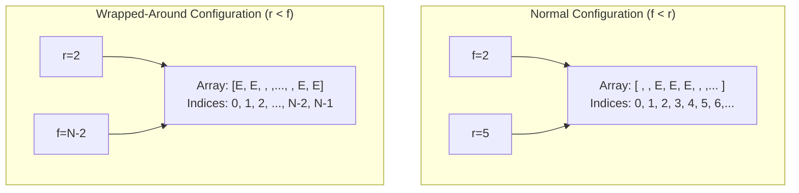
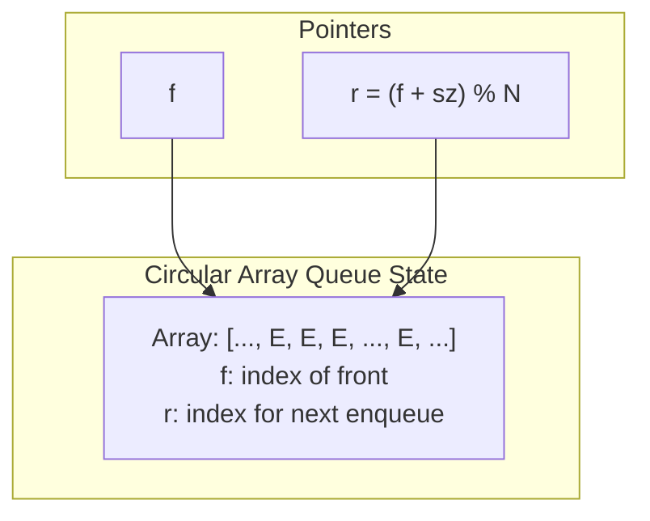
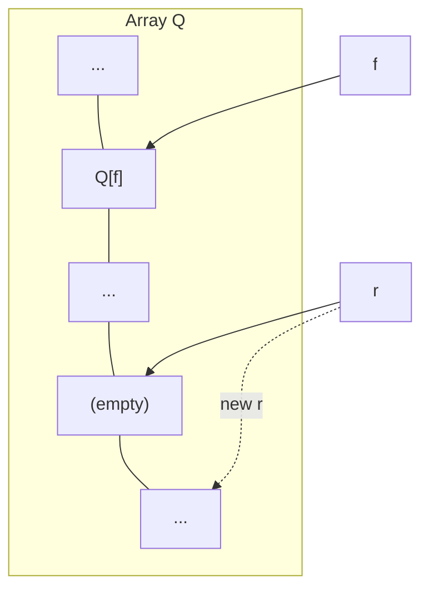
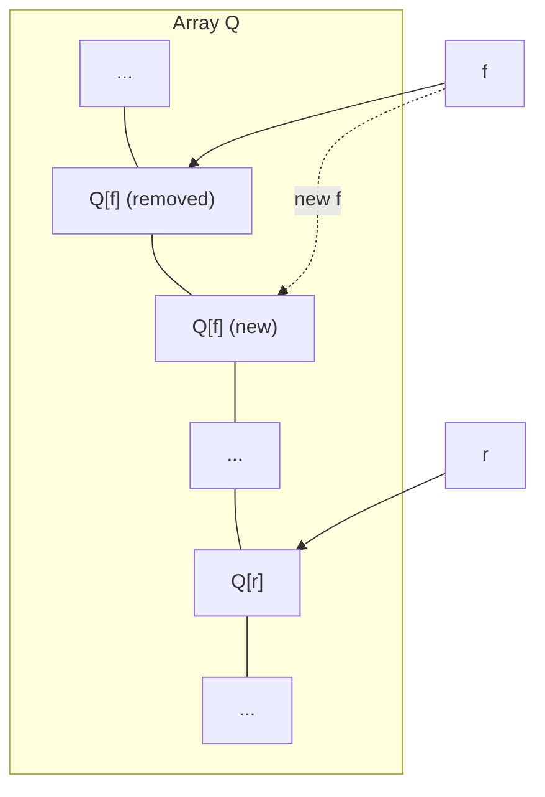
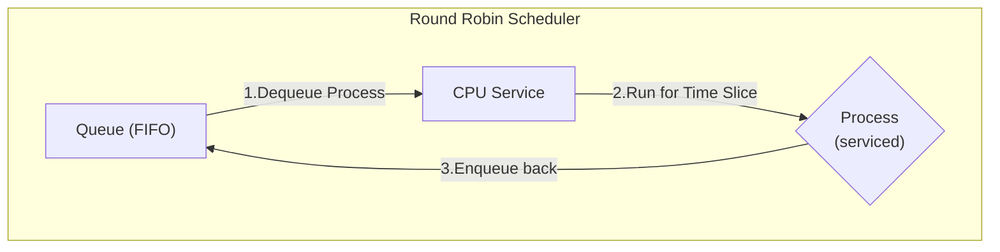
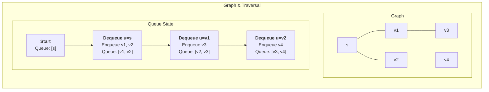
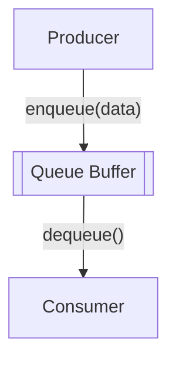
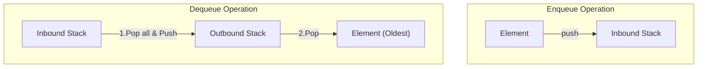
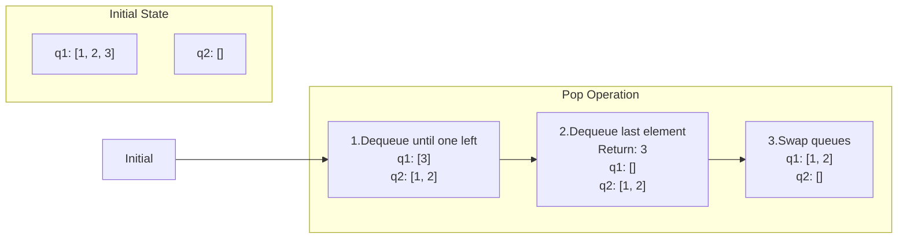

---
# Frontmatter for Slidev configuration
title: 'Queues'
transition: slide-left
theme: seriph
layout: cover
background: https://cover.sli.dev
---

# Queues
## {{ $slidev.configs.subject }}
### Semester {{ $slidev.configs.semester }}
<br>

### Presented by {{ $slidev.configs.presenter }}

---
hideInToc: false
---

## Outline

<toc mode="onlySiblings" minDepth="2" columns="2"/>


---

## The Queue Abstract Data Type (ADT)

* A **Queue** stores a collection of arbitrary objects. It follows a **First-In, First-Out (FIFO)** principle. Insertions happen at the **rear** (end), and removals occur at the **front**.
* **Core Operations:**
    * `enqueue(object)`: Inserts an element at the rear of the queue.
    * `dequeue()`: Removes and returns the element from the front of the queue.
* **Helper Operations:**
    * `first()`: Returns the front element without removing it.
    * `size()`: Returns the number of elements currently in the queue.
    * `isEmpty()`: Checks if the queue contains any elements.
* **Error Conditions:**
    * Attempting to `dequeue()` or `first()` on an empty queue should result in an error (typically by throwing an exception).

<div style="position:fixed;right:50px;width:200px;height:200px;top:150px">

</div>

---
layout: two-cols-header
---

## Queue Operation Example

:: left ::

<Transform :scale="0.9">

| **Method Call** | **Return Value** | **Queue Contents (Front to Rear)** |
| :---------- | :----------- | :----------------------------- |
| enqueue(5)  |              | (5)                            |
| enqueue(3)  |              | (5, 3)                         |
| dequeue()   | 5            | (3)                            |
| enqueue(7)  |              | (3, 7)                         |
| dequeue()   | 3            | (7)                            |
| first()     | 7            | (7)                            |
| dequeue()   | 7            | ()                             |
| dequeue()   | throws Exception | ()                         |

</Transform>

:: right ::

<Transform :scale="0.9">

| **Method Call** | **Return Value** | **Queue Contents (Front to Rear)** |
| :---------- | :----------- | :----------------------------- |
| isEmpty()   | true         | ()                             |
| enqueue(9)  |              | (9)                            |
| enqueue(7)  |              | (9, 7)                         |
| size()      | 2            | (9, 7)                         |
| enqueue(3)  |              | (9, 7, 3)                      |
| enqueue(5)  |              | (9, 7, 3, 5)                   |
| dequeue()   | 9            | (7, 3, 5)                      |


</Transform>


---

## Applications of Queues

* **Direct Uses:**
    * Managing waiting lists (e.g., customer service).
    * Handling access to shared resources like printers (print queues).
    * Scheduling tasks in operating systems (multiprogramming).
* **Indirect Uses:**
    * As an auxiliary data structure within various algorithms (e.g., Breadth-First Search).
    * As a component for building more complex data structures.

---

## Array-Based Queue Implementation

* Uses a fixed-size array (`N`) in a **circular** manner to store elements.
* Two key variables:
    * `f`: Index of the front element.
    * `sz`: Current number of elements stored in the queue.
* The position immediately after the rear element (where the next enqueue would occur) is calculated as `r = (f + sz) % N`. The modulo operator (`%`) handles the wrap-around.



---
layout: two-cols
hide: true
---

## Array-Based Queue: Basic Operations

Using the `f` (front index) and `sz` (size) variables:

```text
Algorithm size():
  return sz

Algorithm isEmpty():
  return (sz == 0)
```

:: right ::




---
layout: two-cols
---


## Array-Based Queue: Enqueue Operation

Adds an element `o` to the rear.

```text
Algorithm enqueue(o):
  // Check if the array is full (size equals capacity)
  if size() == N then // N is the array capacity
    throw IllegalStateException("Queue is full")
  else
    // Calculate rear index using modulo arithmetic
    r = (f + sz) % N
    Q[r] = o // Place the new element at the rear
    sz = sz + 1 // Increment the size
```

* Throws an exception if the queue is full (cannot add more elements). The specific exception depends on the implementation.


:: right ::

<div style="position:fixed;right:100px">



</div>

---
layout: two-cols
---


## Array-Based Queue: Dequeue Operation

Removes and returns the element from the front.

```text
Algorithm dequeue():
  if isEmpty() then
    throw EmptyQueueException() // Or a similar exception
  else
    o = Q[f] // Get the element at the front index
    f = (f + 1) % N // Move front index forward (circularly)
    sz = sz - 1 // Decrement the size
    return o // Return the removed element
```

* Returns `null` if the queue was empty (as per our ADT definition).


:: right ::

<div style="position:fixed;right:100px">

</div>

---

## Queue Interface Definition

This interface formalizes the Queue ADT in Java.

```java
public interface Queue<E> {
  /** Returns the number of elements in the queue. */
  int size();

  /** Tests whether the queue is empty. */
  boolean isEmpty();

  /** Returns, but does not remove, the element at the front of the queue. */
  E first() throws EmptyQueueException;

  /** Inserts an element at the rear of the queue. */
  void enqueue(E e);

  /** Removes and returns the element at the front of the queue. */
  E dequeue() throws EmptyQueueException;
}
```

* Consistent with our ADT definition where `first()` and `dequeue()` return `null` on an empty queue.

---

## Array-Based Queue Implementation

```java {*}{maxHeight:'380px'}
/** Implementation of the Queue ADT using a fixed-length circular array. */
public class ArrayQueue<E> implements Queue<E> {

    // Default capacity if none specified
    public static final int CAPACITY = 1000;

    // Instance variables
    private E[] data;       // Generic array for storage
    private int f = 0;      // Index of the front element
    private int sz = 0;     // Current number of elements

    // Constructors
    public ArrayQueue() { this(CAPACITY); } // Default capacity

    public ArrayQueue(int capacity) {        // Given capacity
        data = (E[]) new Object[capacity]; // Create array (unsafe cast needed)
    }

    // Methods from Queue interface
    @Override
    public int size() { return sz; }

    @Override
    public boolean isEmpty() { return (sz == 0); }

    // enqueue, dequeue, first methods would follow...
}
```

*(Note: Only shows basic structure and some methods for brevity)*

---

## Array-Based Queue: Enqueue/Dequeue

```java {*}{maxHeight:'380px'}
// Continuing ArrayQueue<E> class...

@Override
public void enqueue(E e) throws IllegalStateException {
    if (sz == data.length) throw new IllegalStateException("Queue is full");
    int avail = (f + sz) % data.length; // Calculate index for new element
    data[avail] = e;
    sz++;
}

@Override
public E first() {
    if (isEmpty()) throw new EmptyQueueException();
    return data[f];
}

@Override
public E dequeue() {
    if (isEmpty()) throw new EmptyQueueException();
    E answer = data[f];
    data[f] = null; // Help garbage collection
    f = (f + 1) % data.length; // Move front index circularly
    sz--;
    return answer;
}
```

*(Note: Includes the remaining core methods)*

---

## Array-Based Queue: Performance & Limits

*   **Performance:**
    *   Space complexity: $O(n)$, where $n$ is the fixed capacity of the array.
    *   Time complexity: $O(1)$ for all operations (`enqueue`, `dequeue`, `first`, `size`, `isEmpty`).

*   **Limitations:**
    *   **Fixed Capacity:** The most significant limitation is that the queue has a fixed maximum capacity. If the queue becomes full, `enqueue` operations will fail (e.g., throw an `IllegalStateException`). This requires pre-determining the maximum size, which can be inefficient if usage patterns vary widely.
    *   **Potential for Wasted Space:** If the allocated array size is much larger than the average number of elements stored, memory is wasted.
    *   **No Dynamic Resizing (typically):** While it's theoretically possible to implement resizing for a circular array, it adds significant complexity and overhead (copying elements to a new, larger array), which often negates the simplicity and efficiency benefits of an array-based approach.

---
layout: two-cols-header
---

## Linked-Based Queue Implementation
:: left ::
A `LinkedQueue` can be created by adapting the `SinglyLinkedList` class.


The **adapter pattern** modifies an existing class so its methods match those of a related, but different, interface.

- We define a new class that contains an instance of the existing class as a hidden field.
- We then implement the methods of the new class by calling methods on the hidden instance.

For our `LinkedQueue`, `enqueue` operations will add to the "rear" (or tail) of the linked list, and `dequeue` operations will remove from the "front" (or head) of the linked list. Both operations are done in constant time.

:: right ::

| **Queue Method** | **SinglyLinkedList Method** |
|---|---|
| `enqueue(e)` | `list.addLast(e)` |
| `dequeue()` | `list.removeFirst()` |
| `first()` | `list.get(0)` |
| `size()` | `list.size()` |
| `isEmpty()` | `list.isEmpty()` |

---

## LinkedQueue Implementation - Adapter Pattern

This implementation uses the Adapter pattern, leveraging the `SinglyLinkedList` class to provide queue functionality.

```java {*}{maxHeight:'350px'}
public class LinkedQueue<E> implements Queue<E> {

    private SinglyLinkedList<E> list = new SinglyLinkedList<>(); // The adaptee

    public LinkedQueue() { }

    @Override
    public int size() { return list.size(); }

    @Override
    public boolean isEmpty() { return list.isEmpty(); }

    @Override
    public void enqueue(E e) {
        list.addLast(e); // Enqueue corresponds to adding to the rear of the list
    }

    @Override
    public E first() throws EmptyQueueException {
        if (isEmpty()) throw new EmptyQueueException();
        return list.get(0); // First corresponds to getting the first element
    }

    @Override
    public E dequeue() throws EmptyQueueException {
        if (isEmpty()) throw new EmptyQueueException();
        return list.removeFirst(); // Dequeue corresponds to removing from the front
    }
}
```

---

## Linked-List Queue: Performance (Adapter Pattern)

*   **Performance:**
    *   Space complexity: $O(n)$, where $n$ is the number of elements. Each element requires a new node object within the underlying `SinglyLinkedList`.
    *   Time complexity: $O(1)$ for all operations (`enqueue`, `dequeue`, `first`, `size`, `isEmpty`) because they delegate to `SinglyLinkedList` methods (`addLast`, `removeFirst`, `get(0)`, `size`, `isEmpty`) which are all $O(1)$ for a singly linked list with head and tail references.
*   **Advantages:**
    *   No capacity limitations, unlike the array-based implementation.
    *   Efficient use of memory, as nodes are created only when needed.
    *   **Code Reusability:** Leverages an existing data structure (`SinglyLinkedList`) for implementation, promoting cleaner and more modular code.


---

## Application: Round Robin Schedulers

* A common scheduling algorithm where processes are given a fixed time slice (quantum) of CPU time in a circular order.
* A queue is a natural fit for managing the processes waiting for their turn.
* **Algorithm:**
    1.  `e = Q.dequeue()` (Get the next process from the front).
    2.  Service element `e` (Let it run for its time slice).
    3.  `Q.enqueue(e)` (Put the process back at the end of the queue).
* Repeat these steps.




--- 


## Application: Breadth-First Search (BFS)

*   **BFS** is a fundamental graph traversal algorithm that explores a graph layer by layer.
*   It starts at a source node `s` and explores all its immediate neighbors before moving on.
*   A queue manages the "frontier" of nodes to visit.

**Algorithm:**
1.  Initialize a queue and add the starting node `s`.
2.  Mark `s` as visited.
3.  While the queue is not empty:
    a.  Dequeue a node `u`.
    b.  For each unvisited neighbor `v` of `u`:
        i.  Mark `v` as visited.
        ii. Enqueue `v`.





---
layout: two-cols
---

## Application: Data Buffering

*   Queues are essential for **buffering** data between two processes that produce and consume data at different rates.
*   **Producer:** A process that generates data and `enqueues` it (e.g., a network card receiving packets, a user typing on a keyboard).
*   **Consumer:** A process that `dequeues` data and processes it (e.g., an application processing the packets, a text editor displaying characters).
*   The queue acts as a temporary storage area, smoothing out variations in speed and preventing data loss.

:: right ::

<div style="position:fixed;right:200px">




</div>

---
layout: two-cols-header
---

## Application: Queue from Stacks (Adapter Pattern)
How can we implement a `Queue` using only `Stack`s? 

:: left ::
We use two stacks: `inbound` and `outbound`.
*   **`dequeue()`:**
    1.  If the `outbound` stack is empty, pop every element from `inbound` and push it onto `outbound`. This reverses the order of elements, placing the oldest element at the top of `outbound`.
    2.  Pop and return the top element from `outbound`.
:: right ::
*   **`enqueue(e)`:** Push the new element `e` onto the `inbound` stack. This is an $O(1)$ operation.
*   **Performance:**
    *   `enqueue` is always $O(1)$.
    *   `dequeue` is $O(1)$ when `outbound` is not empty.
    *   `dequeue` is $O(n)$ when `outbound` is empty, as it moves $n$ elements. However, the **amortized time complexity** for `dequeue` is $O(1)$ because each element is moved between stacks only once.


---
layout: two-cols
---

## Application: Stack from Queues (Adapter Pattern)

Implementing a `Stack` using only `Queue`s.

We can use two queues, `q1` and `q2`, to simulate LIFO behavior.
*   **`pop()`:**
    1.  While `q1` has more than one element, dequeue from `q1` and enqueue into the secondary queue (`q2`).
    2.  The last remaining element in `q1` is the one to be "popped". Dequeue it and return it.
    3.  Swap the roles of `q1` and `q2`. The secondary queue now holds all the other elements and becomes the primary.
:: right ::
*   **`push(e)`:** Enqueue the new element `e` into the primary queue (`q1`). This is an $O(1)$ operation.

*   **Performance:**
    *   `push` is always $O(1)$.
    *   `pop` is an $O(n)$ operation because it requires moving $n-1$ elements from one queue to the other.

<br>



---

## Summary: Queues

*   **Principle:** First-In, First-Out (FIFO).
*   **Core Operations:** `enqueue`, `dequeue`, `first`, `isEmpty`, `size`.
*   **Implementations:**
    *   **Array-Based (Circular):**
        *   **Pros:** Memory-efficient, $O(1)$ for all operations.
        *   **Cons:** Fixed capacity, potential for wasted space, no dynamic resizing.
    *   **Linked-List-Based (Adapter Pattern):**
        *   **Pros:** Dynamic capacity, efficient use of memory, code reusability.
        *   **Performance:** $O(1)$ for all operations.
*   **Key Applications:** Scheduling (Round Robin), graph traversal (BFS), data buffering, and managing requests.
