```mermaid {scale:0.55}
graph TD
    subgraph one [1.initial array]
        direction LR
        A["el<sub>0</sub>"] --- B["el<sub>1</sub>"] --- C["..."] --- D["el<sub>i</sub>"] --- E["..."] --- F["el<sub>n-1</sub>"] --- G["(empty)"]
        style D fill:#ffc,stroke:#333,stroke-width:2px
        style G fill:#eee,stroke-dasharray: 5 5
    end

    subgraph two [2.shifted elements →→→]
        direction LR
        A2["el<sub>0</sub>"] --- B2["el<sub>1</sub>"] --- C2["..."] --- D2["(vacated)"] --- E2["el<sub>i</sub>"] --- F2["..."] --- G2["el<sub>n-1</sub>"]
        style D2 fill:#9f9,stroke:#333,stroke-width:2px
    end

    subgraph three [3.insert new element 'e']
        direction LR
        A3["el<sub>0</sub>"] --- B3["el<sub>1</sub>"] --- C3["..."] --- D3["e"] --- E3["el<sub>i</sub>"] --- F3["..."] --- G3["el<sub>n-1</sub>"]
        style D3 fill:#9f9,stroke:#333,stroke-width:2px
    end

    one --> two
    two --> three
    
    %%"1. Initial Array" -- "Shift elements from index n-1 down to i" --> "2. Shift elements to the right"
    %%"2. Shift elements to the right" -- "Place new element 'e' at index i" --> "3. Insert new element 'e'"
    %%"3. Insert new element 'e'" --> End("End")
```

---
# Frontmatter for Slidev configuration
title: 'Lists and Iterators'
transition: slide-left
theme: seriph
layout: cover
background: https://cover.sli.dev
---

# Lists and Iterators
### Algorithm and Data Structures
### semester 1/2025
### Dr. Ruslee Sutthaweekul

---
hideInToc: false
---

## Outline

<toc mode="onlySiblings" minDepth="2" columns="2"/>


---

## The `java.util.List` Interface (ADT)

The standard Java `List` interface defines core operations for list structures:

* `size()`: Returns the number of elements.
* `isEmpty()`: Returns `true` if the list has no elements, `false` otherwise.
* `get(i)`: Returns the element at index `i`. Throws an error if `i` is out of bounds (`[0, size()-1]`).
* `set(i, e)`: Replaces the element at index `i` with `e`, returning the old element. Throws an error if `i` is out of bounds.
* `add(i, e)`: Inserts element `e` at index `i`, shifting subsequent elements. Throws an error if `i` is out of bounds (`[0, size()]`).
* `remove(i)`: Removes and returns the element at index `i`, shifting subsequent elements. Throws an error if `i` is out of bounds.

---
layout: two-cols
---
## List Operation Example

| Method Call | Return Value | List Contents |
| :---------- | :----------- | :------------ |
| `add(0, A)` |              | (A)           |
| `add(0, B)` |              | (B, A)        |
| `get(1)`    | A            | (B, A)        |
| `set(2, C)` | *error* | (B, A)        |
| `add(2, C)` |              | (B, A, C)     |
| `add(4, D)` | *error* | (B, A, C)     |
| `remove(1)` | A            | (B, C)        |
| `add(1, D)` |              | (B, D, C)     |

:: right ::

| Method Call | Return Value | List Contents |
| :---------- | :----------- | :------------ |
| `add(1, E)` |              | (B, E, D, C)  |
| `get(4)`    | *error* | (B, E, D, C)  |
| `add(4, F)` |              | (B, E, D, C, F) |
| `set(2, G)` | D            | (B, E, G, C, F) |
| `get(2)`    | G            | (B, E, G, C, F) |

---

## Array Lists: Implementation Concept

* A common way to implement the `List` ADT is using an array, let's call it `A`.
* The element at list index `i` is stored in the array cell `A[i]`.
* **Advantages:**
    * `get(i)` and `set(i, e)` are very efficient (constant time, O(1)) because they involve direct array access `A[i]`, assuming `i` is a valid index.

  
---

## Array List: Insertion (`add(i, e)`)

<Transform scale="0.9">

* To insert an element `e` at index `i`, we need to create space.
* This involves shifting `n - i` elements (from `A[i]` to `A[n-1]`) one position to the right (towards higher indices).
* **Worst Case:** Inserting at the beginning (`i = 0`) requires shifting all `n` elements.
* **Time Complexity:** $O(n)$ in the worst case.

</Transform>




---

## Array List: Removal (`remove(i)`)

* To remove the element at index `i`, we need to close the gap.
* This involves shifting `n - i - 1` elements (from `A[i+1]` to `A[n-1]`) one position to the left (towards lower indices).
* **Worst Case:** Removing from the beginning (`i = 0`) requires shifting `n-1` elements.
* **Time Complexity:** $O(n)$ in the worst case.


---

## Array List: Performance Summary

For a standard array-based list implementation:

* **Space:** $O(n)$ - proportional to the number of elements.
* **Time:**
    * **`get(i)`, `set(i, e)`:** $O(1)$ - constant time (very fast). 🚀
    * <ins>**`add(i, e)`, `remove(i)`:** $O(n)$ - linear time in the worst case due to potential shifting.</ins> 🐌
* **Handling Full Arrays:** When adding an element to a full array, instead of failing, we can resize the underlying array (create a larger one and copy elements over).

---

## Array List: Java Implementation Snippets (Get/Set)

```java {*}{maxHeight:'420px',lines:true}
// Assumes 'data' is the underlying array and 'size' tracks the number of elements.

/** Returns the number of elements in the array list. */
public int size() { return size; }

/** Returns whether the array list is empty. */
public boolean isEmpty() { return size == 0; }

/** Returns (but does not remove) the element at index i. */
public E get(int i) throws IndexOutOfBoundsException {
    checkIndex(i, size); // Helper method to validate index
    return data[i];
}

/** Replaces the element at index i with e, and returns the replaced element. */
public E set(int i, E e) throws IndexOutOfBoundsException {
    checkIndex(i, size); // Helper method to validate index
    E temp = data[i];
    data[i] = e;
    return temp;
}

/** Checks whether the given index is in the range [0, n-1]. */
protected void checkIndex(int i, int n) throws IndexOutOfBoundsException {
    if (i < 0 || i >= n)
        throw new IndexOutOfBoundsException("Illegal index: " + i);
}

```

---

## Array List: Java Implementation Snippets (Add/Remove)

```java {*}{maxHeight:'420px',lines:true}
// Continuing the array-based list implementation...

/** Inserts element e to be at index i, shifting all subsequent elements later. */
public void add(int i, E e) throws IndexOutOfBoundsException, IllegalStateException {
    checkIndex(i, size + 1); // Allow adding at index 'size'
    if (size == data.length)
        throw new IllegalStateException("Array is full"); // Or resize here

    // Shift elements to make room
    for (int k = size - 1; k >= i; k--) {
        data[k + 1] = data[k];
    }
    data[i] = e; // Place the new element
    size++;
}

/** Removes/returns the element at index i, shifting subsequent elements earlier. */
public E remove(int i) throws IndexOutOfBoundsException {
    checkIndex(i, size);
    E temp = data[i];

    // Shift elements to fill the hole
    for (int k = i; k < size - 1; k++) {
        data[k] = data[k + 1];
    }
    data[size - 1] = null; // Help garbage collection
    size--;
    return temp;
}

```

---

## Growable Array Lists

* What happens when `add` is called on a full array? We can resize!
* **Goal:** Replace the current array with a larger one and copy elements.
* **Strategies for New Size:**
    1.  **Incremental:** Increase size by a fixed constant `c`.
    2.  **Doubling:** Double the current size.

```text
Algorithm addAtEnd(o): // Simplified add at the very end
  if size == capacity then
    // Resize Step
    new_capacity = calculate_new_capacity(...) // e.g., capacity + c OR capacity * 2
    New_Array = new array of size new_capacity
    for j from 0 to size - 1 do
      New_Array[j] = Old_Array[j]
    Old_Array = New_Array
    capacity = new_capacity
    // End Resize Step
  Old_Array[size] = o
  size = size + 1

```

---

## Resizing Strategy Comparison

* We analyze the **total time** `T(n)` for `n` `addAtEnd` operations starting from an empty list (initial capacity 1).
* **Amortized Time:** The average time per operation, `T(n) / n`.

---

## Incremental Strategy Analysis

* If we increase capacity by a constant `c` each time it's full.
* Resizing happens roughly `k = n / c` times.
* Copying costs: `c`, `2c`, `3c`, ..., `kc`.
* Total time `T(n)` is proportional to `n` (for insertions) + `c + 2c + ... + kc` (for copying).
* `c(1 + 2 + ... + k) = c * k*(k+1)/2`, which is O(k²).
* Since `k` is O(n), the copying cost is O(n²).
* `T(n)` is O(n + n²) = **O(n²)**.
* **Amortized time:** T(n)/n = **O(n)**. (Gets slower on average as n grows).

---

## Doubling Strategy Analysis

* If we double the capacity each time it's full.
* Resizing happens `k = log₂ n` times.
* Array sizes during resize: 1, 2, 4, 8, ..., 2ᵏ (where 2ᵏ is roughly n).
* Copying costs: 1, 2, 4, 8, ..., 2ᵏ.
* Total time `T(n)` is proportional to `n` (insertions) + `1 + 2 + 4 + ... + 2ᵏ` (copying).
* The geometric series sum `1 + 2 + ... + 2ᵏ = 2ᵏ⁺¹ - 1`, which is `2 * 2ᵏ - 1`. Since `2ᵏ` is approx `n`, this sum is roughly `2n - 1`.
* `T(n)` is proportional to `n + (2n - 1)`, which is **O(n)**.
* **Amortized time:** T(n)/n = **O(1)**. (Constant time on average!).

*Conclusion: The doubling strategy is significantly more efficient for growable arrays.*

---

## Positional Lists ADT

* An extension of the List concept where we can refer to elements by their **Position**.
* A `Position` acts like a marker or token for a specific element within the list.
* Key Idea: A `Position` remains valid even if other elements are added/removed *around* it. It only becomes invalid if the element *at that position* is explicitly removed.
* **Position Object Method:**
    * `p.getElement()`: Returns the element stored at position `p`.

---

## Positional List ADT: Methods

**Accessor Methods:**

* `size()`, `isEmpty()`: Same as standard List.
* `first()`: Returns the `Position` of the first element (or null if empty).
* `last()`: Returns the `Position` of the last element (or null if empty).
* `before(p)`: Returns the `Position` of the element before `p` (or null if `p` is the first).
* `after(p)`: Returns the `Position` of the element after `p` (or null if `p` is the last).

*(Error conditions apply if `p` is invalid)*

---

## Positional List ADT: Update Methods

* `addFirst(e)`: Adds element `e` at the front, returns its new `Position`.
* `addLast(e)`: Adds element `e` at the end, returns its new `Position`.
* `addBefore(p, e)`: Adds `e` immediately before position `p`, returns its new `Position`.
* `addAfter(p, e)`: Adds `e` immediately after position `p`, returns its new `Position`.
* `set(p, e)`: Replaces the element at position `p` with `e`, returns the old element.
* `remove(p)`: Removes and returns the element at position `p`, invalidating `p`.

*(Error conditions apply if `p` is invalid)*

---

## Positional List Example

| Method Call           | Return Value | List Contents (Positions denoted by elements) |
| :-------------------- | :----------- | :------------------------------------------ |
| `pA = addLast(A)`     | pA           | (A)                                         |
| `pB = addLast(B)`     | pB           | (A, B)                                      |
| `pC = addBefore(pB,C)`| pC           | (A, C, B)                                   |
| `first()`             | pA           | (A, C, B)                                   |
| `after(pC)`           | pB           | (A, C, B)                                   |
| `before(pA)`          | null         | (A, C, B)                                   |
| `remove(first())`     | A            | (C, B)                                      |
| `set(pB, D)`          | B            | (C, D)                                      |
| `addAfter(pC, E)`     | pE           | (C, E, D)                                   |

---

## Positional List Implementation: Doubly Linked List

* A **doubly linked list** is the most natural fit for implementing a Positional List.
* Each `Node` in the linked list can directly represent a `Position`.
* The `Node` stores:
    * The element.
    * A `prev` link.
    * A `next` link.
* Using `header` and `trailer` sentinel nodes simplifies edge cases (operations at the beginning/end).

(Diagram showing header/trailer sentinels and nodes with prev/next links representing positions)

---

## Doubly Linked List: Insertion (`addBetween`)

To insert a new node `q` (representing the new position) between existing nodes `p` (predecessor) and `p.next` (successor):

1.  Link `q` forward: `q.prev = p`, `q.next = p.next`.
2.  Link neighbours to `q`: `p.next.prev = q`, `p.next = q`.

(Diagram showing the 4 link updates for insertion)

---

## Doubly Linked List: Deletion (`remove`)

To remove the node `p`:

1.  Bypass `p`: `p.prev.next = p.next`.
2.  Bypass `p`: `p.next.prev = p.prev`.
3.  Node `p` is now unlinked and its element can be returned. The `Position` represented by `p` is now invalid.

(Diagram showing the 2 link updates for deletion)

---

## Iterators: Concept

* An **Iterator** is a design pattern providing a standard way to traverse through the elements of a collection sequentially, one by one.
* It abstracts the underlying structure (array, linked list, etc.) from the traversal logic.

---

## The `java.lang.Iterable` Interface

* A core interface in Java Collections.
* Any class implementing `Iterable<E>` signifies that its elements can be traversed.
* It has one method:
    * `iterator()`: Returns an `Iterator<E>` object specific to the collection instance.
* Standard collections like `ArrayList`, `LinkedList` implement `Iterable`.
* Calling `iterator()` typically returns a *new* iterator instance each time, allowing multiple independent traversals.

---

## The `java.util.Iterator` Interface

The object returned by `iterator()` implements the `Iterator<E>` interface:

* `hasNext()`: Returns `true` if there are more elements to visit.
* `next()`: Returns the next element in the sequence and advances the iterator's position. Throws `NoSuchElementException` if called when `hasNext()` is false.
* `remove()` (Optional): Removes the element most recently returned by `next()` from the underlying collection. Not always supported.

---

## Using an Iterator

```java
List<String> names = new ArrayList<>();
names.add("Alice");
names.add("Bob");
names.add("Charlie");

// Get an iterator for the list
Iterator<String> it = names.iterator();

// Traverse using the iterator
while (it.hasNext()) {
    String currentName = it.next(); // Get element and advance
    System.out.println(currentName);
    // if (currentName.equals("Bob")) {
    //     it.remove(); // Safely remove Bob during iteration (if supported)
    // }
}

// After the loop, 'it' is positioned past the end.
// System.out.println(names); // Might show [Alice, Charlie] if remove was used

```

---

## The For-Each Loop (Enhanced For Loop)

* Java provides syntactic sugar for iteration over `Iterable` collections.
* The "for-each" loop simplifies traversal code.

```java
List<String> names = new ArrayList<>();
// ... add names ...

// For-each loop syntax
for (String currentName : names) {
    System.out.println(currentName);
    // Note: Cannot safely remove elements from the list
    // using list.remove() inside a standard for-each loop
    // due to potential ConcurrentModificationException. Use Iterator.remove() instead.
}

```

* This loop implicitly uses an `Iterator` behind the scenes. It's equivalent to the `while (it.hasNext())` loop structure shown previously (without the `remove` call).
