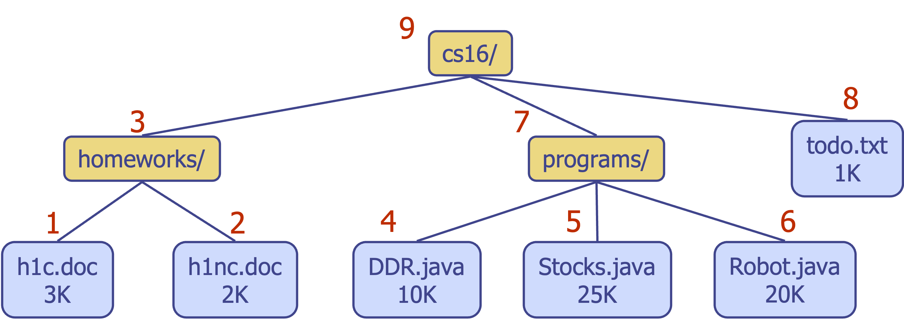

---
# Frontmatter for Slidev configuration
title: 'Trees'
transition: slide-left
theme: seriph
layout: cover
background: https://cover.sli.dev
---

# Trees
## {{ $slidev.configs.subject }}
### Presented by {{ $slidev.configs.presenter }}
### Semester {{ $slidev.configs.semester }}

---
hideInToc: false
---

## Outline

<toc mode="onlySiblings" minDepth="2" columns="2"/>


---

## What is a Tree?

* In computer science, a **tree** is an abstract representation of a hierarchical structure.
* It's composed of **nodes** connected by a **parent-child** relationship.
* **Common Applications:**
    * Organizational charts.
    * File systems (directories and files).
    * Structure in programming environments (e.g., syntax trees).

```mermaid {scale:0.65}
graph TD

    

    A(🏪 7-Eleven Products) --- B(🌭 Food & Drinks)
    A --- C(💊 Personal Care)
    A --- D(🤵 Services)

    B --- E(Ready-to-Eat)
    B --- F(Snacks)
    B --- G(Beverages)

    E --- H("Krapao Rice")
    E --- I("Sausage Buns")

    G --- L("Slurpee")
    G --- M("All Café")

    C --- N(Skincare)
    C --- S(Drugs)
    D --- R("Bill Payment")

    class A,B,C,D,E,F,G,H,I,L,M,N,R,S AB;
    classDef AB fill:#ecd082,stroke:black,stroke-width:2px;
    

```


<!-- 
 -->

---
layout: two-cols-header
---
## Tree Terminology

:: left ::

* **Root:** The unique node with no parent (e.g., A).
* **Internal Node:** A node possessing at least one child (e.g., A, B, C, F).
* **External Node (Leaf):** A node without any children (e.g., E, I, J, K, G, H, D).
* **Ancestors:** Parent, grandparent, great-grandparent, etc., tracing back to the root.
* **Descendants:** Child, grandchild, great-grandchild, etc., tracing down from a node.
* **Subtree:** The portion of the tree consisting of a node and all its descendants.
* **Depth:** The number of ancestors a node has (root depth is 0).

:: right ::

* **Height:** The maximum depth among all nodes in the tree.


<!--
 -->

---

## Example: Structuring a Maze

A tree is a natural way to model the structure of a maze.
*   The **entrance** of the maze can be considered the **root** of the tree.
*   Each **junction** or **decision point** becomes an **internal node**.
*   **Dead ends** become **leaf nodes**.
*   The **exit** is also a node in the tree.

By representing the maze as a tree, algorithms like **depth-first search (DFS)** or **breadth-first search (BFS)** can be used to systematically find a path from the entrance to the exit.


<div style="position:fixed;right:120px;top:100px">

</div>


---
layout: two-cols
---

## Tree Abstract Data Type (ADT)

* We use the concept of **Positions** to abstractly refer to nodes.

* **Generic Methods:**
    * `size()`: Returns the total number of nodes.
    * `isEmpty()`: Checks if the tree has any nodes.
    * `iterator()`: Provides an iterator for the elements (often based on a traversal).
    * `positions()`: Returns an iterable collection of all node positions.

*(Note: Update methods like add/remove are usually defined by specific tree implementations)*

:: right ::
* **Accessor Methods:**
    * `root()`: Returns the position of the root node.
    * `parent(p)`: Returns the position of the parent of `p`.
    * `children(p)`: Returns an iterable collection of the positions of `p`'s children.
    * `numChildren(p)`: Returns the count of `p`'s children.
* **Query Methods:**
    * `isInternal(p)`: Checks if `p` is an internal node.
    * `isExternal(p)`: Checks if `p` is an external node (leaf).
    * `isRoot(p)`: Checks if `p` is the root node.


---

## Tree Interface in Java

A possible Java interface definition for the Tree ADT:

```java {*}{maxHeight:'380px',lines:true}
import java.util.Iterator;

/** An interface for a tree where nodes can have an arbitrary number of children. */
public interface Tree<E> extends Iterable<E> {

    Position<E> root();
    Position<E> parent(Position<E> p) throws IllegalArgumentException;
    Iterable<Position<E>> children(Position<E> p) throws IllegalArgumentException;
    int numChildren(Position<E> p) throws IllegalArgumentException;

    boolean isInternal(Position<E> p) throws IllegalArgumentException;
    boolean isExternal(Position<E> p) throws IllegalArgumentException;
    boolean isRoot(Position<E> p) throws IllegalArgumentException;

    int size();
    boolean isEmpty();

    // Methods inherited from Iterable<E>
    Iterator<E> iterator();

    // Method to get positions
    Iterable<Position<E>> positions();
}

// Note: Position<E> would be another interface/class defining getElement()
// and potentially other position-related methods.

```

---

## Tree Traversal: Preorder

* **Traversal:** A systematic way to visit every node in a tree.
* **Preorder Traversal:** A node is visited *before* its descendants.
* **Algorithm:**

```text
Algorithm preOrder(v):
  visit(v) // Process the current node v
  for each child w of v:
    preOrder(w) // Recursively traverse the subtree rooted at w

```

* **Application:** Useful for printing structured documents, like outlining sections and subsections in order.


---

## Tree Traversal: Postorder

* **Postorder Traversal:** A node is visited *after* all its descendants have been visited.
* **Algorithm:**

```text
Algorithm postOrder(v):
  for each child w of v:
    postOrder(w) // Recursively traverse the subtree rooted at w
  visit(v) // Process the current node v

```

* **Application:** Useful for computing space used by files in a directory structure (calculate subdirectory sizes first, then add the directory's own size).



---
layout: two-cols
---

## Binary Trees

* A specialized type of tree where each node has **at most two** children.
* **Properties:**
    * Each node has a potential left child and a potential right child.
    * A node's children form an ordered pair (left child comes before right child).
* **Applications:**
    * Arithmetic expressions.
    * Decision processes.
    * Binary search trees.
 
:: right ::


<!-- 
 -->

---
layout: two-cols-header
---

## Binary Tree ADT

:: left ::
Extends the basic Tree ADT with methods specific to binary trees:

* `left(p)`: Returns the `Position` of the left child of `p` (or null if none).
* `right(p)`: Returns the `Position` of the right child of `p` (or null if none).
* `sibling(p)`: Returns the `Position` of the sibling of `p` (the other child of `p`'s parent, or null if none).
:: right ::
**Binary Tree Interface extends the `Tree` interface.**
```java {*}
/** An interface for a binary tree, where each node has at most two children. */
public interface BinaryTree<E> extends Tree<E> {

    /** Returns the Position of p's left child (or null if no left child). */
    Position<E> left(Position<E> p) throws IllegalArgumentException;

    /** Returns the Position of p's right child (or null if no right child). */
    Position<E> right(Position<E> p) throws IllegalArgumentException;

    /** Returns the Position of p's sibling (or null if no sibling). */
    Position<E> sibling(Position<E> p) throws IllegalArgumentException;

    // Methods inherited from Tree: root, parent, children, numChildren,
    // isInternal, isExternal, isRoot, size, isEmpty, iterator, positions
}

```

---

## Properties of Binary Trees

Let `n` be the number of nodes, `e` the number of external nodes (leaves), `i` the number of internal nodes, and `h` the height.

* `n = i + e` (Total nodes = internal + external)
* `e = i + 1` (Number of leaves is one more than internal nodes)
* `n = 2e - 1` (Total nodes in terms of leaves)
* `h >= log₂(n)` (Height is at least logarithmic in the number of nodes)
* `h >= log₂(i + 1)`
* `h >= log₂(e) - 1`

---

## Binary Tree Traversal: Inorder

* Specific to binary trees.
* A node is visited *after* its left subtree and *before* its right subtree.
* **Algorithm:**

```text
Algorithm inOrder(v):
  if v has a left child u then
    inOrder(u) // Traverse left subtree
  visit(v) // Process the current node v
  if v has a right child w then
    inOrder(w) // Traverse right subtree

```

* **Application:** Useful for visiting nodes in a binary search tree in ascending order.


---

## Binary Tree Traversal: Applications

* **Preorder:** Useful for creating a prefix representation of an expression tree. `+ * 2 5 - 3 1`
* **Postorder:** Useful for creating a postfix representation (Reverse Polish Notation). `2 5 * 3 1 - +`
* **Inorder:** Useful for creating the standard infix representation (requires parentheses for correctness). `(2 * 5) + (3 - 1)`


---

## Evaluating Arithmetic Expressions (Binary Tree)

* A specialized **postorder traversal** can evaluate an expression tree.
* **Algorithm:**

```text
Algorithm evaluateExpression(v):
  if isInternal(v) then // v is an operator
    x = evaluateExpression(left(v))
    y = evaluateExpression(right(v))
    return x OPERATOR y // Apply operator stored at v
  else // v is an external node (operand)
    return value_stored_at_v

```


---

## Euler Tour Traversal (Binary Trees)

* A generic way to traverse a binary tree that encompasses preorder, inorder, and postorder.
* Imagine "walking around" the tree. Each node is encountered three times:
    1.  From the left (corresponds to preorder visit).
    2.  From below (corresponds to inorder visit).
    3.  From the right (corresponds to postorder visit).

<br>


---
layout: two-cols
---

## Linked Structure for General Trees

* A node can be represented by an object containing:
    * The element.
    * A reference to the parent node.
    * A sequence (e.g., a List or Array) of references to its children nodes.
* These node objects implement the `Position` ADT concept.

<div style="padding-left:130px">


</div>


:: right ::


---
layout: two-cols
---

## Linked Structure for Binary Trees

* A node representation optimized for binary trees:
    * The element.
    * A reference to the parent node.
    * A reference to the left child node.
    * A reference to the right child node.
* Again, these node objects implement the `Position` ADT concept.


<div style="padding-left:130px">


</div>


:: right ::


---
layout: two-cols-header
---

## Array-Based Representation of a Binary Tree

:: left ::

A binary tree can be stored in an array (or an `ArrayList`) by level-order traversal.
*   The root is stored at index `p=0`.
*   For a node at index `p`:
    *   Left child: `2p + 1`
    *   Right child: `2p + 2`
    *   Parent: `(p - 1) / 2` (integer division)

**Advantages:**
*   Space-efficient for *complete* binary trees.
*   No overhead for storing parent/child pointers.

**Disadvantages:**
*   Wastes space for skewed or incomplete trees.

::right::

**Example:**


**Array:**
| Index | 0 | 1 | 2 | 3 | 4 | 5 |
| :---: |:-:|:-:|:-:|:-:|:-:|:-:|
| Value | A | B | C | D | E | F |

---
layout: two-cols-header
---

## Binary Search Trees (BST)

:: left ::

* A **Binary Search Tree** is a binary tree with a special property:
    * For any node `n`, all values in its left subtree are less than `n`'s value.
    * For any node `n`, all values in its right subtree are greater than `n`'s value.
* This property makes searching for elements very efficient.
* Both the left and right subtrees must also be binary search trees.

:: right ::


---
layout: two-cols
---

## Searching in a BST

* The BST property allows us to eliminate half of the tree at each step.
* **Algorithm `TreeSearch(x, k)`:**
    * If `x` is null or `k` is at `x`, return `x`.
    * If `k` is smaller than the value at `x`, search the left subtree: `TreeSearch(left(x), k)`.
    * If `k` is larger than the value at `x`, search the right subtree: `TreeSearch(right(x), k)`.
* **Performance:** The time complexity is $O(h)$, where $h$  is the `height` of the tree. For a balanced tree, this is $O(log n)$.

:: right ::


---
layout: two-cols
---

## Insertion in a BST

* To insert a new value `k`, we search for it until we reach an external node (a null link).
* The new node is inserted at this position.
* **Algorithm:**
    1.  Start at the root.
    2.  If the tree is empty, the new node becomes the root.
    3.  Compare `k` with the current node's value.
    4.  If `k` is smaller, move to the left child.
    5.  If `k` is larger, move to the right child.
    6.  Repeat until a null child is found.
    7.  Insert the new node as that child.

:: right ::


---
layout: two-cols
---

## Deletion from a BST

Deletion is more complex as we need to maintain the BST property. There are three cases for the node `z` to be deleted:

1.  **`z` has no children:** Simply remove `z` (e.g., deleting 1, 4, 7, or 13 in the example).
2.  **`z` has one child:** Replace `z` with its child (e.g., deleting 10).
3.  **`z` has two children:**
    *   Find `z`'s **inorder successor** (the smallest node in its right subtree). Let's call it `y`.
    *   Replace `z`'s value with `y`'s value.
    *   `y` has at most one child (a right child), so delete `y` using case 1 or 2.


:: right ::


---
transition: slide-up
---

## Summary

*   **Trees** are non-linear data structures representing hierarchical data.
*   **Key Terminology:** Root, Parent, Child, Leaf, Internal Node, Depth, Height.
*   **Tree ADT** provides a formal way to interact with tree structures (`root`, `parent`, `children`, etc.).
*   **Traversals** are systematic ways to visit all nodes:
    *   **Preorder:** Visit root, then left, then right.
    *   **Postorder:** Visit left, then right, then root.
    *   **Inorder (Binary Trees):** Visit left, then root, then right.
*   **Binary Trees** are a fundamental variant where each node has at most two children.
*   **Binary Search Trees (BSTs)** are binary trees with a special ordering property, enabling efficient searching, insertion, and deletion.
*   **Implementations:**
    *   **Linked Structure:** Flexible, good for dynamic trees (nodes with pointers).
    *   **Array-Based:** Space-efficient for complete trees, but can be wasteful for sparse or skewed trees.
