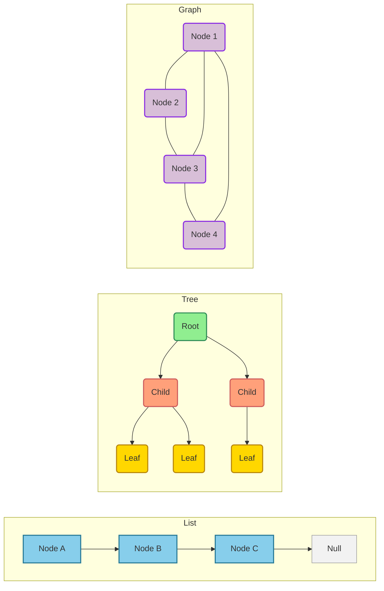
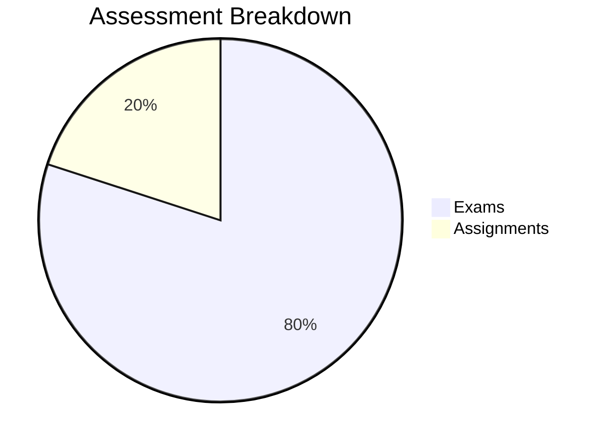
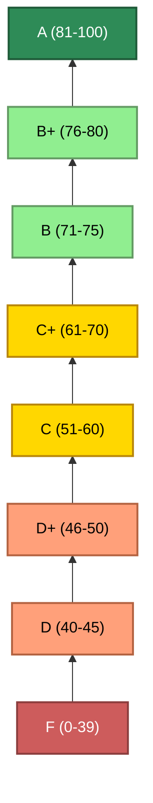

## Course Information

* **Course Number:** 010153103
* **Credits:** 3 (3-0-6)
* **Lecture Hours:** 3 hours per week (incl. class exercises)
* **Course Type:** Required
* **Prerequisites:** 010153002 Computer Programming
* **Textbook:**
    * Goodrich, Michael T., Roberto Tamassia, and Michael H. Goldwasser. *Data structures and algorithms in Java, 6th Edition*, John Wiley & Sons, 2014.

---
layout: two-cols
image: https://substackcdn.com/image/fetch/f_auto,q_auto:good,fl_progressive:steep/https%3A%2F%2Fsubstack-post-media.s3.amazonaws.com%2Fpublic%2Fimages%2Fa8a5a4fc-5cc9-44db-b8ca-08dd83c34737_1160x1384.png
---

## Course Description

This course requires students to understand basic data structures for computer programming development, including 
* lists 
* stacks 
* queues 
* trees
* graphs

The course also covers fundamental algorithms for
* sorting 
* searching
* recursion

:: right ::

---

## Course Learning Outcomes (CLOs)

Upon successful completion of this course, students will be able to:

1.  Demonstrate a good understanding of linear data structures, including arrays, linked lists, stacks, and queues.
2.  Implement abstract data types effectively.
3.  Understand non-linear data structures, including trees and graphs.
4.  Select and use appropriate data structures to solve specific problems.
5.  Understand and implement sorting, searching, and hashing algorithms.
6.  Choose and apply appropriate algorithms to solve specific problems.

---

## Course Topics

* Arrays
* Stacks, Queues, and Deques
* Lists and Iterator 
* Trees/Binary Trees
* Priority Queues and Heap
* Maps and Hash Tables
* Search Trees
* Sorting and Searching
* Graphs

---
layout: two-cols
---

## Assessment and Grading

**Assessment Tools:**
* Exams - 80%
* Assignments - 20%

 

:: right ::

**Grading Plan:**
* **81-100:** A
* **76-80:** B+
* **71-75:** B
* **61-70:** C+
* **51-60:** C
* **46-50:** D+
* **40-45:** D
* **0-39:** F

